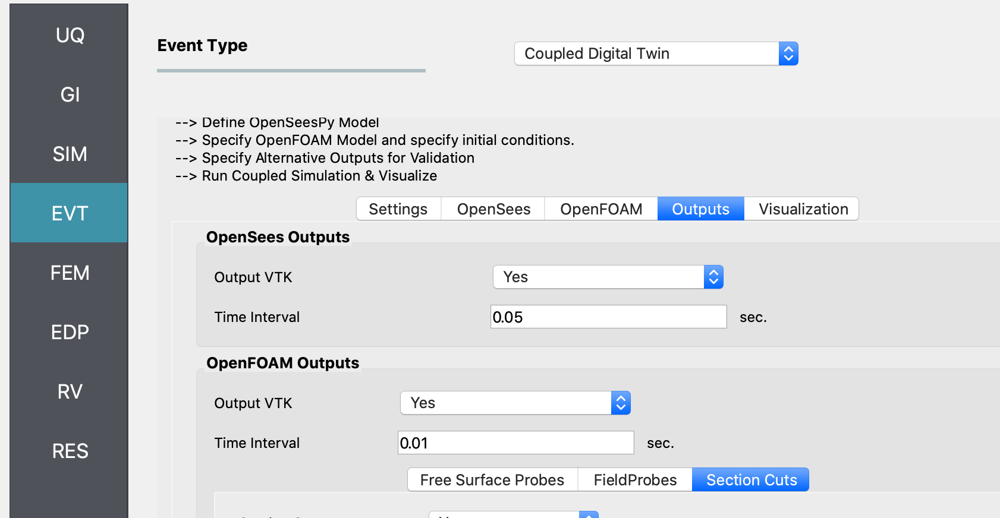
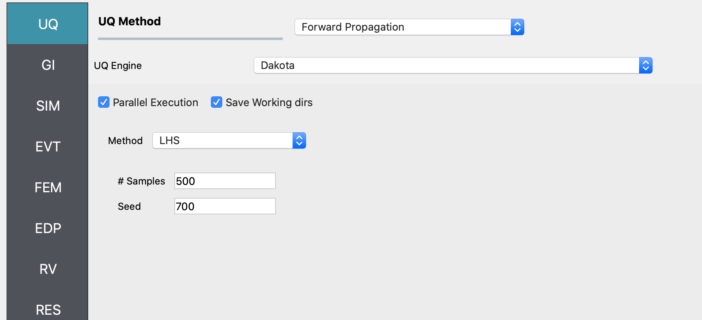
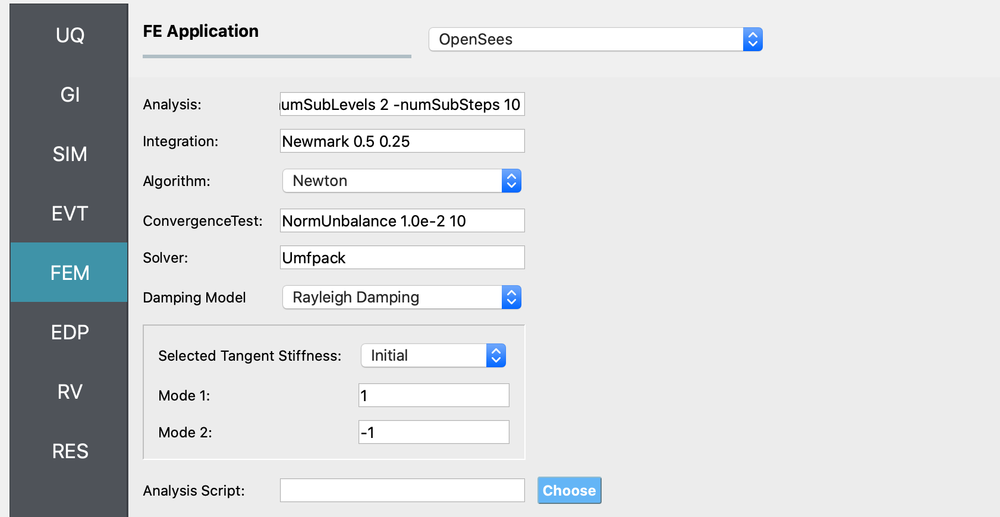
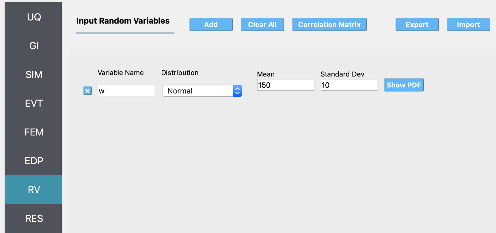

.. _hdro-0001:

=============================================================
Multi-Story Shear Building - Coupled CFD-FEM Digital Twin
=============================================================

+---------------+----------------------------------------------------------------+
| Problem files | :github:`HydroUQ Github Repository<Examples/hdro-0001/>`       |
+---------------+----------------------------------------------------------------+

.. _hdro-0001-overview:

Overview
--------
This example uses a NHERI wave-flume digital twin, the ``OSU LWF``, to simulate a scaled structure during wave loading in ``HydroUQ``. Two-way coupled OpenFOAM-OpenSees is configured to simulate the scenario. 

You will define a Waterborne Event (**EVT**) to determine the engineering demand parameters (**EDP**) on a specified structure, i.e. **EVT** --> **EDP**,  with the following steps:

#. Configure a FOAMySees simulation event (**EVT**). This is a two-way coupling of OpenFOAM Finite Volume Method (FVM) for Computational Fluid Dynamics (CFD) and OpenSees Finite Element Analaysis (FEA) for Computational Structural Dynamics (CSD). 

#. Next, the coupled model will determine floor loads on the building, also known as intensity measures (**IM**) in common performance-based engineering (PBE) nomenclature. 

#. Then, perform an OpenSees finite element analysis (**FEM**) simulation of the building by taking IMs as inputs. 

#. Finally, recieve engineering demand parameters (**EDP**) of the structural response. Though beyond this example, you can use these EDPs to perform a fragility analysis of the structure.

.. _hdro-0001-setup:

Set-Up
------

The dataset in this example originates from experimental tests conducted in the Hinsdale Wave Research Laboratory's Large Wave Flume at Oregon State University (``OSU LWF``), Corvallis, in 2020. Refer to Lewis 2023 [Lewis2023]_ and Bonus 2023 [Bonus2023]_ for details.

.. _figCoupled:

 the larger right panel, the interface shows a section titled "Event Type" with a dropdown menu set to "Coupled Digital Twin". Below, there are instructions for defining models and outputs, as well as tabs labeled "Settings", "OpenSees", "OpenFOAM", "Outputs", and "Visualization". The visible content under the "OpenSees" and "OpenFOAM" tabs includes options for "Output VTK" set to "Yes", and fields to input "Time Interval", set to "0.05 sec." for OpenSees and "0.01 sec." for OpenFOAM. Other available options are "Free Surface Probes" and "Section Cuts". The interface has a clean, modern design with a blue and grey color scheme.
   :figclass: align-center
   :width: 400

   Coupled Digital Twin Illustration

Model
^^^^^

This model is characterized by the parameters:

* Structural weight, :math:`w`, in kN as a random variable with a mean of 100 kN and a standard deviation of 10 kN.
^
.. warning::
   **Do NOT** place the files in your ``root``, ``downloads``, or ``desktop`` folder. The running application will copy every unrelated file in the directories and subdirectories multiple times.

Workflow
^^^^^^^^^^^

The inputs needed to run this example can be loaded into the HydroUQ user interface by selecting the ``Coupled Digital Twin`` example from the ``Examples`` menu at the top of the application.

The inputs can also be set up manually through the following steps:

#. Start the application and select the **UQ** panel:
   In the **UQ Method** drop-down menu, select the **Bayesian Calibration** option. In the **UQ Engine** dropdown menu select **UCSD-UQ** option. In the **Model** dropdown, select the **Hierarchical** option. Enter the values in this panel as shown in the figure below. A brief explanation of the different user input fields can be found in the :ref:`User Manual <lblUCSDHierarchical>`. 

.. _figHBMUQ:

Method" set to "LHS," and fields to input the number of "Samples" (set to 500) and "Seed" (set to 700). On the left side, there is a vertical navigation bar with various abbreviated items like "UQ," "GI," "SIM," "EVT," "FEM," "EDP," "RV," and "RES" highlighted.
   :figclass: align-center
   :width: 600
   
   Inputs in the UQ panel

#. Next in the **FEM** panel: 
   Select **OpenSees** and populate the **Input Script** field by choosing the path to the model file.

.. _figHBMFEM:

as "Analysis: {umSubLevels 2 -numSubSteps 10}", "Integration: Newmark 0.5 0.25", and "ConvergenceTest: NormUnbalance 1.0e-2 10". The interface also includes dropdown menus for algorithm and damping model, input fields for specifying mode shape numbers, and a button to choose an analysis script. On the left side, there is a vertical navigation menu with highlighted options like "FEM", "EDP", and other abbreviations possibly referring to different modules or steps in the engineering analysis process.
   :figclass: align-center
   :width: 600
   
   Inputs in the FEM panel

#. Select the **RV** tab from the input panel: 
   This panel should be pre-populated with the names of the variables that were defined in the model scripts. If not, press the **Add** button to create a new field to define the input random variable. Enter the same variable name, as required in the model script. For this example, choose the Normal probability distribution for all the random variables and enter the parameter values for each distribution as shown in the figures below:

.. _figHBMRV:

ormal' for Distribution, '150' for Mean, and '10' for Standard Dev. There are buttons for 'Add', 'Clear All', 'Correlation Matrix', 'Export', and 'Import'. On the left side, a vertical menu with the options 'UQ', 'GI', 'SIM', 'EVT', 'FEM', 'EDP', 'RV', 'RES' is visible, with 'RV' highlighted in a lighter shade. A 'Show PDF' button is also in view.
   :figclass: align-center
   :width: 600

.. .. _figHBMRV1:

.. .. figure:: figures/RV1.png
..    :align: center
..    :figclass: align-center
..    :width: 600

.. .. _figHBMRV2:

.. .. figure:: figures/RV2.png
..    :align: center
..    :figclass: align-center
..    :width: 600
   
..    Inputs in the RV panel

#. In the **EDP** panel:
   Create the output quantities corresponding to each of the experiments with a descriptive name, as shown in the figures below:

.. .. _figHBMEDP1:

.. .. figure:: figures/EDP1.png
..    :align: center
..    :figclass: align-center
..    :width: 600

.. .. _figHBMEDP2:

.. .. figure:: figures/EDP2.png
..    :align: center
..    :figclass: align-center
..    :width: 600
   
..    Inputs in the EDP panel

#. Click on the **Run** button. 
   This will create the necessary input files to perform a Bayesian calibration of the hierarchical model, run the analysis, and display the results when the analysis is completed.

#. The **RES** tab will open with the workflow results when the simulation completers. The results produced are sample values drawn from the distribution that represents the aleatory uncertainty in the estimated material parameters from each of the datasets. 

  The **Summary** tab shows the mean, standard deviation, and coefficient of variation of each of the seven parameters of the material model that were inferred in this example.

  In the **Data Values** tab of the **RES** panel, a chart and a table with all the sample values are shown. By clicking on the data inside the columns of the chart with the **left** or **right** mouse button (``M1`` and ``M2``), different chart types are created and shown in the chart area on the left. 

.. .. _figHBMRES1:

.. .. figure:: figures/RES1.png
..    :align: center
..    :figclass: align-center
..    :width: 600

.. .. _figHBMRES2:

.. .. figure:: figures/RES2.png
..    :align: center
..    :figclass: align-center
..    :width: 600

.. Results in the **RES** panel summary tab

.. .. _figHBMRES3:

.. .. figure:: figures/RES3.png
..    :align: center
..    :figclass: align-center
..    :width: 600

.. .. _figHBMRES4:

.. .. figure:: figures/RES4.png
..    :align: center
..    :figclass: align-center
..    :width: 600

   .. Data values tab in the RES panel

.. _lblHBMRestart:

.. info::
   In addition to the results displayed in the **RES** panel in ``HydroUQ``, JSON files with the state of the chain at every step of the sampling algorithm are saved in a directory called ``sampling_results`` within the ``tmp.SimCenter`` directory inside the jobs directory specified in the ``HydroUQ`` Preferences menu.
   Any of these files can be used to resume the sampling, by copying the file to the directory containing the model files and specifying its name in the Restart File Name field in the **UQ** panel.

.. warning::
   The ``tmp.SimCenter`` directory is cleared every time the ``RUN`` button is clicked in ``HydroUQ``. So, if you want to restart the analysis using one of the sampling results files outlined above, make sure to copy the results file to a location outside the ``tmp.SimCenter`` directory at the end of the analysis.

.. _hdro-0001-references:

References
----------

.. [Lewis2023]
   Lewis, N. (2023). Development of An Open-Source Methodology for Simulation of Civil Engineering Structures Subject to Multi-Hazards. *PhD thesis*, University of Washington, Seattle, WA. ISBN: 979-8-381408-69-0.

.. [Bonus2023]
   Bonus, J. (2023). Evaluation of Fluid-Driven Debris Impacts in a High-Performance Multi-GPU Material Point Method [University of Washington]. In ProQuest Dissertations and Theses. ISBN: 979-8-381406-66-5. https://www.proquest.com/dissertations-theses/evaluation-fluid-driven-debris-impacts-high/docview/2915819774/se-2?accountid=14784

   