.. _hdro-0002:

Validation - Multiple Debris Impacts on a Raised Structure - Digital Twin (OSU LWF) 
============================

+---------------+----------------------------------------------+
| Problem files | :github:`Github <Examples/hdro-0002/>`       |
+---------------+----------------------------------------------+

Overview
-------

In this digital twin validation example, debris-field wave-flume tests at a NHERI facility, Oregon State University's Large Wave Flume (OSU LWF), are briefly summarized before demonstrating the use of HydroUQ's OSU LWF digital twin paired with the Material Point Method (MPM).

.. figure:: figures/HydroUQ_MPM_3DViewPort_OSULWF_2024.04.25.gif
   :align: center
   :width: 600
   :figclass: align-center
   
   HydroUQ's desktop GUI for the NHERI OSU LWF digital wave-flume twin.

Details for the experiments are available in various publications. Namely, the work of Andrew Winter [Winter2020]_ [Winter2019]_, Krishnendu Shekhar [Shekhar2020]_ and Dakota Mascarenas [Mascarenas2022]_ [Mascarenas2022PORTS]_.  The simulations replicated in this example appeared originally in Bonus 2023 [Bonus2023Dissertation]_.

Experiments were performed in the NHERI OSU LWF, a 100 meter long flume with adjustable bathymetry, in order to quantify stochastic impact loads of ordered and disordered debris-fields on effectively rigid, raised structure. 

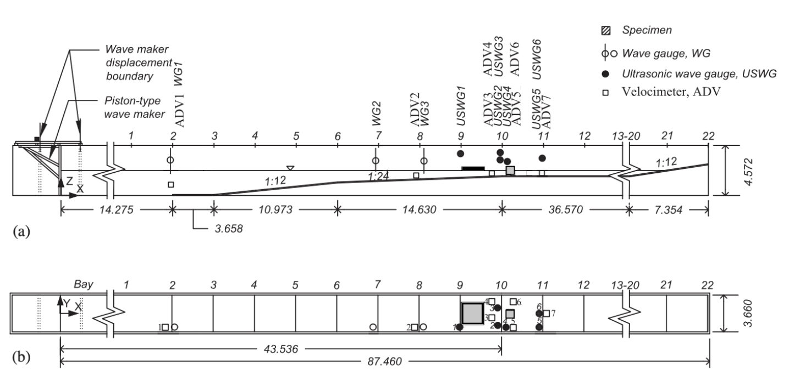

   NHERI OSU LWF facilty's experimental schematic used in this example. Adapted from Winter 2019 [Winter2019]_, and Mascarenas 2022 [Mascarenas2022]_.

This example may help to produce a robust database (numerical and physical) from which to eventually be able to extract both the first-principals of wave-driven debris-field phenomena and design guidelines on induced forces. 

We validate against two very similar (but not identical) physical studies done in the OSU LWF by [Shekhar2020]_ and [Mascarenas2022_, indicating high accuracy of our model and low bias to minor experiment specifications. 

Results for free surface elevation and streamwise structural loads are to be recorded for validation at a specified interval. 

Qualitatively, an MPM simulation of debris impacts on a raised structure in the OSU LWF is shown below.

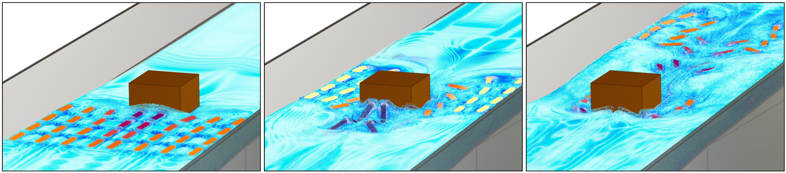

   OSU LWF debris impact photos from HydroUQ's MPM simulations.

It appears similar in the mechanism of debris impact, stalling, and deflection relative to the structure and flow for a similar case in Mascarenas 2022 [Mascarenas2022]_.

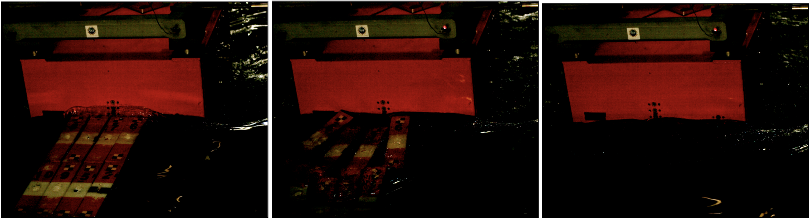

   OSU LWF debris impact photos from Mascarenas 2022 [Mascarenas2022]_ experiments.

The experiments by Shekhar et al. 2020 [Shekhar2020]_ are also shown below for comparison. These tests had a slightly different configuartion, primarily the debris were located 0.5 meters further upstream from the box and the water level was 0.10-0.15 meters lower than the 2.0 meter datum used in the simulations and Mascarenas 2022 [Mascarenas2022]_ experiments.

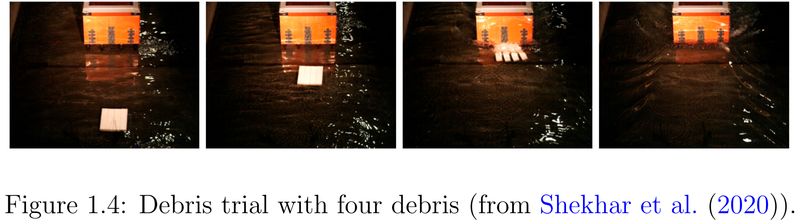

   OSU LWF debris impact photos from Shekhar et al. 2020 [Shekhar2020]_ experiments.

Similar figures can be made for the whole range of order debris-array experiments done at the OSU LWF. However, this example focuses on teaching you how to replicate the above results.

Set-Up
------

A step-by-step walkthrough on replicating an MPM simulation result from Bonus 2023 [Bonus2023Dissertation]_ is provided below.

Open ``Settings``. Here we set the simulation time, the time step, and the number of processors to use, among other pre-simulation decisions.

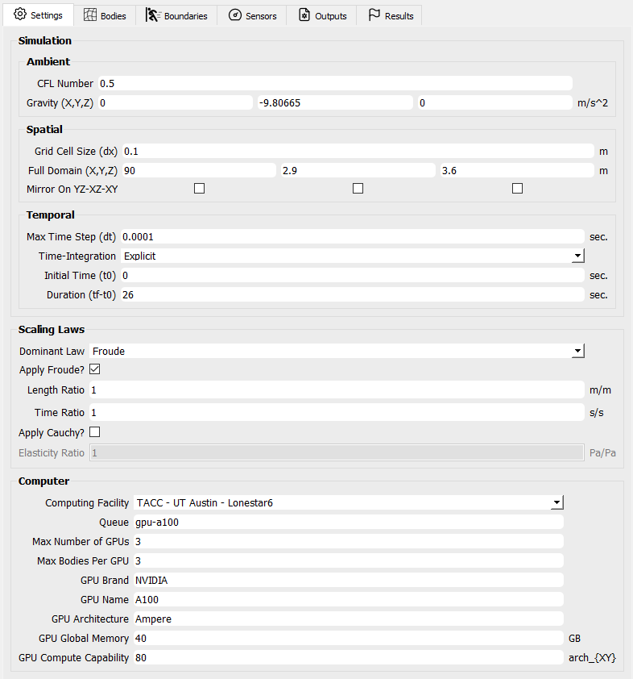

   HydroUQ Settings GUI

Open ``Bodies`` / ``Fluid`` / ``Material``. Here we set the material properties of the fluid and the debris.

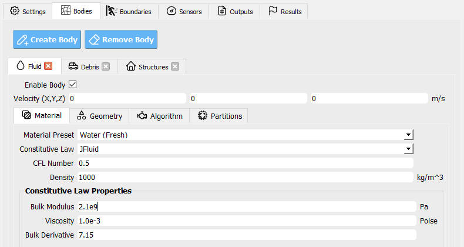

   HydroUQ Bodies Fluid Material GUI

Open ``Bodies`` / ``Fluid`` / ``Geometry``. Here we set the geometry of the flume, the debris, and the raised structure. 

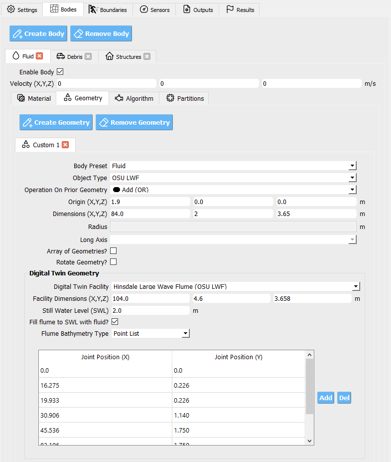

   HydroUQ Bodies Fluid Geometry GUI

Open ``Algorithm``. Here we set the algorithm parameters for the simulation. We choose to apply F-Bar antilocking to aid in the pressure field on the fluid. The associated toggle must be checked, and the antilocking ratio set to 0.9, loosely.

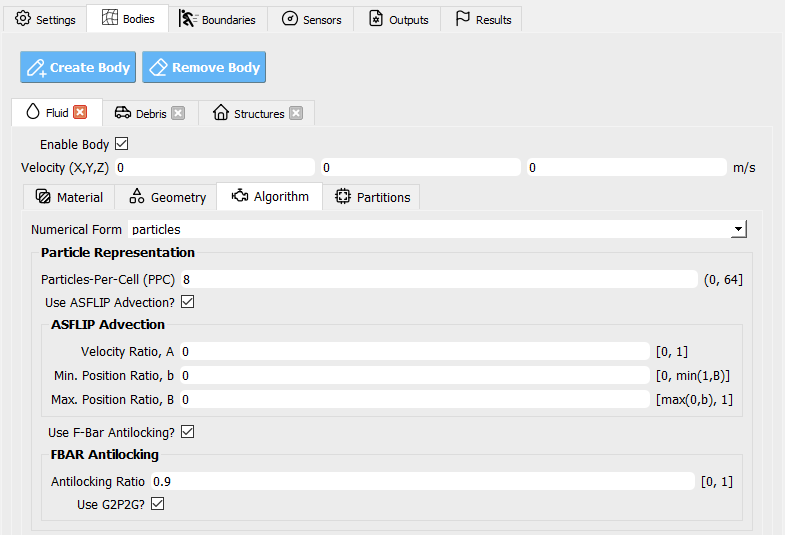

   HydroUQ Bodies Fluid Algorithm GUI

Open ``Bodies`` / ``Fluid`` / ``Partitions``. Here we set the number of partitions for the simulation. This is the domain decomposition across discrete hardware units, i.e. Multi-GPUs. These may be kept as there default values. 

.. figure:: figures/GUI_Bodies_Fluid_Partitions.PNG
   :align: center
   :width: 600
   :figclass: align-center

   HydroUQ Bodies Fluid Partitions GUI

Moving onto the creation of an ordered debris-array, we set the debris properties in the ``Bodies`` / ``Debris`` / ``Material`` tab. We will assume debris are made of HDPE plastic, as in experiments by Mascarenas 2022 [Mascarenas2022]_ and Shekhar et al. 2020 [Shekhar2020]_.

.. figure:: figures/GUI_Bodies_Debris_Material.PNG
   :align: center
   :width: 600
   :figclass: align-center

   HydroUQ Bodies Debris Material GUI

Open ``Bodies`` / ``Debris`` / ``Geometry``. Here we set the debris properties, such as the number of debris, the size of the debris, and the spacing between the debris. Rotation is another option, though not used in this example. We've elected to use an 8 x 4 grid of debris (longitudinal axis parallel to long-axis of the flume).

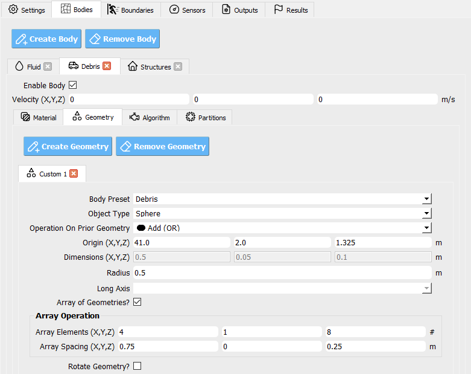

   HydroUQ Bodies Debris Geometry GUI

The ``Bodies`` / ``Debris`` / ``Algorithm`` and ``Debris`` / ``Partitions`` tabs are not used in this example, but are available for more advanced users.

Open ``Bodies`` / ``Structures``. Uncheck the box that enables this body, if it is checked. We will not model the structure as a body in this example, instead, we will modify it as a boundary later.

.. figure:: figures/GUI_Bodies_Structure_Disabled.PNG
   :align: center
   :width: 600
   :figclass: align-center

   HydroUQ Bodies Structures GUI

Open ``Boundaries`` / ``Wave Flume``. We will set the boundary to be a rigid body, with a fixed separable velocity condition, that is faithful to the digital tiwn of the NHERI OSU LWF. Bathmyetry joint points should be indetical to the ones used in ``Bodeis`` / ``FLuid``.

.. figure:: figures/GUI_Boundaries_Flume.PNG
   :align: center
   :width: 600
   :figclass: align-center

   HydroUQ Boundaries Wave Flume Facility GUI

Open ``Boundaries`` / ``Wave Generator``.

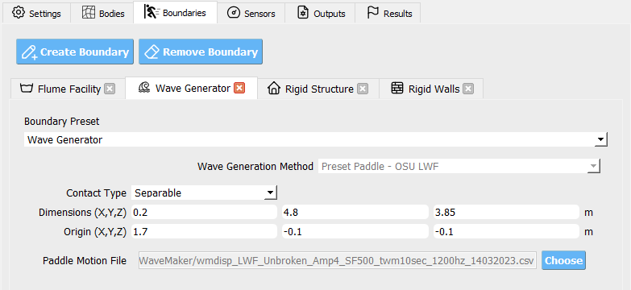

   HydroUQ Boundaries Wave Generator GUI

Open ``Boundaries`` / ``Rigid Structure``.

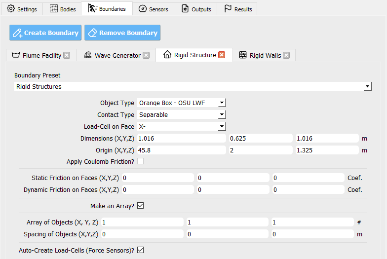

   HydroUQ Boundaries Rigid Structure GUI

Open ``Boundaries`` / ``RigidWalls``.

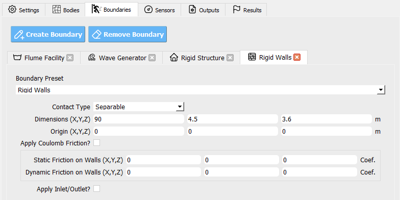

   HydroUQ Boundaries Wave-Flume Facility GUI

Open ``Sensors`` / ``Wave Gauges``. Set the ``Use these sensor?`` box to ``True`` so that the simulation will output results for the instruments we set on this page.

Three wave gauges will be defined. The first is located prior to the bathymetry ramps, the second partially up the ramps, and the third near the the bathymetry crest, debris, and raised structure. 

Set the origins and dimensions of each wave as in the table below. To match experimental conditions, we also apply a 120 Hz sampling rate to the wave gauges, meaning they record data every 0.0083 seconds. 

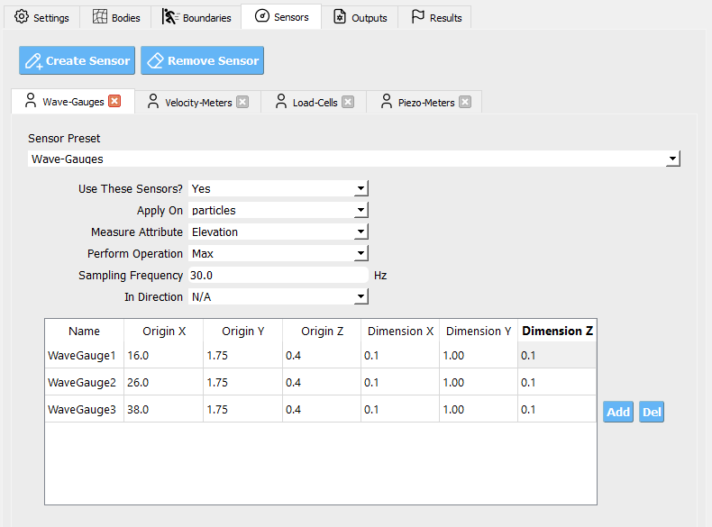
   
   HydroUQ Sensors Wave-Gauge GUI

These wave gauges will read all numerical bodies (i.e. particles) within their defined regions every sampling step, and will report the highest elevation value (Position Y) of a contained body as the free-surface elevation at that gauge. The results is written into our sensor results files.

Open ``Sensors`` / ``Load Cells``. Set the ``Use these sensor?`` box to ``True`` so that the simulation will output results for the instruments we set on this page.

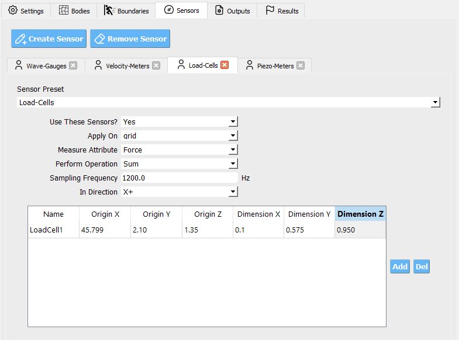

   HydroUQ Sensors Load-Cells GUI

Open ``Outputs``. Here we set the non-physical output parameters for the simulation, e.g. attributes to save per frame and file extension types. The particle bodies' output frequency is set to 10 Hz (0.1 seconds), meaning the simulation will output results every 0.1 seconds. This is decent for animations without taking too much space. Fill in the rest of the data in the figure into your GUI to ensure all your outputs match this example.

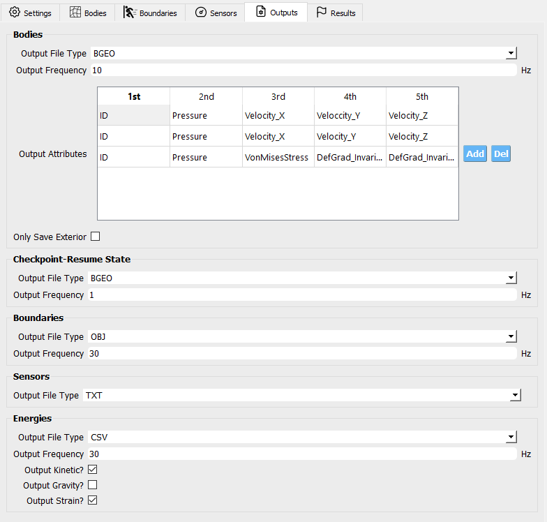

   HydroUQ Outputs GUI

Execution
---------

We assume that 2 hours are reserved for your simulation. For those using the reduce fluid bulk modulus or reduced resolution, this may be more than neccesary.

This simulation was ran on the TACC Lonestar6 system. It uesd three NVIDIA A100 GPUs on a single node in the ``gpu-a100`` queue. Real time to complete was 2 hours. Simulated time in the digital twin is 26 seconds.

In order to retrieve results from the analysis, the analysis must complete and postprocess the model output files into an appropriate format before the end of the allotted submission time. 

Provide a large amount of time for the ``Max Run Time`` field in HydroUQ when submitting a job to ensure the model completes before the time allotted runs out! We recommend 2 hours in this example. 

.. warning::
   USE CAUTION WHEN REQUESTING OUTPUT RATE, SENSOR COUNT, OR NUMBER OF OUTPUT VARIABLES! Only ask for what you need, or you will end up with massive amounts of data.

Analysis
--------

When the simulation job has completed, the results will be available on the remote system for retrieval or remote post-processing.

Retrieving the ``results.zip`` folder from the ``Tools & Applications`` Page of Design Safe starts by navigating to the designsafe-ci.org website. Login and go to ``Use DesignSafe`` / ``Tools & Applications``

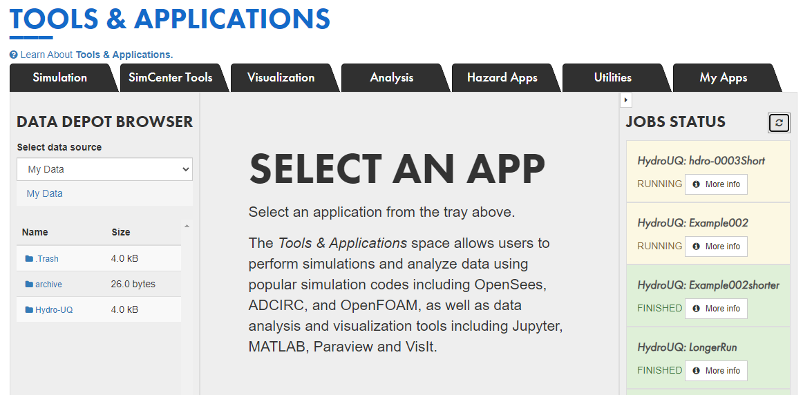

   Locating the job files on DesignSafe

Check if the job has finished in the right-side vertical drawer by clicking the refresh icon. If it has, click ``More info``.  

.. figure:: figures/DSToolsAndAppsJobsStatusFinished.PNG
   :align: center
   :width: 600
   :figclass: align-center

Once the job is finished, the output files should be available in the directory which the analysis results were sent to

Find the files by clicking ``View``. 
	
.. figure:: figures/DSToolsAndAppsJobsStatusViewFiles.PNG
   :align: center
   :width: 600
   :figclass: align-center

Move the ``results.zip`` to somewhere in ``My Data/``. Use the Extractor tool available on DesignSafe.  Unzip the results.zip folder. 

.. figure:: figures/extractonDS.PNG
   :align: center
   :width: 600
   :figclass: align-center
    
   Extracting the ``results.zip`` folder on DesignSafe

OR Download the ``results.zip`` folder to your PC and unzip to look at the model results. 

.. figure:: figures/downloadResults.PNG
   :align: center
   :width: 600
   :figclass: align-center

   Download button on DesignSafe shown in red

Download the results to look at the geometry files of the analysis.

Extract the ``results.zip`` folder either on DesignSafe or on your local machine. You will likely want to have a free Side FX Houdini Apprentice installation to view BGEO files.

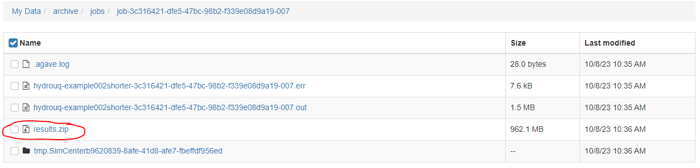

   File-system view of results zip folder on DesignSafe.

Locate the zip folder and extract it somewhere convenient. The local or remote work directory on your computer is a good option, but note that these files may be erased if another simulation is set-up in HydroUQ, so keep a backup somewhere outside the working directories.
	
HydroUQ's sensor / probe / instrument output is available in ``{your_path_to_HydroUQ_WorkDir}/HydroUQ/RemoteWorkDir/results/`` as CSV files.

Particle geometry files often have a ``BGEO`` extension, open Side FX Houdini Apprentice (free to use) to look at MPM results in high-detail.

Once complete, the simulation data at the three wave gauges (WG1, WG2, and WG3, left-to-right) is as showm below when plotted against experimental trials of Mascarenas 2022 [Mascarenas2022]_ for the "unbroken" solitary wave case.

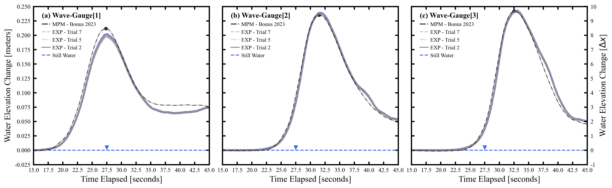

   OSU LWF simulated free-surface elevation wave gauges vs. experimental data from Mascarenas 2022 [Mascarenas2022]_.

The simulation data at the load-cell is as shown below when plotted against experimental trials of Mascarenas 2022 [Mascarenas2022]_ for the "unbroken" solitary wave case. The experimental streamwise load is the combination of "LC5" and "LC8" in Mascarenas 2022 [Mascarenas2022]_, as both measured streamwise load on the box to reduce errors from position / slight box apparatus out-of-plane rotation.

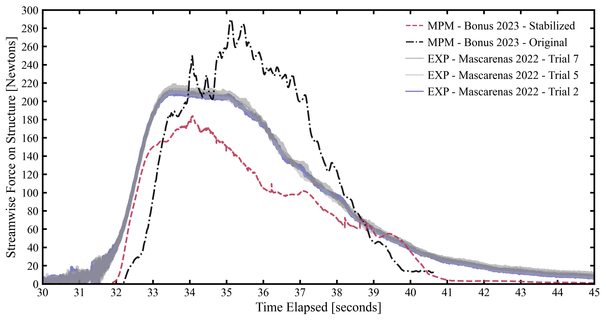

   OSU LWF simulated streamwise load-cells vs. experimental data from Mascarenas 2022 [Mascarenas2022]_.

Though only one case was considered here, if many experimental debris-field cases are ran (10+) we can use HydroUQ to perform a sensitivity analysis on the debris-field parameters. This isn't pursued here-in. 

However, the following box-and-whisker charts demonstrates the strengh of the numerical replication, as most points fall within experimental interquartile ranges and never outside of the experimental envelope for impact loads.

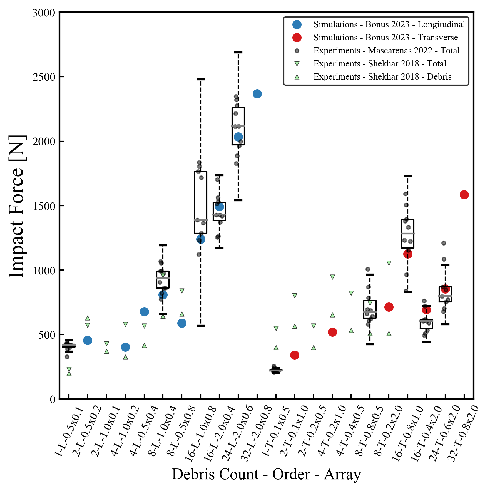

   OSU LWF simulated first peak debris impact loads vs. experimental data from Mascarenas 2022 [Mascarenas2022]_.

This complete our HydroUQ validation example for multiple debris impacts on a raised structure in the OSU LWF, Bonus 2023 [Bonus2023Dissertation]_.

References
----------

.. Need to redo these

.. [Winter2020] Winter, A. (2020). "Wave-Driven Debris Impact on a Raised Structure in the Large Wave Flume." PhD thesis. University of Washington, Seattle.

.. [Winter2019] Winter, A., Mascarenas, D., Shekhar, K., and Cox, D. (2019). "Wave-Driven Debris Impact on a Raised Structure in the Large Wave Flume." 16th International Conference on Hydroinformatics, Palermo, Italy.

.. [Shekhar2020] Shekhar, K., Mascarenas, D., and Cox, D. (2020). "Wave-Driven Debris Impact on a Raised Structure in the Large Wave Flume." 17th International Conference on Hydroinformatics, Seoul, South Korea.

.. [Mascarenas2022] Mascarenas, Dakota. (2022). "Wave-Driven Debris Impact on a Raised Structure in the Large Wave Flume." Journal of Waterway, Port, Coastal, and Ocean Engineering.

.. [Mascarenas2022PORTS] Mascarenas, Dakota (2022). "Wave-Driven Debris Impact on a Raised Structure in the Large Wave Flume." Journal of Waterway, Port, Coastal, and Ocean Engineering.

.. [Bonus2023Dissertation] Bonus, Justin (2023). "Evaluation of Fluid-Driven Debris Impacts in a High-Performance Multi-GPU Material Point Method." PhD thesis. University of Washington, Seattle.

