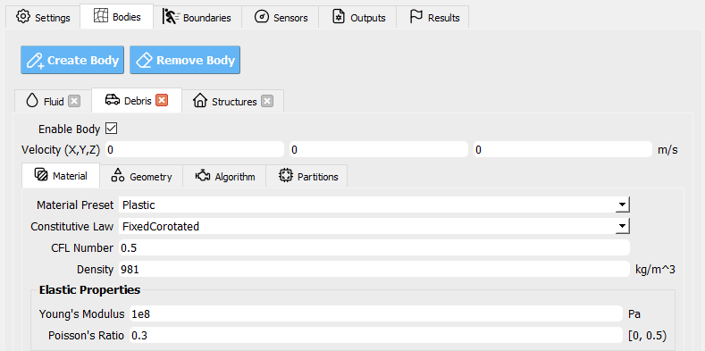

.. _hdro-0002:

Debris Impacts on a Rigid Structure - OSU Large Wave Flume Digital Twin - MPM
============================

+---------------+----------------------------------------------+
| Problem files | :github:`Github <Examples/hdro-0002/>`       |
+---------------+----------------------------------------------+

Outline 
-------

In this example, debris-field wave-flume tests at a NHERI facility, Oregon State University's Large Wave Flume (OSU LWF), are briefly summarized before demonstrating the use of HydroUQ's OSU LWF digital twin paired with the Material Point Method (MPM).

.. figure:: figures/HydroUQ_MPM_3DViewPort_OSULWF_2024.04.25.gif
   :align: center
   :width: 600
   :figclass: align-center
   

Details for the experiments are available in various publications. Namely, the work of Andrew Winter cite{Winter2019} cite{Winter2020}, Krishnendu Shekhar cite{Shekhar2020}, and Dakota Mascarenas cite{Mascarenas2022} cite{Mascarenas2022PORTS}. 

Experiments were performed in the NHERI OSU LWF, a 100 meter long flume with adjustable bathymetry, in order to quantify stochastic impact loads of ordered and disordered debris-fields on effectively rigid, raised structure. 

.. figure:: figures/OSU_Flume_Schematic_Dakota_Alam.png
   :align: center
   :width: 600
   :figclass: align-center

NHERI OSU LWF facilty's experimental schematic used in this example.

This research aims to produce a robust database (numerical and physical) from which to eventually be able to extract both the first-principals of wave-driven debris-field phenomena and design guidelines on induced forces. 

Because the structural impact loads of debris-fields driven by waves are notoriously chaotic, meaning very small changes in initial conditions can greatly alter structural demands between near identical cases, this represents a step towards better understanding one of the least understood phenomena faced by modern coastal engineers.

For ordered debris-field arrays, our simulated structural loads are within 5 - 15% of experimental medians, typically fall within interquartile ranges, and never qualify as outliers relative to experimental trial envelopes. 

We validate against two very similar (but not identical) physical studies done in the OSU LWF by citeNP{Shekhar2020} and citeNP{Mascarenas2022}, indicating high accuracy of our model and low bias to minor experiment specifications. 

Results for free surface, velocity, and pressure, as well as interface forces and moments and a cut section of the case at a specified interval. 

Simulated debris impacts on the structure in the Material Point Method. Experiment debris impact photos shown below.

.. figure:: figures/OSU_LWF_MPM_32L_Impact_3Photos.png
   :align: center
   :width: 600
   :figclass: align-center

.. figure:: figures/OSU_LWF_Dakota_8L_Impact_3Photos.PNG
   :align: center
   :width: 600
   :figclass: align-center
    

Overview of case:

Open ``Settings``. Here we set the simulation time, the time step, and the number of processors to use, among other pre-simulation decisions.

.. figure:: figures/GUI_Settings.PNG
   :align: center
   :width: 600
   :figclass: align-center

HydroUQ Settings GUI

Open ``Materials``. Here we set the material properties of the fluid and the debris.

.. figure:: figures/GUI_Fluid_Material.PNG
   :align: center
   :width: 600
   :figclass: align-center

HydroUQ Materials GUI

Open ``Geometry``. Here we set the geometry of the flume, the debris, and the raised structure. 

.. figure:: figures/GUI_Fluid_Geometry.PNG
   :align: center
   :width: 600
   :figclass: align-center

HydroUQ Geometry GUI

Open ``Algorithm``. Here we set the algorithm parameters for the simulation. We choose to apply F-Bar antilocking to aid in the pressure field on the fluid. The associated toggle must be checked, and the antilocking ratio set to 0.9, loosely.

.. figure:: figures/GUI_Fluid_Algorithm.PNG
   :align: center
   :width: 600
   :figclass: align-center

HydroUQ Geometry GUI

Open ``Partitions``. Here we set the number of partitions for the simulation. This is the domain decomposition across discrete hardware units, i.e. Multi-GPUs. These may be kept as there default values. 

.. figure:: figures/GUI_Bodies_Fluid_Partitions.PNG
   :align: center
   :width: 600
   :figclass: align-center

HydroUQ Partitions GUI

Moving onto the definition of an ordered debris-array, we set the debris properties in the ``Debris`` / ``Materials`` tab. We will assume debris are made of HDPE plastic, as in experiment

HydroUQ Debris Materials GUI

Open ``Debris`` / ``Geometry``. Here we set the debris properties, such as the number of debris, the size of the debris, and the spacing between the debris. Rotation is another option, though not used in this example. We've elected to use an 8 x 4 grid of debris (longitudinal axis parallel to long-axis of the flume).

.. figure:: figures/GUI_Bodies_Debris_Geometry.PNG
   :align: center
   :width: 600
   :figclass: align-center

HydroUQ Debris Geometry GUI

The ``Debris`` / ``Algorithm`` and ``Debris`` / ``Partitions`` tabs are not used in this example, but are available for more advanced users.

Open ``Bodies`` / ``Structures``. Uncheck the box that enables this body, if it is checked. We will not model the structure as a body in this example, instead, we will modify it as a boundary later.

.. figure:: figures/GUI_Bodies_Structure_Disabled.PNG
   :align: center
   :width: 600
   :figclass: align-center

HydroUQ Bodies Structures GUI

Open ``Bodies`` / ``Boundaries`` / ``Wave Flume``. We will set the boundary to be a rigid body, with a fixed separable velocity condition, that is faithful to the digital tiwn of the NHERI OSU LWF. Bathmyetry joint points should be indetical to the ones used in ``Bodeis`` / ``FLuid``.

.. figure:: figures/GUI_Boundaries_Flume.PNG
   :align: center
   :width: 600
   :figclass: align-center

Open ``Bodies`` / ``Boundaries`` / ``Wave Generator``.

.. figure:: figures/GUI_Boundaries_WaveGenerator.PNG
   :align: center
   :width: 600
   :figclass: align-center

Open ``Bodies`` / ``Boundaries`` / ``Rigid Structure``.

.. figure:: figures/GUI_Boundaries_RigidStructure.PNG
   :align: center
   :width: 600
   :figclass: align-center

Open ``Bodies`` / ``Boundaries`` / ``RigidWalls``.

.. figure:: figures/GUI_Boundaries_RigidWalls.PNG
   :align: center
   :width: 600
   :figclass: align-center

HydroUQ Bodies Boundaries Wave-Flume Facility GUI

Open ``Bodies`` / ``Debris``. Here we set the boundary conditions for the debris. We will set the boundary to be a rigid body, with a fixed boundary condition.

Open ``Bodes`` /  ``Boundaries`` / ``Debris``. Here we set the boundary conditions for the debris. We will set the boundary to be a rigid body, with a fixed boundary condition.

Open ``Sensors`` / ``Wave Gauges``. Set the ``Use sensor?`` box to ``True`` so that the simulation will output results for the instruments we set on this page.

Three wave gauges will be defined. The first is located prior to the bathymetry ramps, the second partially up the ramps, and the third near the the bathymetry crest, debris, and raised structure. 

Set the origins and dimensions of each wave as in the table below. To match experimental conditions, we also apply a 120 Hz sampling rate to the wave gauges, meaning they record data every 0.0083 seconds. 

.. figure:: figures/GUI_Sensors_WaveGauges.PNG
   :align: center
   :width: 600
   :figclass: align-center
   
HydroUQ Wave Gauges GUI

These gauges will read all numerical bodies within their defined regions every sampling step, and will report the highest elevation value (Position Y) of a contained body as the free-surface elevation at that gauge. The results is written into our sensor results files.

Open ``Sensors`` / ``Load Cells``. Set the ``Use these sensor?`` box to ``True`` so that the simulation will output results for the instruments we set on this page.

.. figure:: figures/GUI_Sensors_LoadCells.PNG
   :align: center
   :width: 600
   :figclass: align-center

HydroUQ Load Cells GUI

Open ``Outputs``

.. figure:: figures/GUI_Outputs.PNG
   :align: center
   :width: 600
   :figclass: align-center

   HydroUQ Outputs GUI

Simulation Details
---------------
Simulation Time: 2 hours - Ran on TACC Lonestar6, 56 processors, 3 NVIDIA A100 GPUs, 1 node -/ Real Time: 1hr, 20 minutes

Submitted
May 1, 2024 1:14:37 PM
Finished
May 1, 2024 2:34:10 PM

The case can be run for as long as desired, but mind that the longer the case runs, the longer the postprocessing routines will be.

In order to retrieve results from the analysis, the analysis must complete and postprocess the model output files into a VTK format before the end of the allotted submission time. 

Provide a large amount of time for the 'Max Run Time' field in HydroUQ when submitting a job to ensure the model completes before the time allotted runs out!

Be aware that the smaller the OpenFOAM Outputs and OpenSees Outputs 'Time Interval' value is, the longer the post processing of the case will take after analysis has completed, and the larger the results.zip folder will be. 

USE CAUTION WHEN REQUESTING OUTPUT RATE, SENSOR COUNT, OR NUMBER OF OUTPUT VAIRABLES! Only ask for what you need, or you will end up will massive amounts of data.

Post Processing
-------------------------------------------------------------------

Retrieving the results.zip folder from the Tools and Applications Page of Design Safe.. 

.. figure:: figures/DSToolsAndAppsJobsStatus.PNG
   :align: center
   :width: 600
   :figclass: align-center

   Locating the job files on DesignSafe

Check if the job has finished. If it has, click 'More info'.  

.. figure:: figures/DSToolsAndAppsJobsStatusFinished.PNG
   :align: center
   :width: 600
   :figclass: align-center

Once the job is finished, the output files should be available in the directory which the analysis results were sent to

Find the files by clicking 'View'. 
	
.. figure:: figures/DSToolsAndAppsJobsStatusViewFiles.PNG
   :align: center
   :width: 600
   :figclass: align-center

   Locating this directory is easy. 
	

Move the results.zip to somewhere in My Data/. Use the Extractor tool available on DesignSafe.  Unzip the results.zip folder. 

.. figure:: figures/extractonDS.PNG
   :align: center
   :width: 600
   :figclass: align-center
    
	
OR Download the results.zip folder to your PC and unzip to look at the model results. 

.. figure:: figures/downloadResults.PNG
   :align: center
   :width: 600
   :figclass: align-center

Download the results to look at the VTK files of the analysis. This will include OpenFOAM and OpenSees field data and model geometry

Extract the Zip folder either on DesignSafe or on your local machine. You will need Paraview to view the model data.

.. figure:: figures/resultsZip.png
   :align: center
   :width: 600
   :figclass: align-center

Locate the zip folder and extract it to somewhere convenient
	
The results folder should look something like this. 
	

Paraview files have a .PVD extension. Open VTK/Fluid.vtm.series to look at OpenFOAM results.
Open OpenSeesOutput.pvd to look at OpenSees results.

MPM sensor / probe output is available in `{your_path_to_HydroUQ_WorkDir}/HydroUQ/RemoteWorkDir/results/postProcessing/`.

SideFX Houdini files often have a .BGEO extension, open Houdini Apprentice to look at MPM results in high-detail.

Once complete, the simulation data at the three wave gauges (left-to-right, respectively) is as show below when plotted against an experimental trial.

.. figure:: figures/OSU_LWF_Wave_Gauges_Hydro_2D_Plots3_2023.10.31.png
   :align: center
   :width: 600
   :figclass: align-center

Though only one case was considered here, if many experimental debris-field cases are ran (10+) we can use HydroUQ to perform a sensitivity analysis on the debris-field parameters. This isn't pursued here-in. 

However, the following box-and-whisker charts demonstrates the strengh of the numerical replication, as most points fall within experimental interquartile ranges and never outside of the experimental envelope for impact loads.

.. figure:: figures/OSU_U_FirstPeak_BoxAndWhiskers_KrishExpOnly_31072023.png
   :align: center
   :width: 600
   :figclass: align-center

This is the output of the model

.. figure:: figures/OSU_LWF_LodCell_Hydro_2D_Plots3_2023.10.31.png
   :align: center
   :width: 600
   :figclass: align-center

This is the output of the model

