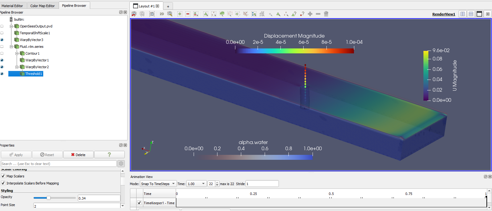

.. _hdro-0003:

=======================================================================================
Cylinder Half-Submerged in Flow  -  UW WASIRF Twin  -  FOAMySees (OpenFOAM + OpenSees)
=======================================================================================

+---------------+------------------------------------------------------------------------------------------------------+
| Problem files | :github:`Github <Examples/hdro-0003/>`                                                               |
+---------------+------------------------------------------------------------------------------------------------------+

.. contents:: Table of Contents
   :local:
   :backlinks: none

.. _hdro-0003-overview:

Overview
--------

This example demonstrates how to run a coupled **OpenSees-OpenFOAM** simulation (**FOAMySees**) to determine floor loads on a building caused by strongly-coupled, two-way fluid-structure interaction. 
You can then perform an **OpenSees** simulation of the building assuming uncertainties in the building properties. 

A truncated digital twin of the UW WASIRF wave flume contains a simple cantilevered cylinder. The cylinder, our structure, is half-submerged. The flow around the cylinder is calculated for a given period of time in order to determine a simulated structural response time-series under wave loading. 

Outputs of the **EVT** simulation will include results, sampled at specified frequenies, for the:

#. Fluid flow's free surface elevation at wave gauges
#. Flow velocity at velocimeter locations
#. Fluid pressure at piezometers locations
#. FSI forces and moments at the structural interface 
#. Cross-section cuts of the OpenFOAM continuum

As the **EVT** and **FEM** functionality are effectively fused for FOAMySees, the **FEM** tab will be envisioned as providing additional results in the form of:

#. Time-series motion of any structural nodes with defined *recorders* in the **OpenSees** model.

The **EDP** tab will then process these results.

#. Displacement of the cylinder tip from rest, peak relative-floor displacement (PFD)
#. Displacement of the cylinder tip relative to its base or supporting , peak inter-story drift (PID)
#. Peak floor acceleration (PFA)

.. _hdro-0003-setup:

Set-Up
------

The case is set up in the HydroUQ tool on DesignSafe.  You can select the case from the list of available examples off of the HydroUQ menubar, i.e. ``Examples / hdro-0003``. The case is set up as follows.

The flume is 1 meter wide (from Y=-0.5m to Y=0.5 m), 1 meter tall (Z=0.0m to Z=1.0m), and 4 meters long (X=0.0m to X=4.0m). The cardinal direction Z+ is vertical, X+ is downstream, and Y+ is crossflow. Gravity is -9.81 m / s^2 in the Z direction.

The case is initialized with a still water level of 0.25 meters. The velocity at the inlet is given a time history boundary condition, ``src/VelTime.csv``. 

This structure is a simple cylinder. It has a diameter 0.1 meters and it is located at X=1.5, Y=0.0, Z=0.0. The length of the cylinder is 0.5 meters in Z+. 

The cylinder is represented in OpenSees by a cantilevered beam, with an elastic section, modelled with displacement-action controlled beam elements. The bottom of the cantilevered beam is fixed at Z=0.0.

The constrained node is removed from the coupled solution, by omitting it from the list *coupledNodes* in the OpenSees model file. 

The interface surface file is ``'src/interface.stl'``. 

.. _hdro-0003-fig-schematic:

.. figure:: figures/hdro-0003 example.png
   :align: center
   :width: 600
   :figclass: align-center

   Schematic of the digital twin example in the UW WASIRF truncated flume

Probe positions in the digital flume are set at the following locations:
	
.. figure:: figures/hdro-0003 example probeLoc.png
   :align: center
   :width: 600
   :figclass: align-center

   Instrumentation locations in theUW WASIRF truncated digital flume    

Inlet Velocity Time History (U(t)) for the truncated digital twin is given by the following function in OpenFOAM:

.. figure:: figures/inletVTH.png
   :align: center
   :width: 600
   :figclass: align-center

   Inlet Velocity Time History for the UW WASIRF digital twin
    

We now have a coupled simulation configured for fluid flow around, and the structural response of, a cylinder. Next, we will run the simulation on a remote TACC high-performance computing system.

.. _hdro-0003-simulation:

Simulation
----------

Login to DesignSafe and submit the job to run remotely on a TACC system, either *Frontera* or *Stampede3*.

Simulation time for 1 second in the digital flume took 1 hour and 20 minutes. This was using one computational node on TACC Frontera, possessing 56 cores.

The case can be run for as long as desired, but mind that the longer the case runs, the longer the postprocessing routines will be.

In order to retrieve results from the analysis, the job must complete and postprocess the model output files into a VTK format before the end of the allotted submission time. 

.. important::
   Provide a large amount of time for the *Max Run Time* field in HydroUQ when submitting a job to ensure the model completes before the time allotted runs out!

.. note::
   Be aware that the smaller the OpenFOAM Outputs and OpenSees Outputs *Time Interval* value is, the longer the post processing of the case will take after analysis has completed, 
   and the larger the ``results.zip`` folder will be. 

.. warning:: 
   Be modest when requesting simulation outputs across many recording probes or full geometry snapshots. 
   Only ask for what you need, or your simulation will become slow due to I/O constraints and the output data will be too large to effecitvely post-process or host on your local machine.

.. _hdro-0003-results:

Results
-----------

First, we must retrieve the ``results.zip`` folder from the DesignSafe file storage. This zip file will contain all our    from the Tools and Applications Page of Design Safe

.. figure:: figures/DSToolsAndAppsJobsStatus.PNG
   :align: center
   :width: 600
   :figclass: align-center
   
   Locating the job files on DesignSafe

Check if the job has finished. If it has, click 'More info'.  

.. figure:: figures/DSToolsAndAppsJobsStatusFinished.PNG
   :align: center
   :width: 600
   :figclass: align-center
   
   Once the job is finished, the output files should be available in the directory which the analysis results were sent to

Find the files by clicking 'View'. 
	
.. figure:: figures/DSToolsAndAppsJobsStatusViewFiles.PNG
   :align: center
   :width: 600
   :figclass: align-center
   
   Directory shown on DesignSafe contains the ``results.zip`` output for a HydroUQ EVT simulation. Download the results.zip folder to your local machine to view the model results.
	

Move the ``results.zip`` to somewhere in ``My Data/``. Use the Extractor tool available on DesignSafe.  Unzip the ``results.zip`` folder. 

.. figure:: figures/extractonDS.PNG
   :align: center
   :width: 600
   :figclass: align-center
    
	
OR Download the ``results.zip`` folder to your PC and unzip to look at the model results. 

.. figure:: figures/downloadResults.PNG
   :align: center
   :width: 600
   :figclass: align-center
   
   Download the results to look at the VTK files of the analysis. This will include OpenFOAM and OpenSees field data and model geometry

Extract the Zip folder either on DesignSafe or on your local machine. You will need Paraview to view the model data.

.. figure:: figures/resultsZip.png
   :align: center
   :width: 600
   :figclass: align-center
   
   Locate the zip folder and extract it to somewhere convenient
	
The results folder should look something like this. 
	
.. figure:: figures/results.png
   :align: center
   :width: 600
   :figclass: align-center
   
   This is the output of the model
	

.. _hdro-0003-analysis:

Analysis
--------

Paraview files have a .PVD extension. Open VTK/Fluid.vtm.series to look at OpenFOAM results.
Open OpenSeesOutput.pvd to look at OpenSees results.

   
   This is the model output data as seen from ParaView

OpenSees Displacements And Reactions 

.. figure:: figures/TipDisplacement.png
   :align: center
   :width: 600
   :figclass: align-center
   
   This is the model output data as seen from ParaView

.. figure:: figures/ReactionForces.png
   :align: center
   :width: 600
   :figclass: align-center
   
   This is the model output data as seen from ParaView

OpenFOAM probe and function object output is available in ``results/postProcessing/``. OpenFOAM output is currently unorganized. An example Matlab script is provided in the ``src/`` directory to post process the OpenFOAM output for this particular case and output. 
This file can be modified to work for any case. The names of the data folders will need to be changed according to the name of the probe given in HydroUQ.

.. figure:: figures/MatlabScriptCopyToLocation.PNG
   :align: center
   :width: 600
   :figclass: align-center
    In the /src/ folder in the hrdo-0003 folder, an example matlab script is provided to look at time history data of the output probes	
	
	
OpenFOAM Calculated Story Forces are 

.. figure:: figures/storyForces.png
   :align: center
   :width: 600
   :figclass: align-center
   
   Story Forces in OpenFOAM
	
OpenFOAM Calculated Coupled Interface Forces are visualized in the following figure

.. figure:: figures/Forces.png
   :align: center
   :width: 600
   :figclass: align-center
   
   Coupled Interface Forces in OpenFOAM-OpenSees
 
OpenFOAM calculated, coupled interface moments at the structural surface are
 
.. figure:: figures/Moments.png
   :align: center
   :width: 600
   :figclass: align-center
   
   Coupled Interface Moments in OpenFOAM-OpenSees

OpenFOAM calculated pressure probe values throughout the flume are

.. figure:: figures/Pressures.png
   :align: center
   :width: 600
   :figclass: align-center
   Pressure Probe Values in OpenFOAM

OpenFOAM calculated fluid velocity probe values throughout the flume are

.. figure:: figures/Velocities.png
   :align: center
   :width: 600
   :figclass: align-center
   
   Velocity Probe Values in OpenFOAM

OpenFOAM calculated wave gauge free-surface values at key locations in the facility are 

.. figure:: figures/WaveGauges.png
   :align: center
   :width: 600
   :figclass: align-center
   
   Wave Gauge Free-Surface Probe Values in OpenFOAM

This completes the analysis of the model. In validation of any flume experimental case, a similar process may be employed with an added step of comparison to experimental data.

.. _hdro-0003-references:

References
----------

.. [Lewis2023]
   Lewis, N. (2023). Development of An Open-Source Methodology for Simulation of Civil Engineering Structures Subject to Multi-Hazards. *PhD thesis*, University of Washington, Seattle, WA. ISBN: 979-8-381408-69-0.

.. [OpenFOAM] 
   OpenFOAM. OpenFOAM Foundation. https://www.openfoam.com/

.. [OpenSees]
   OpenSees. Pacific Earthquake Engineering Research Center. http://opensees.berkeley.edu/

.. [Paraview] 
   Paraview. Kitware. https://www.paraview.org/

.. [DesignSafe]
   DesignSafe**. DesignSafe-CI. https://www.designsafe-ci.org/

.. [TACC] 
   TACC. Texas Advanced Computing Center. https://www.tacc.utexas.edu/

.. [Frontera] 
   Frontera. Texas Advanced Computing Center. https://frontera-portal.tacc.utexas.edu/

.. [Stampede3] 
   Stampede3. Texas Advanced Computing Center. https://stampede2.tacc.utexas.edu/

