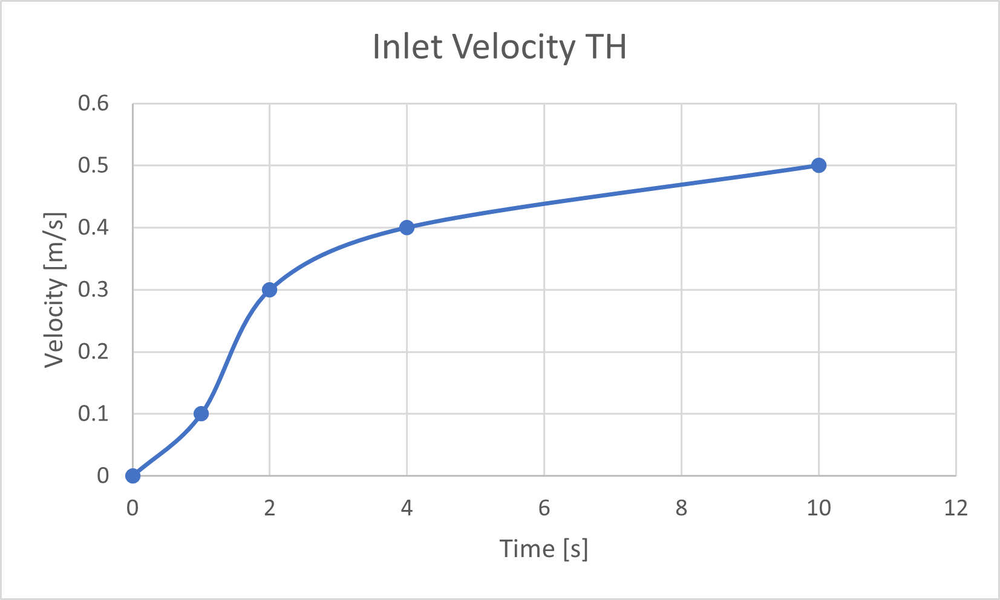
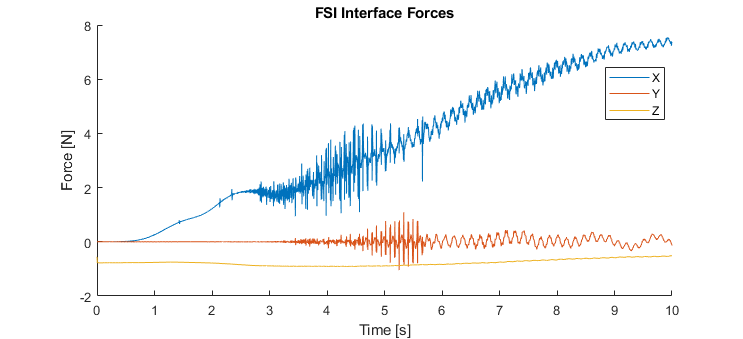
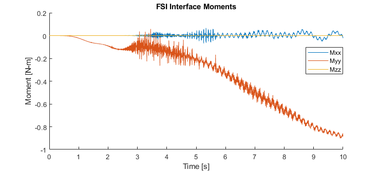
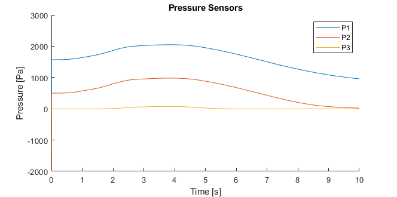
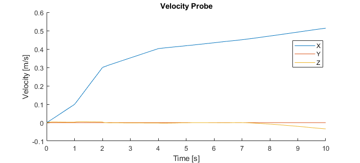
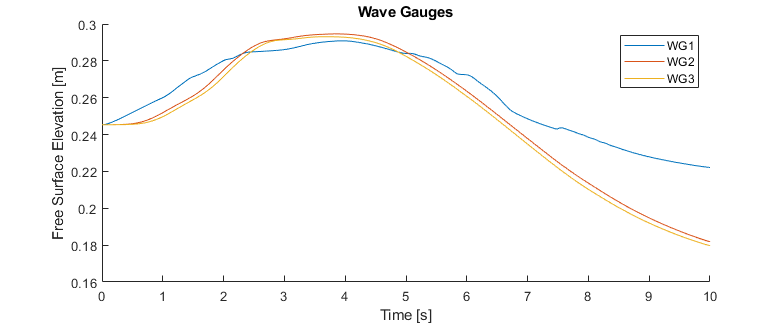

.. _hydro-0003:

Coupled Digital Twin Example 3
============================

Example to demonstrate how to run a coupled OpenSees-OpenFOAM simulation to determine floor loads on a building and then perform
an OpenSees simulation of the building assuming uncertainties in the building properties.

.. figure:: figures/hdro-0003 example.png
   :align: center
   :width: 400
   :figclass: align-center
    Overview of case
	
.. figure:: figures/hdro-0003 example probeLoc.png
   :align: center
   :width: 400
   :figclass: align-center
    Probe locations

    Inlet Velocity Time History (U(t))

Post Processing
-------------------------------------------------------------------

After retrieving the results.zip folder from the Tools and Applications Page of Design Safe.. 
.. figure:: figures/DSToolsAndAppsJobsStatus.PNG
   :align: center
   :width: 400
   :figclass: align-center
    Locating the job files on DesignSafe
   
.. figure:: figures/DSToolsAndAppsJobsStatusFinished.PNG
   :align: center
   :width: 400
   :figclass: align-center
    Once the job is finished, the output files should be available in the directory which the analysis results were sent to
	
.. figure:: figures/DSToolsAndAppsJobsStatusViewFiles.PNG
   :align: center
   :width: 400
   :figclass: align-center
    Locating this directory is easy. 
	
      
.. figure:: figures/downloadResults.PNG
   :align: center
   :width: 400
   :figclass: align-center
    Download the results to look at the VTK files of the analysis. This will include OpenFOAM and OpenSees field data and model geometry

.. figure:: figures/resultsZip.png
   :align: center
   :width: 400
   :figclass: align-center
    Locate the zip folder and extract it to somewhere convenient
	
	
.. figure:: figures/results.png
   :align: center
   :width: 400
   :figclass: align-center
    This is the output of the model

.. figure:: figures/MatlabScriptCopyToLocation.PNG
   :align: center
   :width: 400
   :figclass: align-center
    In the /src/ folder in the hrdo-0003 folder, an example matlab script is provided to look at time history data of the output probes	
	
   

    Forces
   

    Moments

    Pressures

    Velocities

    Wave Gauges

