.. _hdro-0004:

===============================================================================
Tsunami Debris Motion In a Scaled Port Setting - Digital Flume (WU TWB) - MPM
===============================================================================

+---------------+----------------------------------------------+
| Problem files | :github:`Github <Examples/hdro-0004/>`       |
+---------------+----------------------------------------------+

.. contents:: Table of Contents
   :local:
   :backlinks: none

.. _hdro-0004-overview:

Overview
--------

.. figure:: figures/hdro-0004.gif
   :align: center
   :width: 600
   :alt: HydroUQ GUI configured as a digital flume for the Waseda University Tsunami Wave Basin; debris containers, harbor apron, and obstacle rows visible.
   :figclass: align-center

This example contributes to an **international comparative analysis** [Bonus2025]_ of 3D tsunami debris hazards by configuring a **Waseda University Tsunami Wave Basin (WU TWB)** digital flume in **HydroUQ** and running a baseline **MPM** case (ClaymoreUW, multi-GPU). We then **contrast** the MPM results with companion simulations produced using **SPH** (DualSPHysics, GPU) and **Eulerian FVM CFD** (Simcenter STAR-CCM+, multi-CPU/GPU)—focusing on *wave generation, debris motion and spreading, stacking interactions,* and *impact loads* on simplified port obstacles.

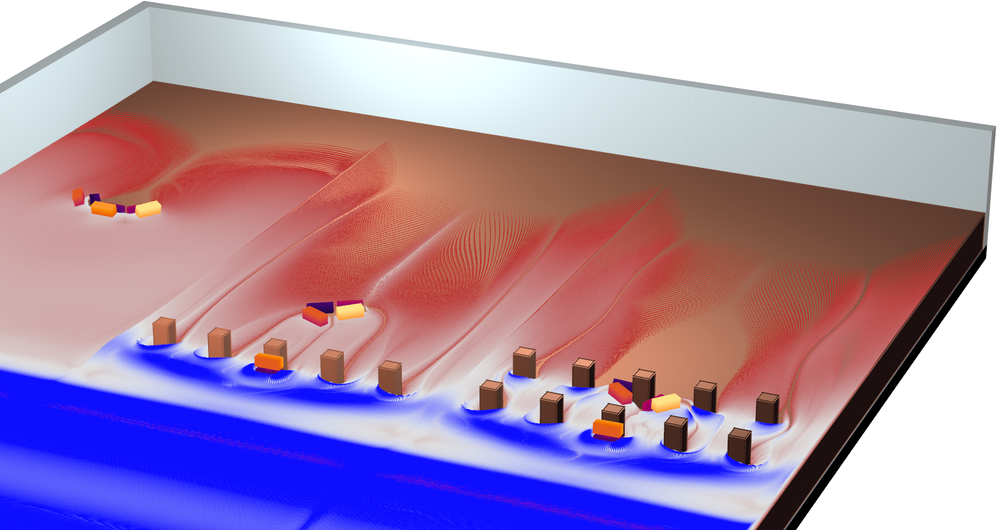

The physical benchmark (1:40 **Froude scaling**) follows **Goseberg et al. (2016b)**: a vacuum-controlled long wave surges over a harbor apron and mobilizes **3-6 hollow shipping-container surrogates** arranged in **1-2 vertical layers** against friction. **Obstacle arrays** (0, 1, or 2 rows of **5 square columns**) are placed **upstream or downstream** of the debris with **width = 0.66x** and **gap = 2.2x** the debris length.

.. figure:: figures/TOKYO_Flume_Schematic_2024.04.05.png
   :align: center
   :width: 600
   :alt: Schematic of WU TWB domain with debris/obstacles layout and probe stations.
   :figclass: align-center

.. note::

   This **HydroUQ** example runs the **MPM** configuration natively. Companion **SPH** and **FVM** results can be **imported** (optional) for side-by-side plots in the **Analysis** section to mirror the comparative study. Acquire said data from: `PRJ-5846 <https://www.designsafe-ci.org/data/browser/public/designsafe.storage.published/PRJ-5846>`_.

.. _hdro-0004-set-up:

Set-Up
------

Step 1: UQ
~~~~~~~~~~

Configure **Forward** sampling to explore structural/material uncertainty under a fixed hydrodynamic signal.

- **Engine**: Dakota
- **Forward Propagation**: Sampling method (e.g., **LHS**) with ``samples`` (e.g., ``20``) and a reproducible ``seed`` (e.g., ``1``).

.. figure:: figures/hdro-0004_UQ.png
   :align: center
   :alt: HydroUQ UQ panel with Dakota Forward selected, sample count and seed set.
   :figclass: align-center

Step 2: GI
~~~~~~~~~~

Set **General Information** and **Units** consistent with experiments (length, time, density, gravity). Record project metadata.

- Structure name: ``Wooden Column @ WU's Tsunami Wave Basin``
- Units: choose a consistent set (e.g., N-m-s or kips-in-s)

.. figure:: figures/hdro-0004_GI.png
   :align: center
   :alt: General Information panel with project name, metadata, and unit selections.
   :figclass: align-center

.. note::

   Keep **GI**, **SIM**, **EVT**, and **FEM** units consistent. Match MPM's length/time scales and OpenSees integration settings (e.g., time step). Verify any force/unit conversions used during load mapping.

Step 3: SIM
~~~~~~~~~~~~~~~~~~~~~~~

The structural model is as follows: a single-story Multi-Degree-of-Freedom system (MDOF, see :ref:`lblMDOFSIM`) replicating a stiff, wooden structural box in the experimental tests.

.. figure:: figures/hdro-0004_Structure.png
   :align: center
   :alt: Schematic of a single-story MDOF structure representing a stiff, wooden structural box undergoing deflection from MPM derived hydrodynamic loading.
   :width: 200
   :figclass: align-center

   Schematic of a single-story MDOF structure representing a stiff, wooden structural box undergoing deflection from MPM derived hydrodynamic loading.

.. note::

   The structure will be represented initially as a **rigid boundary** in MPM to recover local hydrodynamic forces at grid nodes for direct comparison with **load-cell** data. Structural dynamic response is added later by mapping these loads onto an **OpenSees** model defined here in the SIM panel with analysis options set in the FEM panel.

**Uncertain structural properties** (treated as RVs; see Step 7):

- ``w``: Weight. Mean ``144``, stdev ``12``

Bind parameters via setting alphabetic characters in the variable input boxes (e.g., ``w``) so the **RV** panel recognizes and manages them automatically.

.. figure:: figures/hdro-0004_SIM.png
   :align: center
   :alt: SIM panel showing a single story MDOF system with uncertain variables w.
   :figclass: align-center

While not necessary to have, we show the template OpenSees model for your reference. The script generated in the backend by the MDOF module resembles the following, `MDOF.tcl <https://github.com/NHERI-SimCenter/HydroUQ/blob/master/Examples/hdro-0004/src/MDOF.tcl>`_:

.. raw:: html

   

   
Click to expand the OpenSees input file used for this example

.. literalinclude:: src/MDOF.tcl
   :language: tcl
   :linenos:

.. raw:: html

   

Step 4: EVT
~~~~~~~~~~~~~~~~~~~~~~~~~~~~~~~~~~~~~~~~~~~~~~~~

In this walk-through we will give a detailed step-by-step configuration of the MPM EVT module.

**Settings**

Open ``Settings``. Here we set the simulation time, the time step, and the grid resolution, among other pre-simulation decisions.

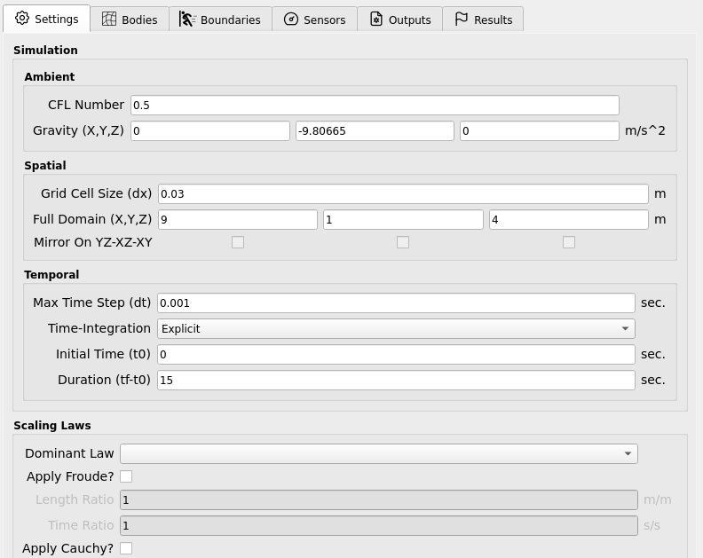

**Bodies**

**Geometry**

- **Fluid geometry**

Open ``Bodies`` / ``Fluid`` / ``Geometry``. Here we set the geometry of the flume's fluid. Note that it is simply a rectangular prism filling the primary flume basin.

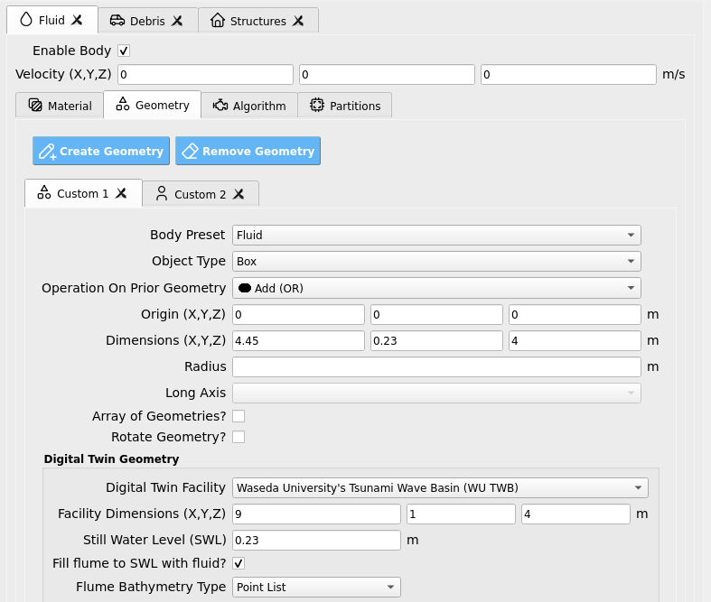

Click ``Create Geometry``. We will now add another fluid geometry to represent the fluid which begins initially in the vacuum chamber reservoir. Define a rectangular prism as shown below.

.. figure:: figures/GUI_Bodies_Fluid_Geometry2.png
   :align: center
   :width: 600
   :alt: Geometry of the vacuum chamber fluid reservoir.
   :figclass: align-center

- **Debris geometry**:

Open ``Bodies`` / ``Debris`` / ``Geometry``. Here we set the debris properties, such as the number of debris, the size of the debris, and the spacing between the debris. Rotation is another option, though not used in this example. We've elected to use an 1 x 2 x 3 grid of debris (longitudinal axis parallel to long-axis of the flume) located in the upstream position from **Goseberg et al. 2016**.

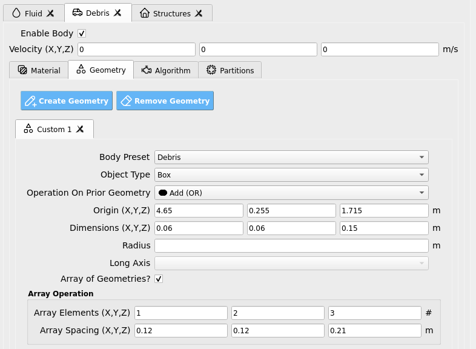

**Material**

- **Fluid material**:

Open ``Bodies`` / ``Fluid`` / ``Material``. Here we set the material properties of the fluid. You may choose to use a realistic bulk modulus value of 2.1 GPa for the water, or you may soften it to 0.21 GPa to accelerate the simulation and reduce numerical stiffness with fairly minimal changes in our final results.

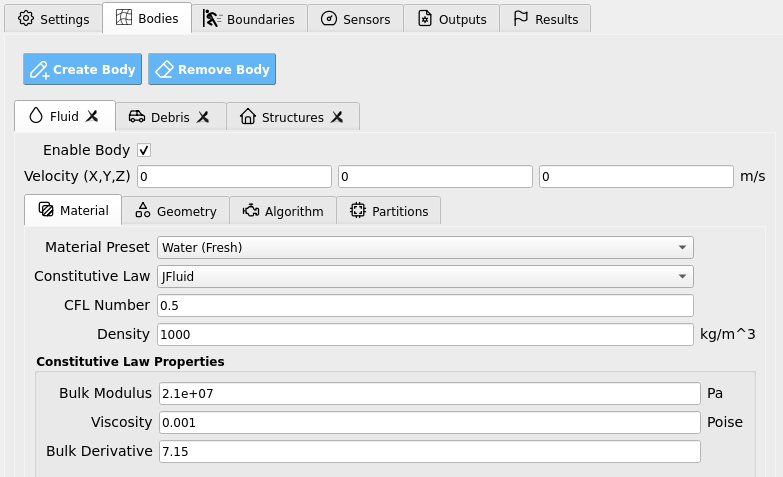

- **Debris material**:

Moving onto the creation of an ordered debris array, we set the debris properties in the ``Bodies`` / ``Debris`` / ``Material`` tab. We will assume debris are made of hollow HDPE plastic, reducing effective density from approximately 987 kg/m3 to 419 kg/m3, as in [Bonus2025]_.

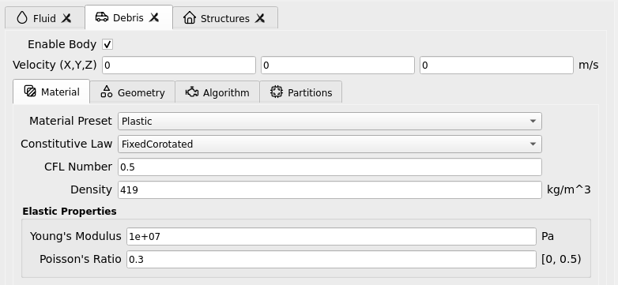

**Algorithm**

Open ``Bodies`` / ``Fluid`` / ``Algorithm``. Here we set the algorithm parameters for the simulation. This is an advanced feature of the MPM module, it is best not to alter it too much. We choose to apply F-Bar antilocking to aid in the pressure field's accuracy on the fluid. The associated toggle must be checked, and the antilocking ratio set to 0.9, loosely. For full bulk modulus water, you may need to increase this value to alleviate numerical stiffness.

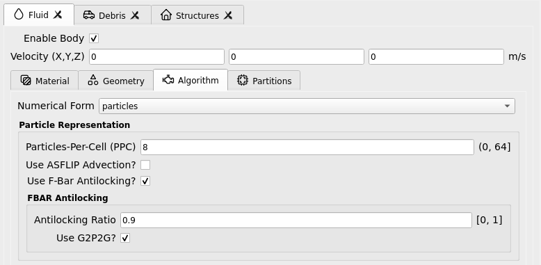

In ``Bodies`` / ``Debris`` / ``Algorithm`` we set debris for compatibility with the fluid as follows: ASFLIP is turned on and F-Bar antilocking is turned off. We keep ASFLIP tuning values at their default of zero as we do not need advanced behavior in this example. Turning on ASFLIP is what allows us to apply friction to the debris particles as they are mobilized across the harbor floor.

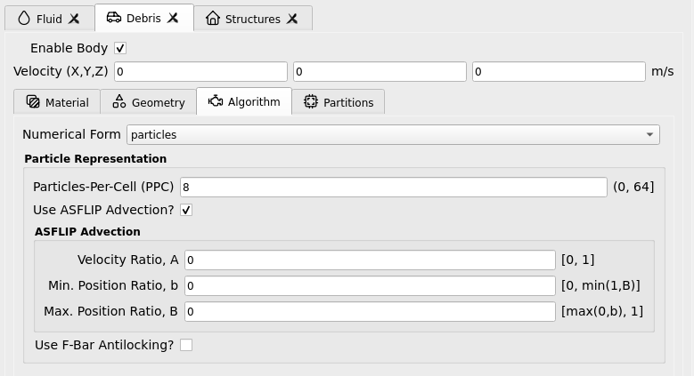

**Partitions**:

Open ``Bodies`` / ``Fluid`` / ``Partitions``. This is an advanced feature of the MPM module which allows us to partition material bodies across hardware devices to optimize simulations. These may be kept as their default values, which have already been set for compatibility on the remote HPC system.

.. figure:: figures/GUI_Bodies_Fluid_Partitions.png
   :align: center
   :width: 600
   :alt: HydroUQ Partitions panel for multi-GPU decomposition.
   :figclass: align-center

Next, ``Bodies`` / ``Debris`` / ``Partitions`` defines a partition where the debris may exist in our flume domain and defines the hardware device (i.e., GPU) that they will be simulated on. Keep this as the default unless you are an advanced user.

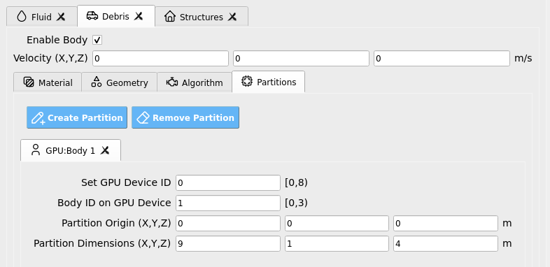

**Structure**:

Finally, open ``Bodies`` / ``Structures``. Uncheck the box that enables this body. We will not model the structure as a deformable MPM material body in this example, instead, we will approximate it as a rigid MPM boundary a few steps from now. After the MPM simulation we will map loads from the boundary to an OpenSees structure for structural analysis, see Steps 3 and 5 for configuration.

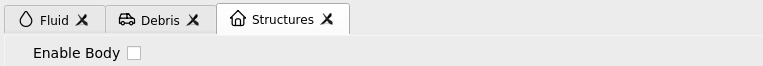
   
   HydroUQ Bodies Structures GUI

**Boundaries**

- **Wave Flume boundary**:

Open ``Boundaries`` / ``Flume Facility``. We will set the flume boundary to be a rigid body, with a fixed separable velocity condition. Bathymetry joint points should be identical to the ones used in ``Bodies`` / ``Fluid`` / ``Geometry``. We also set friction coefficients of ``0.4`` to replicate the experiments, which concerned HDPE plastic debris on rough plywood flooring.

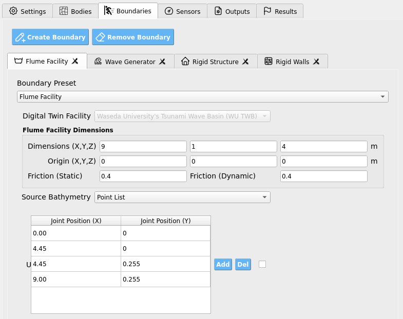

- **Wave Generator**:

Open ``Boundaries`` / ``Wave Generator``. We will use this boundary to define the front-wall of the fluid reservoir vacuum chamber by defining a rectangular prism, as shown below.

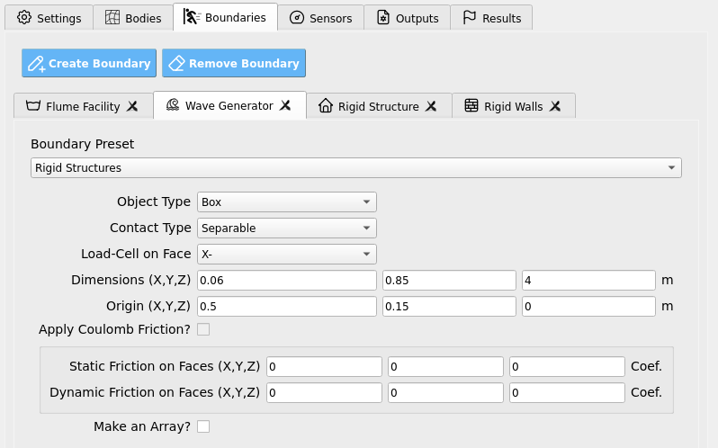

- **Rigid Structure**:

Open ``Boundaries`` / ``Rigid Structure``. This is where we will specify the structure as a boundary condition. By doing so, we can determine the exact loads on the rigid boundary grid-nodes, which automatically map to the model defined in the SIM and FEM tab in Steps 3 and 5 for potentially nonlinear UQ structural response analysis. Note that we elect to define a 2 x 5 array of structures to match one of the cases from **Goseberg et al. 2016**, but other arrangements are available. The front-row, central obstacle is the one which we will perform our structural analysis workflow on later.

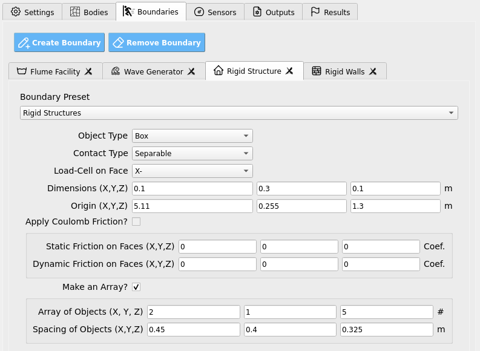

- **Rigid Walls**:

Open ``Boundaries`` / ``Rigid Walls``. Set to encompass the flume domain.

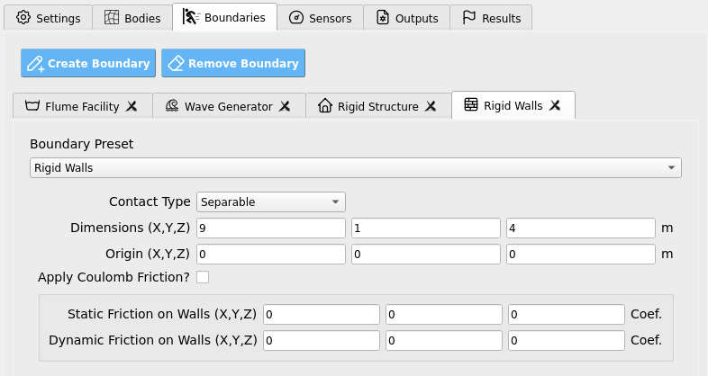

**Sensors**

- **Wave Gauges**:

Open ``Sensors`` / ``Wave Gauges``. Set the ``Use these sensor?`` box to ``True`` so that the simulation will output results for the instruments we set on this page.

Four wave gauges will be defined in the far-field by the vacuum chamber (WG1), mid-field near the harbor quay wall (WG2), above the harbor near the upstream debris (WG3), and amidst the scaled port obstacles (WG4).

Set the origins and dimensions of each wave gauge to encompass at least one grid-cell in each direction as in the table below. To match experimental conditions, we also apply a 30 Hz sampling rate to the wave gauges.

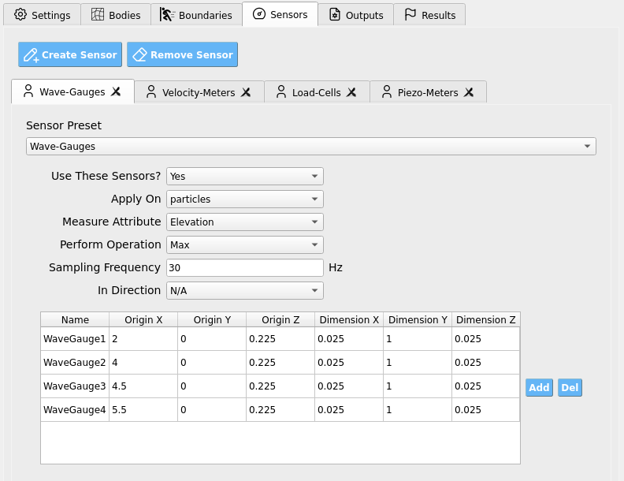

These wave gauges will read all numerical bodies (i.e. particles) within their defined regions at every sampling step and will report the highest elevation value (Position Y) of a contained body as the free-surface elevation at that gauge. The results are written into our sensor results files which we will later analyze.

- **Load Cells**:

Open ``Sensors`` / ``Load Cells``. Set the ``Use these sensor?`` box to ``True`` so that the simulation will output results for the instruments we set on this page. Two load cells are defined so that we may map loads onto two nodes of our OpenSees structural model which we defined in Steps 3 and 5. Output frequency is set to 120 Hz to improve upon experiments by capturing primary load phenomena. Note that the original experiments did not have structure mounted load cells, but rather 30 Hz accelerometers equipped on each debris which were used to infer partial structural loads.

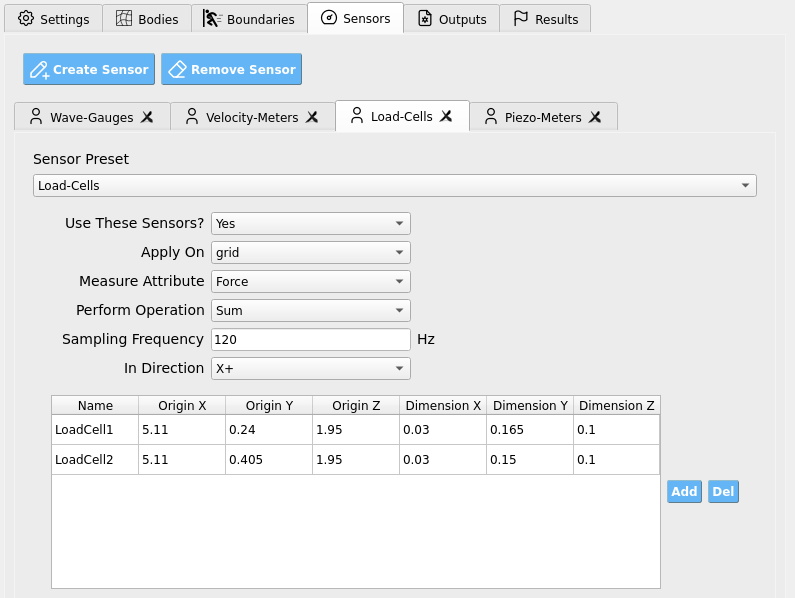

**Outputs**

Open ``Outputs``. Here we set the non-physical output parameters for the simulation, e.g. attributes to save per frame and file extension types. The particle bodies' output frequency is set to 2 Hz, meaning the simulation will output results every 0.5 seconds. This is to save disk space and reduce I/O load, but it may be increased if you wish to make animations (e.g., 10 - 30 Hz). Fill the rest of the data in the figure into your GUI to ensure all your outputs match this example. You may alter output attributes if you are an advanced user familiar with ClaymoreUW attributes and wish to perform more advanced analysis.

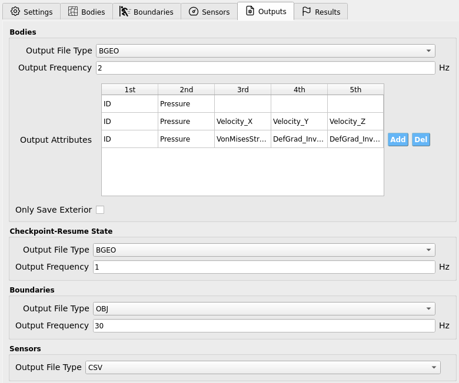

Step 5: FEM
~~~~~~~~~~~~~~~~~~~~~~

This example insofar focused on **hydrodynamic forces** measured on rigid structures. To perform true structural response analysis, map recovered boundary loads to an **OpenSees** model in **SIM** and configure dynamic analysis here as in other HydroUQ tutorials.

**Solver**: OpenSees dynamic analysis. Check:

- Integration step compatible with MPM sensor output interval.
- Algorithm/convergence tolerances suitable for expected nonlinearity.
- Damping model as needed (e.g., Rayleigh).

.. figure:: figures/hdro-0004_FEM.png
   :align: center
   :alt: FEM panel with integration, algorithm, solver, and damping settings.
   :figclass: align-center

Step 6: EDP
~~~~~~~~~~~

Select **Engineering Demand Parameters (EDPs)** to summarize response:

- Peak Floor Acceleration (PFA)
- Root Mean Square Acceleration (RMSA)
- Peak Floor Displacement (PFD)
- Peak Interstory Drift (PID)

.. figure:: figures/hdro-0004_EDP.png
   :align: center
   :alt: EDP panel with standard selections enabled.
   :figclass: align-center

Note that other quantities of interest (QoI) are theoretically obtainable from HydroUQ, if the custom EDP module is configured. E.g.: 

- Wave: max free-surface elevation η(t) at gauges.
- Debris motion: **longitudinal displacement** (forward/back), **lateral spreading angle**, **stack interaction metrics** (contact counts/overturns).
- Loads: **obstacle force time histories** (impact peaks, impulses).

Step 7: RV
~~~~~~~~~~~~~~~~~~~~~

Define distributions for structural RV:

**Structural**

- ``w``: **Normal** (mean ``144``, stdev ``12``)

.. figure:: figures/hdro-0004_RV.png
   :align: center
   :alt: RV panel listing weight (w) with Normal distributions and parameters.
   :figclass: align-center

For future UQ, consider:

- Structure: stiffness variance, eccentricity, multi-story floor variance
- Debris: mass variance, friction coefficients (debris-apron, debris-debris).
- Wave: amplitude/period tolerance relative to vacuum-maker target.
- Obstacles: small misalignment/placement tolerance.

.. _hdro-0004-simulation:

Simulation
----------

This case was executed on **TACC Stampede3** using **2x NVIDIA H100** GPUs on a single node (queue: ``h100``).  
Simulated physical time: **15 seconds**. Wall time: **90 minutes** (allow ample **Max Run Time** in job settings).

.. important::
   Provide generous **Max Run Time**, on the order of 60 to 90 minutes, to complete the run and post-processing before scheduler limits are reached.

.. warning::
   Keep sensor regions, counts, sampling rates, and output frequencies reasonable—excess I/O can dominate runtime.

**Outputs**

- Sensor CSVs (gauges, debris CoM, loads) at your chosen rates.
- Particle/field snapshots (e.g., BGEO/VTK) for visualization/diagnostics.

.. _hdro-0004-analysis:

Analysis
--------

**Accessing Results and Simulation Files**

When the simulation job has been completed, the results and simulation files will be available on the remote system for retrieval or remote post-processing.

Retrieving the ``results.zip``, ``templatedir.zip``, ``workdir.tar.gz``, and ``MPM`` folders will allow you to analyze all of the simulation output (e.g., hydrodynamic, structural, uncertainty quantification).

- ``results.zip``: Contains primary uncertainty quantification output and MPM sensor files. This will be the primary place for analysis.

- ``templatedir.zip``: Contains template and workflow files for the job. This is an important resource for debugging your workflows.

- ``workdir.tar.gz``: Contains the working directories in which each unique simulation was ran. This is where structural response uncertainty is expanded on typically.

- ``MPM``: Contains all the MPM simulation files. Includes the raw particle output frames which can be used to create animations or to perform more advanced post-processing.

The most straightforward way to retrieve the most important files, ``results.zip`` and ``templatedir.zip``, is by clicking the ``GET From DesignSafe`` button in ``HydroUQ``.

.. figure:: figures/getFromDesignSafe.png
   :align: center
   :width: 400
   :figclass: align-center
   
   HydroUQ ``GET From DesignSafe`` button, which opens up a jobs table of all your remote simulations.

Then, right-click on your job (if it is finished) and select ``Retrieve Data``. This will download ``results.zip`` and ``templatedir.zip``. 

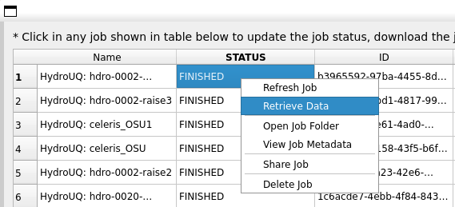
   
   Locating the ``Retrieve Data`` button in the HydroUQ remote jobs table.

HydroUQ will then automatically unzip them into ``results`` and ``templatedir``, which will be located in ``{your_path}/HydroUQ/RemoteWorkDir/tmp.SimCenter``. On most systems, this will be ``~/Documents/HydroUQ/RemoteWorkDir/tmp.SimCenter``, but you can check by clicking on ``Files`` / ``Preferences`` on the upper-left corner of HydroUQ.

To retrieve ``workdir.tar.gz`` and ``MPM``, there are two approaches: 

(1) You can right-click on your job within HydroUQ and select ``Open Job Folder`` to be taken directly to the Design Safe web-page displaying all remote files. 

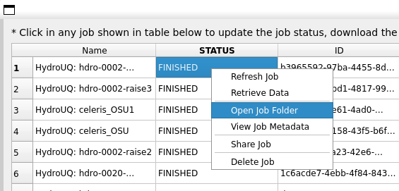
   
   Locating the ``Open Job Folder`` button in the HydroUQ remote jobs table.

(2) You can manually navigate to the designsafe-ci.org website. For the latter, login and go to ``Upper-right Drop-down`` / ``Job Status``.

.. figure:: figures/DSToolsAndAppsJobsStatus.png
   :align: center
   :width: 600
   :figclass: align-center
   
   Locating the job files on DesignSafe

Check if the job has finished in the central vertical drawer by refreshing the page. If it has, click ``View Details``.  

.. figure:: figures/DSToolsAndAppsJobsStatusFinished.png
   :align: center
   :width: 600
   :figclass: align-center
   
   Job status is finished on DesignSafe

Once the job is finished, the output files should be available in the directory which the analysis results were sent to

Find the files by clicking ``View Output``. 
	
.. figure:: figures/DSToolsAndAppsJobsStatusViewFiles.png
   :align: center
   :width: 600
   :figclass: align-center
   
   Viewing the job files on DesignSafe

After navigating to your job folder by one of two ways, it is time to move files for processing. Move important files to somewhere in ``My Data/`` for easier processing. Use the extractor tool available on DesignSafe to unzip the ``results.zip``, ``workdir.tar.gz``, and ``templatedir.zip`` folders natively on DesignSafe. 

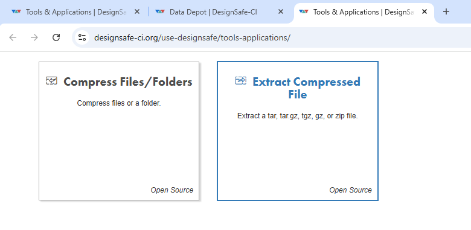
    
   Extracting the ``results.zip`` folder on DesignSafe

Alternatively, you may directly download the zipped folders to your PC, which will require you to use the DesignSafe zip tool on the ``MPM`` folder prior.

.. figure:: figures/downloadResults.png
   :align: center
   :width: 600
   :figclass: align-center

   Download button on DesignSafe shown in red

Locate the downloaded zip folders and extract them somewhere convenient. The HydroUQ local or remote work directory on your computer is a good option.

.. warning::
   
   Files in the HydroUQ local and remote working directories may be erased if another simulation is set up in HydroUQ, so keep a backup if you wish to maintain the files.

Particle geometry files often have a ``BGEO`` extension and are located in the ``MPM`` folder. Open with Side FX Houdini Apprentice (free to use) to look at MPM results in high-detail, or use the PartIO library.

HydroUQ's sensor/probe/instrument output is available in ``{your_path}/HydroUQ/RemoteWorkDir/tmp.SimCenter/results/`` as ``CSV`` files. You may process these files as you wish, most opt to use custom Python scripts or Excel due to their simplicity. 

.. note::
   
   For convenience, HydroUQ also includes basic plotting of all sensors files in the ``EVT`` / ``Results`` tab. Click ``Post-Process Sensors``, configure the drop-down boxes for the sensor you wish to view, and then click ``Plot``.

Plotting the wave gauges shows the development of a tsunami-like wave as it propagates from the vacuum-chamber over the harbor bathymetry.

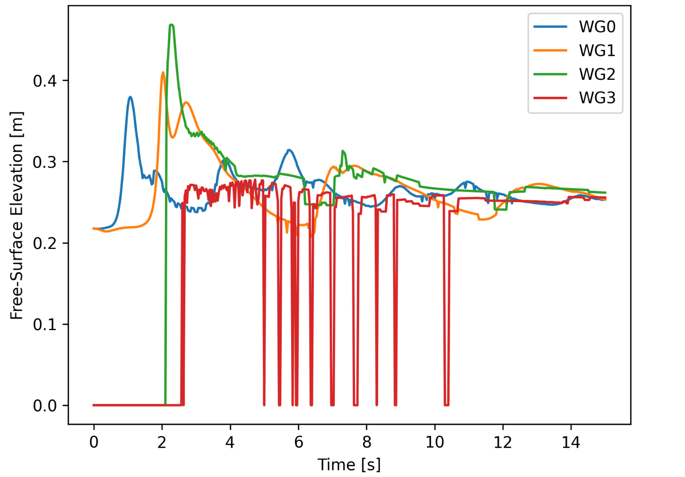

   Simulated free-surface elevations at three wave gauges in MPM.

Load-cell data shows an initially high peak force from debris impact, followed by some damming forces and eventually just hydrodynamic drag.

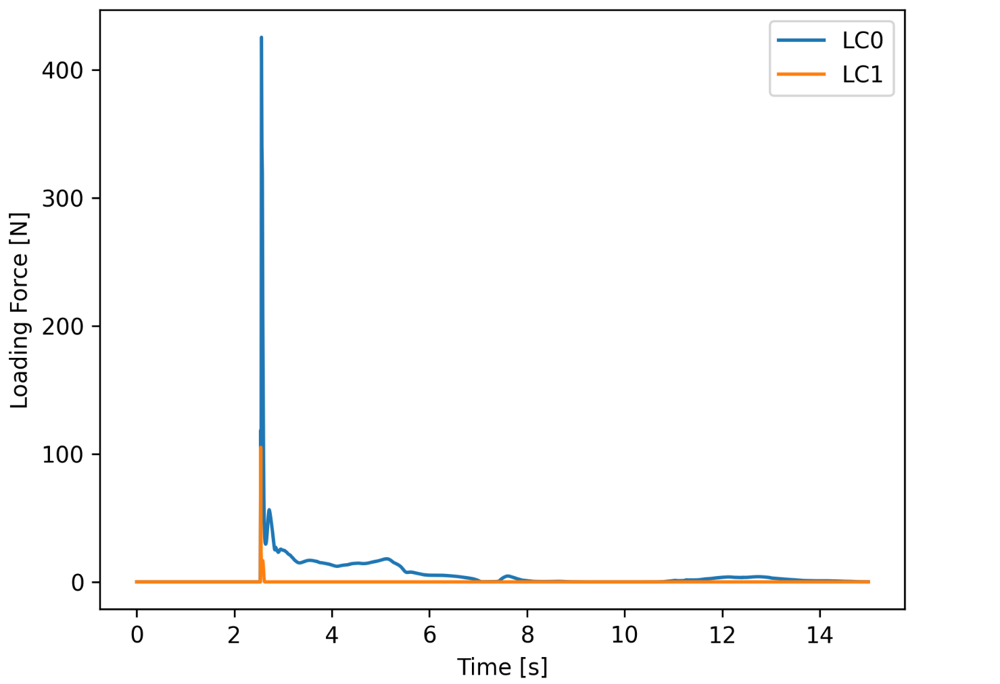

   Simulated load-cell forces in MPM. These are later mapped onto an OpenSees structure for dynamic response analysis.

While this example concerned a quick-to-run simulation with around a million particles at a grid-resolution of 0.1 meters, higher resolution cases with 100 million particles and 0.01 meter cells are possible on remote HPC systems, including Stampede3 and Lonestar6. Below we show simulation results at these specifications from [Bonus2025]_ compared against experiments to demonstrate the benefit of increased resolution. These simulations took 24 hours to complete.

.. note::

   This **HydroUQ** example runs the **MPM** configuration natively. Companion **SPH** and **FVM** results can be **imported** (optional) for side-by-side plots in the **Analysis** section to mirror the comparative study. Acquire said data from: `PRJ-5846 <https://www.designsafe-ci.org/data/browser/public/designsafe.storage.published/PRJ-5846>`_.

**Wave generation (η at gauges)**

.. figure:: figures/Benchmark4_Wave_Gauge_Plots4_2024.04.27.png
   :align: center
   :width: 600
   :alt: Free-surface elevation at multiple gauges; MPM vs SPH vs FVM vs experiments.
   :figclass: align-center

**Debris kinematics**

.. figure:: figures/Benchmark4_Debris_Displacement_BoxAndWhiskers_2024.04.27.png
   :align: center
   :width: 600
   :alt: Longitudinal displacement statistics of debris; MPM vs SPH vs FVM vs experiments.
   :figclass: align-center

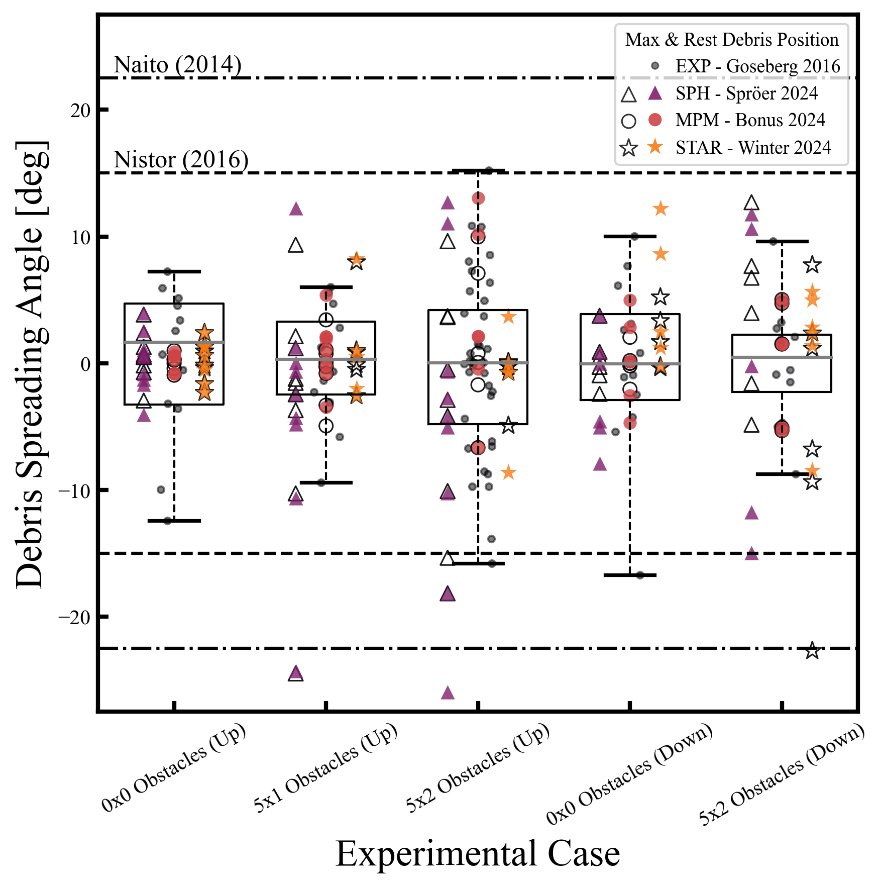

**Obstacle loading**

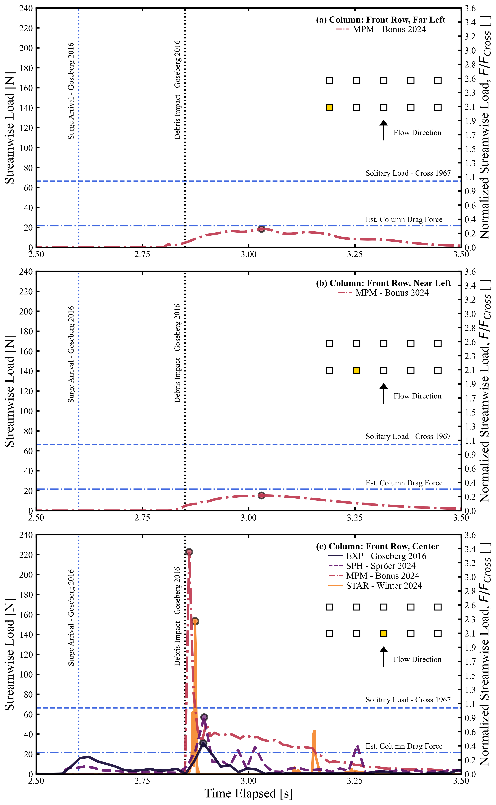

**Structural Analysis**

Returning to our primary HydroUQ workflow, which concerns uncertainty in structural response, we may now view the final results in the **RES** tab. Clicking ``Summary`` on the top-bar, a statistical summary of results is shown below:

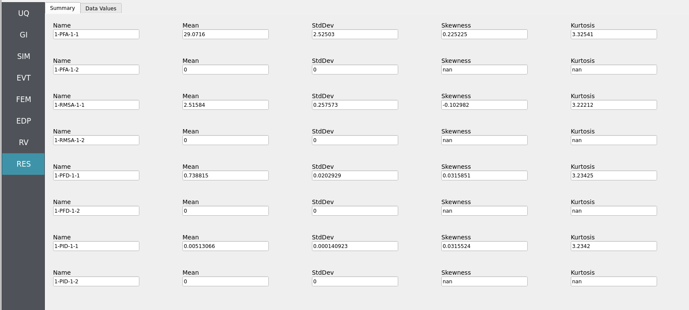

Clicking ``Data Values`` on the top-bar shows detailed histograms, cumulative distribution functions, and scatter plots relating the dependent and independent variables:

.. note:: 
   In the **Data Values** tab, left- and right-click column headers to change plot axes; selecting a single column with both clicks displays frequency and CDF plots.

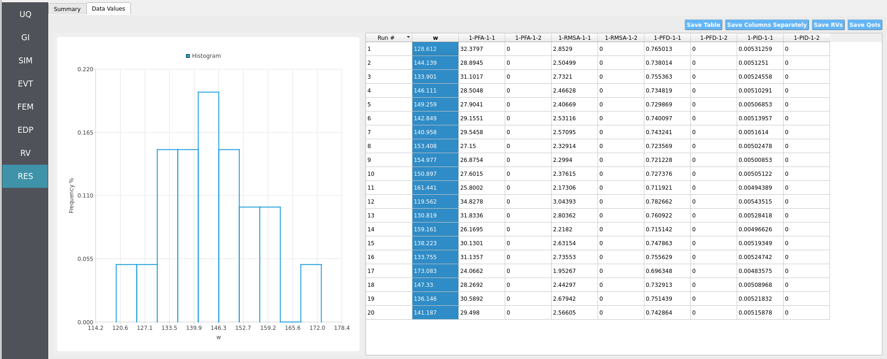

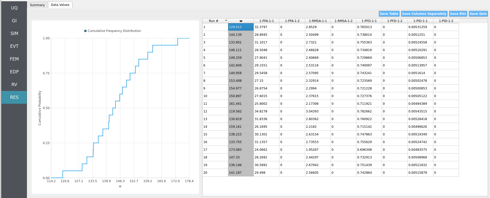

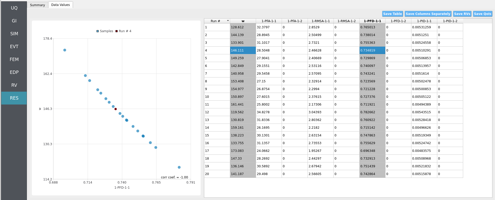

.. note::
   Use **consistent Froude similitude scaling** when comparing numerical simulations, experiments, and full-scale scenarios. For cross-method comparisons, adopt **identical debris footprints**, **friction models**, **probe placement**, and other pertinent parameters to reduce bias.

For more advanced analysis, export results as a CSV file by clicking ``Save Table`` on the upper-right of the application window. This will save the independent and dependent variable data. I.e., the **Random Variables** you defined and the **Engineering Demand Parameters** determined from the structural response per each simulation.

To save your simulation configuration with results included, click ``File`` / ``Save As`` and specify a location for the HydroUQ JSON input file to be recorded to. You may then reload the file at a later time by clicking ``File`` / ``Open``. You may also send it to others by email or place it in an online repository for research reproducibility. This example's input file is viewable at :ref:`hdro-0004-reproducibility`.

To directly share your simulation job and results in HydroUQ with other DesignSafe users, click ``GET from DesignSafe``. Then, navigate to the row with your job and right-click it. Select ``Share Job``. You may then enter the DesignSafe username or usernames (comma-separated) to share with. 

.. important::
   Sharing a job requires that the job was initially ran with an ``Archive System ID`` (listed in the ``GET from DesignSafe`` table's columns) that is **not** ``designsafe.storage.default``. Any other ``Archive System ID`` allows for sharing with DesignSafe **members on the associated project**. See :ref:`lbl-jobs` for more details. 

.. _hdro-0004-conclusions:

Conclusions
-----------

This **WU TWB digital flume** example shows how HydroUQ can stage a **state-of-the-art MPM** debris simulation and **compare** against **SPH** and **FVM** counterparts for a **1:40** scaled port setting. Across wave generation, debris motion/spreading, stacking, and obstacle impacts, each method exhibits **distinct strengths**. The shared benchmark and open-sourced digital twins enable **transparent cross-interrogation** and lay groundwork for **statistical synthesis** across methods and experiments.

.. _hdro-0004-references:

References
----------

.. [Goseberg2016] Goseberg, N., Stolle, J., Nistor, I., & Shibayama, T. (2016). Experimental analysis of debris motion due the obstruction from fixed obstacles in tsunami-like flow conditions. Coastal Engineering, 118, 35-49. https://doi.org/https://doi.org/10.1016/j.coastaleng.2016.08.012

.. [Goseberg2023] Goseberg Nils and Stolle, J. and N. I. and S. T. and S. F. and K. C. (2023). Experimental dataset describing the debris motion due to the obstruction from fixed obstacles in tsunami-like flow conditions. https://doi.org/10.24355/dbbs.084-202303091524-0

.. [Bonus2023Dissertation] Bonus, Justin (2023). "Evaluation of Fluid-Driven Debris Impacts in a High-Performance Multi-GPU Material Point Method." PhD thesis. University of Washington, Seattle.

.. [Bonus2025] Justin Bonus, Felix Spröer, Andrew Winter, Pedro Arduino, Clemens Krautwald, Michael Motley, Nils Goseberg (2025). "Tsunami Debris Motion and Loads in a Scaled Port Setting: Comparative Analysis of Three State-of-the-Art Methods Against Experiments." Coastal Engineering. Volume 197. https://doi.org/10.1016/j.coastaleng.2024.104672.

.. [Bonus2025ClaymoreUW] Bonus, J., & Arduino, P. (2025). ClaymoreUW. Zenodo. https://doi.org/10.5281/zenodo.15128706

.. _hdro-0004-reproducibility:

Reproducibility
---------------

- Random seed(s): ``1`` (if using Forward samples)
- App version: HydroUQ v4.2.0 (or current)
- Solvers:
  - **MPM**: ClaymoreUW (multi-GPU)
  - **SPH**: DualSPHysics (GPU) — *imported for comparison*
  - **FVM**: Simcenter STAR-CCM+ (multi-CPU/GPU) — *imported for comparison*
- Hardware (example): TACC Stampede3, **2x H100** (single node)
- Simulated time: **15 s**; Wall time: **1 h 30 m**
- Sensors: gauges (η), debris CoM, obstacle load-cells; outputs at moderate rates
- Input: The HydroUQ input file is as follows: `input.json <https://github.com/NHERI-SimCenter/HydroUQ/blob/master/Examples/hdro-0004/src/input.json>`_ , is used:
.. raw:: html

   

   
Click to expand the HydroUQ input file used for this example

.. literalinclude:: src/input.json
   :language: json
   :linenos:

.. raw:: html

   

.. .. contents:: Table of Contents
..    :local:
..    :backlinks: none

.. .. _hdro-0004-overview:

.. Outline
.. -------

.. .. figure:: figures/hdro-0004.gif
..    :align: center
..    :width: 600
..    :figclass: align-center

..    GUI for the Waseda University Tsunami Wave Basin (WU TBW).

.. Example to demonstrate how to run a MPM simulation to determine loads on an array of port buildings during a tsunami with respect to debris impacts and damming. Replicates at low resolution the comparative analysis paper results of [Bonus2025]_.

.. .. figure:: figures/TOKYO_MPM_ObstacleEffect_AllCases_y0.25to0.375_Persp_2024.04.03.png
..    :align: center
..    :width: 600
..    :figclass: align-center

..    Simulation of three MPM tsunami debris simulations on zero, one, and two rows of five obstacles replicating a port-setting at a Froude scale of 1:40.

.. Stochastic experiments were performed at the Waseda University Tsunami Wave Basin (WU TBW) flume. Here we replicate it in a simple digital twin with HydroUQ's MPM module. The flume is 4 meters wide (from X=-2m to X=2 m), 1 meter tall (Z=0.0m to Z=1.0m), and 9 meters long (Y=0.0m to Y=9.0m). The case is initialized with a still water level of 0.23 meters. 

.. .. figure:: figures/TOKYO_Flume_Schematic_2024.04.05.png
..    :align: center
..    :width: 600
..    :figclass: align-center
    
..    Schematic of Waseda University's Tsunami Wave Basin (WU TWB) and sensor locations

.. "Smart" debris were used in the experiments, shown below. In MPM they are modeled as fixed-corotated debris.

.. .. figure:: figures/B4_Debris_Picture.PNG
..    :align: center
..    :width: 600
..    :figclass: align-center
    
..    Smart debris used in experiments

.. .. _hdro-0004-setup:

.. Set-Up
.. ----------

.. To configure the digital twin case in HydroUQ, the following settings will be specified.

.. .. _hdro-0004-simulation:

.. Simulation
.. ----------

.. Simulation Time: 6 seconds - Ran on TACC Lonestar6, 56 processors, 3 NVIDIA A100 GPUs, 1 node -> Real Time: 1hr, 20 minutes

.. The case can be run for as long as desired, but mind that the longer the case runs, the longer the postprocessing routines will be.

.. In order to retrieve results from the analysis, the analysis must complete and postprocess the model output files into a VTK format before the end of the allotted submission time. 

.. Provide a large amount of time for the 'Max Run Time' field in HydroUQ when submitting a job to ensure the model completes before the time allotted runs out!

.. Be aware that the smaller the OpenFOAM Outputs and OpenSees Outputs 'Time Interval' value is, the longer the post-processing of the case will take after analysis has been completed, and the larger the results.zip folder will be. 

.. .. _hdro-0004-analysis:

.. Analysis
.. --------

.. Comparative results between the Material Point Method (MPM, HydroUQ), Smoothed Particle Hydrodynamics (SPH, DualSPHysics), and the Finite Volume Method (FVM, STAR-CCM+).:
	

.. .. figure:: figures/Benchmark4_Wave_Gauge_Plots4_2024.04.27.png
..    :align: center
..    :width: 600
..    :figclass: align-center
   
..    Comparative results for wave gauge free-surface measurements

.. .. figure:: figures/Benchmark4_Debris_Displacement_BoxAndWhiskers_2024.04.27.png
..    :align: center
..    :width: 600
..    :figclass: align-center
   
..    Comparative results for debris displacement

.. .. figure:: figures/Benchmark4_Debris_Spread_BoxAndWhiskers_2024.04.27.png
..    :align: center
..    :width: 600
..    :figclass: align-center
   
..    Comparative results for debris spreading angle

.. .. figure:: figures/Benchmark4_Obstacle_Load_Plots3_2024.04.27.png
..    :align: center
..    :width: 600
..    :figclass: align-center
   
..    Comparative results for debris-structure loads

