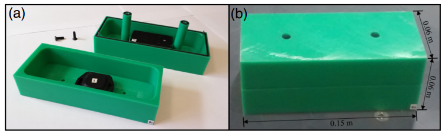
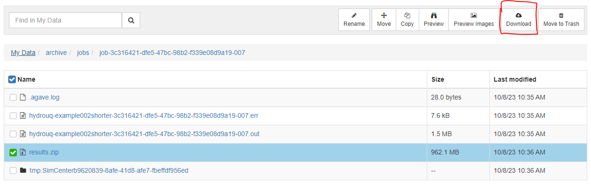

.. _hdro-0004:

===============================================================================
Tsunami Debris Motion Through a Scaled Port Setting - WU TWB Digital Twin - MPM
===============================================================================

+---------------+----------------------------------------------+
| Problem files | :github:`Github <Examples/hdro-0004/>`       |
+---------------+----------------------------------------------+

.. contents:: Table of Contents
   :local:
   :backlinks: none

.. _hdro-0004-overview:

Outline
-------

Example to demonstrate how to run a MPM simulation to determine loads on an array of port buildings during a tsunami with respect to debris impacts and damming. After, we perform
an OpenSees simulation of one building assuming uncertainties in the building properties.

The Waseda University Tsunami Wave Basin (WU TBW) flume is 4 meter wide (from X=-2m to X=2 m), 1 meter tall (Z=0.0m to Z=1.0m), and 9 meters long (Y=0.0m to Y=9.0m). 

The case is initialized with a still water level of 0.23 meters. 

Results for free surface, velocity, and pressure, as well as structural load forces are output at a specified interval to match experimental instruments. 

.. figure:: figures/TOKYO_BoreFrontImage_Debris3_o5x1_Frame20_29072023.png
   :align: center
   :width: 600
   :figclass: align-center

   Simulation of MPM debris impacts on one row of five obstacles

.. figure:: figures/B4_Flume_Schematic.png
   :align: center
   :width: 600
   :figclass: align-center
    
   Schematic of the flume and sensor locations

	

    
   Smart debris used in experiments

.. _hdro-0004-simulation:

Simulation
----------

Simulation Time: 6 seconds - Ran on TACC Lonestar6, 56 processors, 3 NVIDIA A100 GPUs, 1 node -> Real Time: 1hr, 20 minutes

The case can be run for as long as desired, but mind that the longer the case runs, the longer the postprocessing routines will be.

In order to retrieve results from the analysis, the analysis must complete and postprocess the model output files into a VTK format before the end of the allotted submission time. 

Provide a large amount of time for the 'Max Run Time' field in HydroUQ when submitting a job to ensure the model completes before the time allotted runs out!

Be aware that the smaller the OpenFOAM Outputs and OpenSees Outputs 'Time Interval' value is, the longer the post processing of the case will take after analysis has completed, and the larger the results.zip folder will be. 

.. warning::
   Use caution when requesting sensors and using high sampling rates. Only ask for what you need, or you will end up will massive amounts of data.

.. _hdro-0004-analysis:

Analysis
--------

Retrieving the results.zip folder from the Tools and Applications Page of Design Safe.. 

.. figure:: figures/DSToolsAndAppsJobsStatus.PNG
   :align: center
   :width: 600
   :figclass: align-center
   
   Locating the job files on DesignSafe

Check if the job has finished. If it has, click 'More info'.  

.. figure:: figures/DSToolsAndAppsJobsStatusFinished.PNG
   :align: center
   :width: 600
   :figclass: align-center
   
   Once the job is finished, the output files should be available in the directory which the analysis results were sent to

Find the files by clicking 'View'. 
	
.. figure:: figures/DSToolsAndAppsJobsStatusViewFiles.PNG
   :align: center
   :width: 600
   :figclass: align-center
   
   Locating this directory is easy. 
	

Move the results.zip to somewhere in My Data/. Use the Extractor tool available on DesignSafe.  Unzip the results.zip folder. 

.. figure:: figures/extractonDS.PNG
   :align: center
   :width: 600
   :figclass: align-center
    
	
OR Download the results.zip folder to your PC and unzip to look at the model results. 

   
   Download the results to look at the VTK files of the analysis. This will include OpenFOAM and OpenSees field data and model geometry

Extract the Zip folder either on DesignSafe or on your local machine. You will need Paraview to view the model data.

.. figure:: figures/resultsZip.png
   :align: center
   :width: 600
   :figclass: align-center
   
   Locate the zip folder and extract it to somewhere convenient

.. The results folder should look something like this. 
	
.. .. figure:: figures/results.png
..    :align: center
..    :width: 600
..    :figclass: align-center
   
..    This is the output of the model
	
.. Paraview files have a .PVD extension. Open VTK/Fluid.vtm.series to look at OpenFOAM results.
.. Open OpenSeesOutput.pvd to look at OpenSees results.

.. .. figure:: figures/Paraview.PNG
..    :align: center
..    :width: 600
..    :figclass: align-center
   
..    This is the model output data as seen from ParaView

.. OpenSees Displacements And Reactions 

.. .. figure:: figures/TipDisplacement.png
..    :align: center
..    :width: 600
..    :figclass: align-center
   
..    This is the model output data as seen from ParaView

.. .. figure:: figures/ReactionForces.png
..    :align: center
..    :width: 600
..    :figclass: align-center
   
..    This is the model output data as seen from ParaView

.. OpenFOAM probe and function object output is available in results/postProcessing/.

.. OpenFOAM output is messy. An example Matlab script is provided in the /src/ directory to post process the OpenFOAM output for this particular case and output. 
.. This file can be modified to work for any case. The names of the data folders will need to be changed according to the name of the probe given in HydroUQ.

.. .. figure:: figures/MatlabScriptCopyToLocation.PNG
..    :align: center
..    :width: 600
..    :figclass: align-center
..     In the /src/ folder in the hdro-0004 folder, an example matlab script is provided to look at time history data of the output probes	
	
	
.. OpenFOAM Calculated Story Forces

.. .. figure:: figures/storyForces.png
..    :align: center
..    :width: 600
..    :figclass: align-center
   
..    Story Forces	
	
.. OpenFOAM Calculated Coupled Interface Forces

.. .. figure:: figures/Forces.png
..    :align: center
..    :width: 600
..    :figclass: align-center
   
..    Forces
 
.. OpenFOAM Calculated Coupled Interface Moments
 
.. .. figure:: figures/Moments.png
..    :align: center
..    :width: 600
..    :figclass: align-center
   
..    Moments

.. OpenFOAM Calculated Pressure Probe Values

.. .. figure:: figures/Pressures.png
..    :align: center
..    :width: 600
..    :figclass: align-center
   
..    Pressures

.. OpenFOAM Calculated Velocity Probe Values

.. .. figure:: figures/Velocities.png
..    :align: center
..    :width: 600
..    :figclass: align-center
..     Velocities

.. OpenFOAM Calculated Free Surface Values 

.. .. figure:: figures/WaveGauges.png
..    :align: center
..    :width: 600
..    :figclass: align-center
   
..    Wave Gauges

.. _hdro-0004-references:

References
----------

