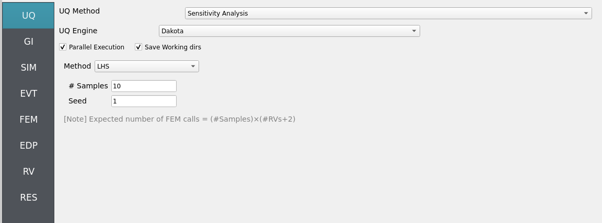
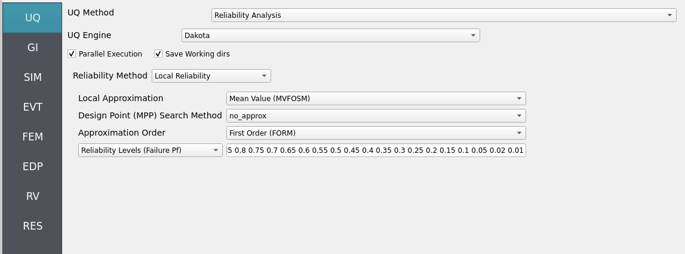
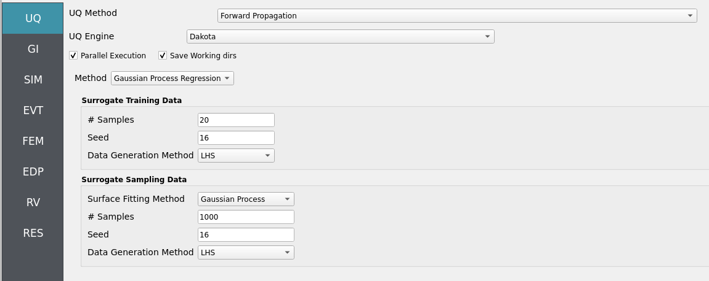
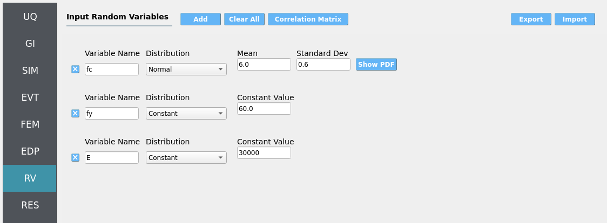
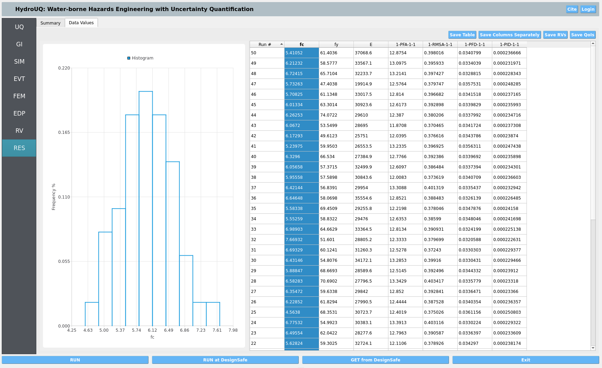
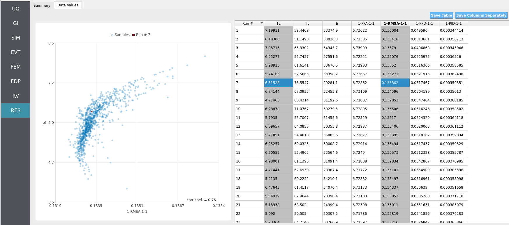

.. _hdro-0005:

====================================================================================
Stochastic Wave Loading on a Frame Structure - JONSWAP Spectra
====================================================================================

+---------------+----------------------------------------------+
| Problem files | :github:`Github <Examples/hdro-0005/>`       |
+---------------+----------------------------------------------+

.. contents:: Table of Contents
   :local:
   :backlinks: none

.. _hdro-0005-overview:

Overview
--------

.. figure:: figures/hdro-0005_WaveTimeSeries.png
   :align: center
   :width: 600
   :alt: Stochastic JONSWAP wave spectra produced in HydroUQ, applying the welib Python package.
   :figclass: align-center

This local workflow example uses **HydroUQ** to apply basic uncertainty quantification methods— **Forward**, **Sensitivity**, **Reliability**, and **Surrogate**—to the response of a simple structure subjected to stochastic wave loading drawn from a **JONSWAP** spectrum. 

.. warning::

   The JONSWAP spectra is limited in its applicability. It was semi-empirically developed based on data from field measurements in the North Sea. In this example, we imagine it as being applied to an off-shore structure in the North Atlantic, perhaps off the coast of Maine or Norway during appropriate sea-states. Ultimately JONSWAP is a placeholder spectra that advanced users can replace with their own.

.. note::

   Units must be used consistently across **GI**, **SIM**, **EVT**, and **FEM** panels. If not otherwise specified, adopt your project's standard (e.g., kips-in-s or N-m-s) and keep all inputs consistent. We leave this double-checking to the user as an exercise in better understanding the OpenSees structural and JONSWAP wave spectra models.

.. _hdro-0005-set-up:

Set-Up
------

Step 1: UQ
~~~~~~~~~~

Configure UQ to explore structural/material and loading uncertainties.

- **Engine**: Dakota  
- **Forward Propagation** Sample method (e.g., **LHS**) with ``samples`` (e.g., ``40``) and ``seed`` (e.g., ``1``) for repeatability.

.. figure:: figures/hdro-0005_UQ.png
   :align: center
   :alt: HydroUQ UQ panel with Dakota engine; Forward methods selected with seed = 1.
   :figclass: align-center

- **Sensitivity**: choose a sampling method (e.g., **Monte-Carlo** or **Latin Hyper Cube**) to aid in ranking influence of ``fc``, ``fy``, and ``E``.  

- **Reliability**: choose a suitable method (e.g., **FORM/SORM** or importance sampling) and define a limit state (e.g., peak drift or member demand ratio).

- **Surrogate**: choose a Gaussian process regression (GPR) or polynomial chaos expansion (PCE) model to build a reduced-order model for efficient uncertainty quantification.

Step 2: GI
~~~~~~~~~~

Set **General Information** and **Units**. Ensure that length/time units are consistent with the JONSWAP parameters (``Tp``, ``dt``, ``T``) and the solver's integration settings.

- Project name: ``hdro-0005``  
- Location/metadata: optional  
- Units: select your consistent set (e.g., kips-in-s or N-m-s)

.. figure:: figures/hdro-0005_GI.png
   :align: center
   :alt: General Information panel showing project name, metadata, and unit selections.
   :figclass: align-center

Step 3: SIM
~~~~~~~~~~~

The structural model is as follows: a **2D, 3-DOF OpenSees portal frame** in OpenSees, :ref:`lblOpenSeesSIM`. 

.. figure:: figures/hdro-0005_Structure.png
   :align: center
   :alt: Schematic of a 2D three-degree-of-freedom portal frame subjected to horizontal wave-induced drag forces along the column line, with parameters taken from a JONSWAP spectrum.
   :width: 600
   :figclass: align-center

   2D 3-DOF portal frame under stochastic wave loading (JONSWAP)

For the OpenSees generator the following model script, `Frame.tcl <https://github.com/NHERI-SimCenter/HydroUQ/blob/master/Examples/hdro-0005/src/Frame.tcl>`_ , is used:

.. raw:: html

   

   
Click to expand the OpenSees input file used for this example

.. literalinclude:: src/Frame.tcl
   :language: tcl
   :linenos:

.. raw:: html

   

.. note::
   
   The first lines containing ``pset`` in an OpenSees tcl file will be read by the application when the file is selected. The application will autopopulate the random variables in the **RV**  panel with these same variable names. 

.. figure:: figures/hdro-0005_SIM.png
   :align: center
   :alt: SIM panel referencing an OpenSees model file (Frame.tcl) with fields for material properties set as variable names fc, fy, and E.
   :figclass: align-center

These variable names (``fc``, ``fy``, ``E``) are **recognized** in ``Frame.tcl`` due to use of the `pset` command instead of `set`. This is so that **RV** picks them up automatically. You can try adding new **RV** parameters in the same way.

**Uncertain properties** (treated as RVs; see Step 7):

- ``fc``: mean ``6``, stdev ``0.06``  
- ``fy``: mean ``60``, stdev ``0.6``  
- ``E``: mean ``30000``, stdev ``300``

Step 4: EVT
~~~~~~~~~~~

**Load Generator**: **Stochastic Waves - JONSWAP Spectra**.  

Set hydrodynamic parameters:

- ``H = 8.1`` (significant wave height)  
- ``Tp = 12.7`` (peak period)  
- ``dt = 1`` (time step)  
- ``T = 300`` (duration)  
- ``Seed = 1`` (random seed)

**Force model**: we assume a monopile-like structure under Wheeler-corrected Morison drag. The monopile possesses a coefficient of drag (``Cd``) and drag area (``Ad``) of:

- ``Cd = 2.1`` (coefficient of drag)
- ``Ad = 1`` (drag area)

If you treat wave descriptive parameters as deterministic in this example, keep them as literals; otherwise enter alphabetic variable names to expose them in **RV**. You may try changing the peak period or significant wave height, for instance, to a random variable.

.. figure:: figures/hdro-0005_EVT.png
   :align: center
   :alt: EVT panel with JONSWAP selected, H=8.1, Tp=12.7, dt=1, T=300, seed=1, and drag model parameters Cd=2.1, Ad=1.
   :figclass: align-center

.. important::

   Two recorders were requested in the EVT panel: one will map its recorded loads to the base node of the OpenSees structure defined in the SIM and FEM panels, whereas the other will map loads to the remaining node. More recorders can be requested to increase loading resolution and extrapolate to multi-story structures if your designated OpenSees model is equipped with more mappable nodes.

Step 5: FEM
~~~~~~~~~~~

**Solver**: OpenSees dynamic analysis. Defaults are usually sufficient; verify the following are consistent with your units, structural model, and anticipated load pattern:

- Integration/time-step tolerance compatible with event
- Algorithm and convergence tolerances suitable for nonlinear response
- Damping model as needed (e.g., Rayleigh)

.. figure:: figures/hdro-0005_FEM.png
   :align: center
   :alt: FEM panel for OpenSees with dynamic analysis options, integration/time step, algorithm, and damping model.
   :figclass: align-center

Step 6: EDP
~~~~~~~~~~~

We will leave selection of engineering demand parameters (EDPs) as the standard set. This defines the following engineering demand parameters (EDPs) of interest which our workflow will solve for:

- Peak Floor Acceleration (PFA)
- Root Mean Square Floor Acceleration (RMSA)
- Peak Floor Displacement (PFD)
- Peak Interstory Drift (PID)

.. figure:: figures/hdro-0005_EDP.png
   :align: center
   :alt: EDP panel showing standard engineering demand parameters selection.
   :figclass: align-center

Step 7: RV
~~~~~~~~~~

Define the distributions for structural uncertainties:

- ``fc``: **Normal** (mean ``6``, stdev ``0.06``)  
- ``fy``: **Normal** (mean ``60``, stdev ``0.6``)  
- ``E``: **Normal** (mean ``30000``, stdev ``300``)

.. note::
   
   If you chose to promote any hydrodynamic parameters in the **Event** to **Random Variables**, ensure they are defined here.

.. warning::

   Do not leave distributions as **constant** when using the Dakota UQ engine unless the variable is intentionally deterministic for this study.

Each uncertainty quantification approach uses slightly different random variable definitions. They are as follow:

- **Forward Sampling**

.. figure:: figures/hdro-0005_RV.png
   :align: center
   :alt: RV panel listing fc, fy, and E with Normal distributions and specified means and standard deviations.
   :figclass: align-center

- **Sensitivity Analysis**

.. figure:: figures/hdro-0005_RV_Sensitivity.png
   :align: center
   :alt: RV panel listing fc and E with Normal distributions and specified means and standard deviations. fy is kept constant.
   :figclass: align-center

.. important::

   One parameter is kept constant for the sensitivity analysis as a sanity check. The constant variable should have little to no influence on the final results, which should be reflected in the reported Sobol indices.

- **Reliability Analysis**

.. important::

   This reliability analysis approach only allows for **one random variable** to be treated as uncertain at a time. The others are kept as constants.

- **Surrogate Modeling**

.. figure:: figures/hdro-0005_RV.png
   :align: center
   :alt: RV panel listing fc, fy, and E with Normal distributions and specified means and standard deviations.
   :figclass: align-center

.. _hdro-0005-simulation:

Simulation
----------

This workflow is designed for local execution. It should be compatible with your personal Mac, Linux, or Windows machine. Click **RUN**. When complete, usually within a few minutes, the **RES** panel opens:

Also, this workflow may be ran remotely using the **RUN at DesignSafe** option. This isn't recommended due to the light computational burden of this example, but it is an option for those with DesignSafe accounts if they would like to run this case at a larger scale on the Stampede3 supercomputer instead.

.. warning::

   Only ask for what you need in terms of recorder count, time-step size, random variables, and UQ samples. Otherwise, you will end up with massive amounts of data which can slow simulations due to I/O constraints.

.. _hdro-0005-analysis:

Analysis
--------

Returning to our primary HydroUQ workflow, which concerns uncertainty in structural response, we may now view the final results in the **RES** tab.

- **Forward**: summary statistics and correlations across realizations.  

.. figure:: figures/hdro-0005_RES_Summary_Forward.png
   :align: center
   :alt: Results summary highlighting statistics from Forward UQ.
   :figclass: align-center

.. note:: 
   In the **Data** tab, left- and right-click column headers to change plot axes; selecting a single column with both clicks displays frequency and CDF plots.

.. figure:: figures/hdro-0005_RES_Cumulative_Forward.png
   :align: center
   :alt: Results data view with CDF and tabular outputs for key response measures.
   :figclass: align-center

- **Sensitivity**: variable influence ranking (e.g., fc vs fy vs E).  

.. figure:: figures/hdro-0005_RES_Summary_Sensitivity.png
   :align: center
   :alt: Results summary highlighting statistics from sensitivity rankings.
   :figclass: align-center

- **Reliability**: probability of exceeding the user-defined limit state (e.g., peak interstory drift over a threshold).

.. figure:: figures/hdro-0005_RES_Summary_Reliability.png
   :align: center
   :alt: Results summary highlighting statistics from reliability metrics for the drift-based limit state.
   :figclass: align-center

- **Surrogate**: reduced-order models (e.g., Gaussian process regression) for efficient uncertainty quantification.

For more advanced analysis, export results as a CSV file by clicking ``Save Table`` on the upper-right of the application window. This will save the independent and dependent variable data. I.e., the **Random Variables** you defined and the **Engineering Demand Parameters** determined from the structural response per each simulation.

To save your simulation configuration with results included, click ``File`` / ``Save As`` and specify a location for the HydroUQ JSON input file to be recorded to. You may then reload the file at a later time by clicking ``File`` / ``Open``. You may also send it to others by email or place it in an online repository for research reproducibility. This example's input file is viewable at :ref:`hdro-0005-reproducibility`.

To directly share your simulation job and results in HydroUQ with other DesignSafe users, click ``GET from DesignSafe``. Then, navigate to the row with your job and right-click it. Select ``Share Job``. You may then enter the DesignSafe username or usernames (comma-separated) to share with. 

.. important::
   Sharing a job requires that the job was initially ran with an ``Archive System ID`` (listed in the ``GET from DesignSafe`` table's columns) that is **not** ``designsafe.storage.default``. Any other ``Archive System ID`` allows for sharing with DesignSafe **members on the associated project**. See :ref:`lbl-jobs` for more details. 

.. _hdro-0005-conclusions:

Conclusions
-----------

This example demonstrates HydroUQ's ability to drive **Forward**, **Sensitivity**, **Reliability**, and **Surrogate** analyses for a simple OpenSees frame under **JONSWAP**-based stochastic wave loading with a Morison-type drag model. The results indicate which material property uncertainties (``fc``, ``fy``, ``E``) most strongly influence response, and provide an estimated probability of exceeding a chosen performance limit.

.. _hdro-0005-reproducibility:

Reproducibility
---------------

- Random seed(s): ``1`` for forward, sensitivity, and reliability analysis, ``16`` for surrogate modeling. (UQ/event)  
- Model file: ``Frame.tcl``  
- App version: HydroUQ v4.2.0 
- System: Your personal Mac, Linux, or Windows machine. Also TACC's Stampede3 supercomputer using a DesignSafe account and allocation.
- Input: The HydroUQ input files are as follows: `input.json <https://github.com/NHERI-SimCenter/HydroUQ/blob/master/Examples/hdro-0005/src/input.json>`_ ,  `input_Sensitivity.json <https://github.com/NHERI-SimCenter/HydroUQ/blob/master/Examples/hdro-0005/src/input_Sensitivity.json>`_,  `input_Reliability.json <https://github.com/NHERI-SimCenter/HydroUQ/blob/master/Examples/hdro-0005/src/input_Reliability.json>`_ ,  `input_GP.json <https://github.com/NHERI-SimCenter/HydroUQ/blob/master/Examples/hdro-0005/src/input_GP.json>`_ :
.. raw:: html

   

   
Click to expand the HydroUQ forward sampling input file used for this example

.. literalinclude:: src/input.json
   :language: json
   :linenos:

.. raw:: html

   

.. raw:: html

   

   
Click to expand the HydroUQ sensitivity analysis input file used for this example

.. literalinclude:: src/input_Sensitivity.json
   :language: json
   :linenos:

.. raw:: html

   

.. raw:: html

   

   
Click to expand the HydroUQ reliability analysis input file used for this example

.. literalinclude:: src/input_Reliability.json
   :language: json
   :linenos:

.. raw:: html

   

.. raw:: html

   

   
Click to expand the HydroUQ surrogate modeling input file used for this example

.. literalinclude:: src/input_GP.json
   :language: json
   :linenos:

.. raw:: html

   

