.. _hdro-0005:

====================================================================================
Feature - Stochastic Wave Loading on a Simple Structure - Stochastic Wave Spectra 
====================================================================================

+---------------+----------------------------------------------+
| Problem files | :github:`Github <Examples/hdro-0005/>`       |
+---------------+----------------------------------------------+

.. contents:: Table of Contents
   :local:
   :backlinks: none

.. _hdro-0005-overview:

Overview
--------

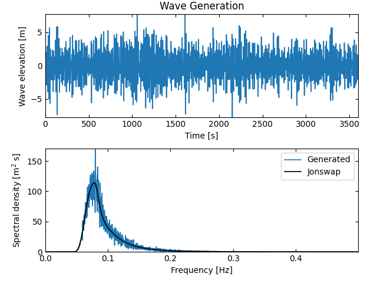
   
   Stochastic JONSWAP wave spectra produced in HydroUQ, applying the welib Python package.

In this local workflow example, basic uncertainty quantification methods (Forward, Sensitivity, Reliability) are applied to the response of a simple structure loaded by a stochastic wave spectra.

Set-Up
------

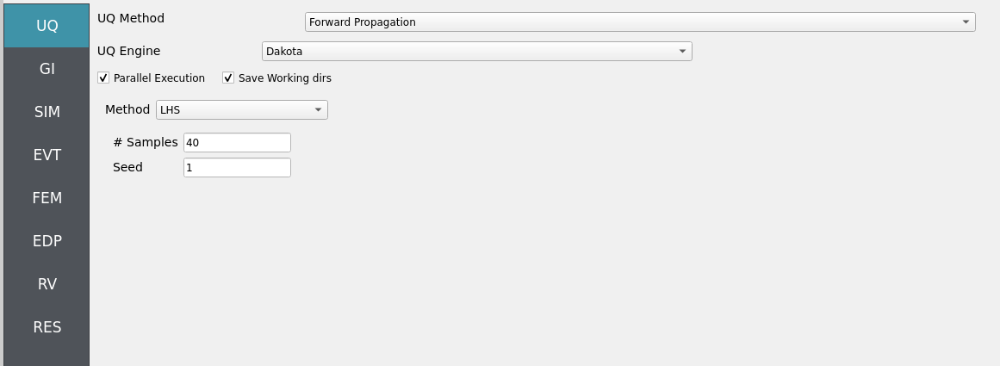
   
   HydroUQ's desktop GUI for the NHERI OSU LWF digital wave-flume twin.

Details for the experiments are available in various publications. Namely, the work of Andrew Winter [Winter2020]_ [Winter2019]_, Krishnendu Shekhar [Shekhar2020]_ and Dakota Mascarenas [Mascarenas2022]_ [Mascarenas2022PORTS]_.  The simulations replicated in this example appeared originally in Bonus 2023 [Bonus2023Dissertation]_.

Experiments were performed in the NHERI OSU LWF, a 100 meter long flume with adjustable bathymetry, in order to quantify stochastic impact loads of ordered and disordered debris-fields on effectively rigid, raised structure. 

.. figure:: figures/hdro-0005_GI.png
   :align: center
   :width: 600
   :figclass: align-center
   
   NHERI OSU LWF facilty's experimental schematic used in this example. Adapted from Winter 2019 [Winter2019]_, and Mascarenas 2022 [Mascarenas2022]_.

This example may help to produce a robust database (numerical and physical) from which to eventually be able to extract both the first-principals of wave-driven debris-field phenomena and design guidelines on induced forces. 

We validate against two very similar (but not identical) physical studies done in the OSU LWF by [Shekhar2020]_ and [Mascarenas2022]_, indicating high accuracy of our model and low bias to minor experiment specifications. 

Results for free surface elevation and streamwise structural loads are to be recorded for validation at a specified interval. 

Qualitatively, an MPM simulation of debris impacts on a raised structure in the OSU LWF is shown below.

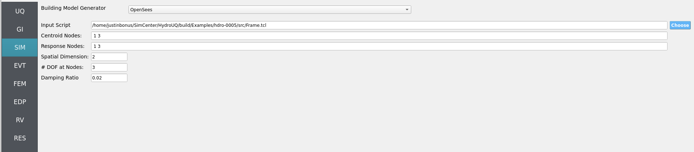

   OSU LWF debris impact photos from HydroUQ's MPM simulations.

It appears similar in the mechanism of debris impact, stalling, and deflection relative to the structure and flow for a similar case in Mascarenas 2022 [Mascarenas2022]_.

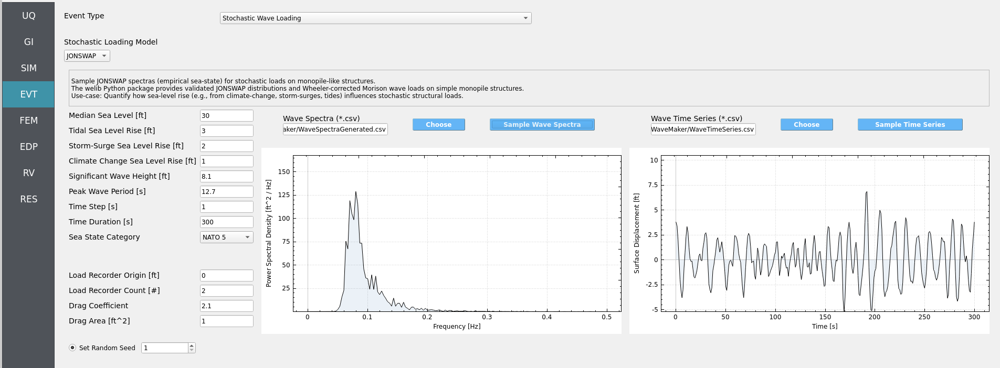

   OSU LWF debris impact photos from Mascarenas 2022 [Mascarenas2022]_ experiments.

The experiments by Shekhar et al. 2020 [Shekhar2020]_ are also shown below for comparison. These tests had a slightly different configuartion, primarily the debris were located 0.5 meters further upstream from the box and the water level was 0.10-0.15 meters lower than the 2.0 meter datum used in the simulations and Mascarenas 2022 [Mascarenas2022]_ experiments.

.. figure:: figures/hdro-0005_EDP.png
   :align: center
   :width: 600
   :figclass: align-center

   OSU LWF debris impact photos from Shekhar et al. 2020 [Shekhar2020]_ experiments.

Similar figures can be made for the whole range of order debris-array experiments done at the OSU LWF. However, this example focuses on teaching you how to replicate the above results.

.. _hdro-0005-setup:

A step-by-step walkthrough on replicating an MPM simulation result from Bonus 2023 [Bonus2023Dissertation]_ is provided below.

Open ``Settings``. Here we set the simulation time, the time step, and the number of processors to use, among other pre-simulation decisions.

.. figure:: figures/hdro-0005_RV.png
   :align: center
   :width: 600
   :figclass: align-center

   HydroUQ Settings GUI

Open ``Bodies`` / ``Fluid`` / ``Material``. Here we set the material properties of the fluid and the debris.

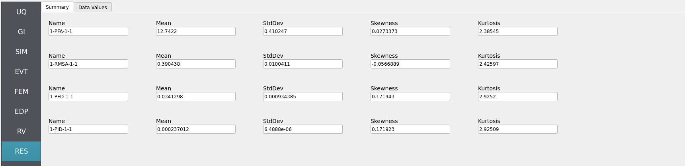

   HydroUQ Bodies Fluid Material GUI

Open ``Bodies`` / ``Fluid`` / ``Geometry``. Here we set the geometry of the flume, the debris, and the raised structure. 

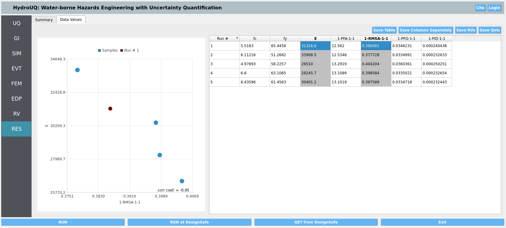

   HydroUQ Bodies Fluid Geometry GUI

Open ``Algorithm``. Here we set the algorithm parameters for the simulation. We choose to apply F-Bar antilocking to aid in the pressure field's accuracy on the fluid. The associated toggle must be checked, and the antilocking ratio set to 0.9, loosely.

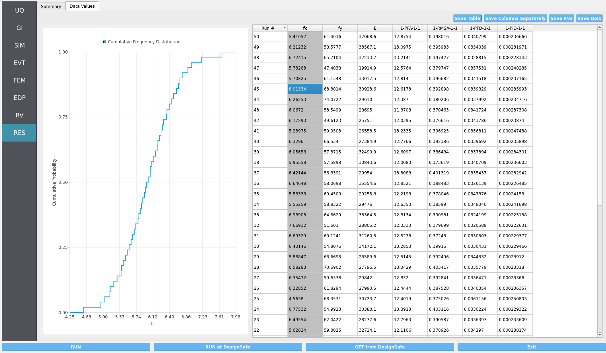

   HydroUQ Bodies Fluid Algorithm GUI

Open ``Bodies`` / ``Fluid`` / ``Partitions``. Here we set the number of partitions for the simulation. This is the domain decomposition across discrete hardware units, i.e. Multi-GPUs. These may be kept as there default values. 

.. figure:: figures/hdro-0005_RES_HistogramForward.png
   :align: center
   :width: 600
   :figclass: align-center

   HydroUQ Bodies Fluid Partitions GUI

Moving onto the creation of an ordered debris-array, we set the debris properties in the ``Bodies`` / ``Debris`` / ``Material`` tab. We will assume debris are made of HDPE plastic, as in experiments by Mascarenas 2022 [Mascarenas2022]_ and Shekhar et al. 2020 [Shekhar2020]_.

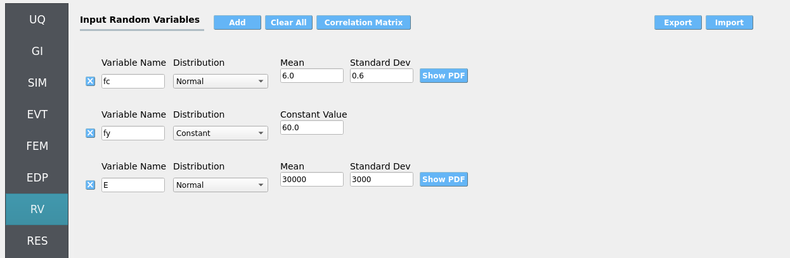

   HydroUQ Bodies Debris Material GUI

Open ``Bodies`` / ``Debris`` / ``Geometry``. Here we set the debris properties, such as the number of debris, the size of the debris, and the spacing between the debris. Rotation is another option, though not used in this example. We've elected to use an 8 x 4 grid of debris (longitudinal axis parallel to long-axis of the flume).

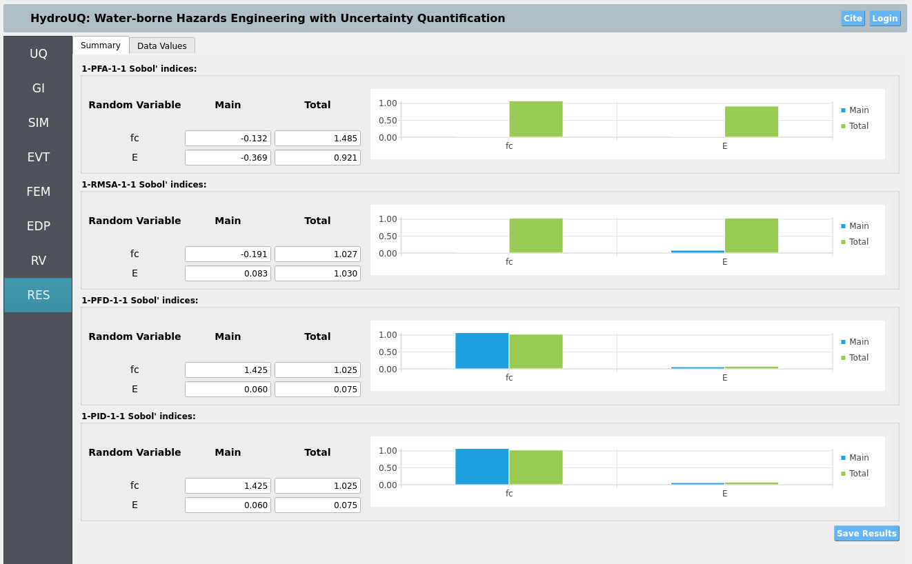

   HydroUQ Bodies Debris Geometry GUI

The ``Bodies`` / ``Debris`` / ``Algorithm`` and ``Debris`` / ``Partitions`` tabs are not used in this example, but are available for more advanced users.

Open ``Bodies`` / ``Structures``. Uncheck the box that enables this body, if it is checked. We will not model the structure as a body in this example, instead, we will modify it as a boundary later.

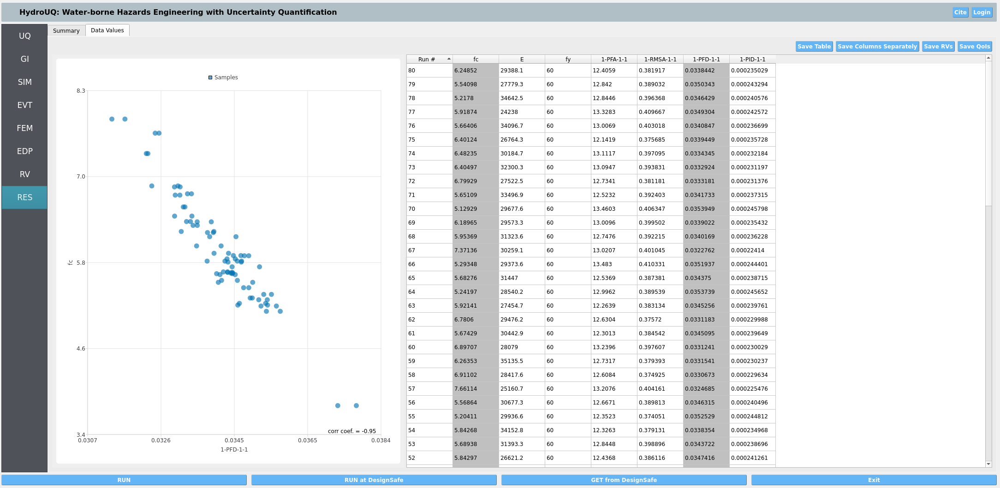
   
   HydroUQ Bodies Structures GUI

Open ``Boundaries`` / ``Wave Flume``. We will set the boundary to be a rigid body, with a fixed separable velocity condition, that is faithful to the digital tiwn of the NHERI OSU LWF. Bathmyetry joint points should be indetical to the ones used in ``Bodeis`` / ``FLuid``.

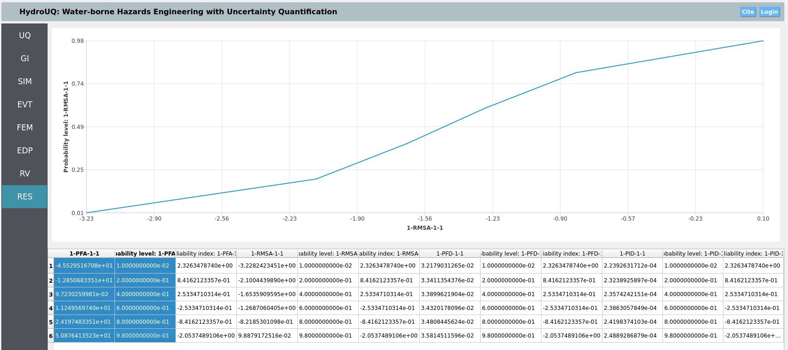

   HydroUQ Boundaries Wave Flume Facility GUI

Open ``Boundaries`` / ``Wave Generator``. Fill in the appropriate file-path for the wave generator paddle motion. It is designed to produce near-solitary like waves.

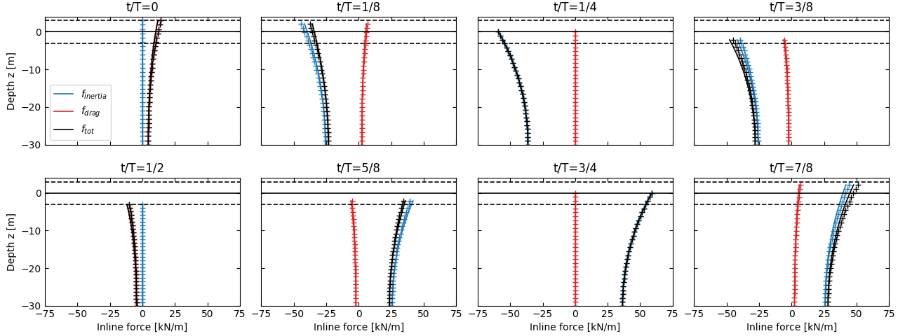
   
   HydroUQ Boundaries Wave Generator GUI

Open ``Boundaries`` / ``Rigid Structure``. This is where we will specify the raised structure as a boundary condition. By doing so, we can determine exact loads on the rigid boundary grid-nodes, which may then be mapped to the FEM tab for nonlinear UQ structural response analysis.

.. figure:: figures/hdro-0005_moments.png
   :align: center
   :width: 600
   :figclass: align-center

   HydroUQ Boundaries Rigid Structure GUI

Open ``Boundaries`` / ``RigidWalls``.

.. figure:: figures/hdro-0005_IntegratedPileLoads.png
   :align: center
   :width: 600
   :figclass: align-center

   HydroUQ Boundaries Wave-Flume Facility GUI

Open ``Sensors`` / ``Wave Gauges``. Set the ``Use these sensor?`` box to ``True`` so that the simulation will output results for the instruments we set on this page.

Three wave gauges will be defined. The first is located prior to the bathymetry ramps, the second partially up the ramps, and the third near the the bathymetry crest, debris, and raised structure. 

Set the origins and dimensions of each wave as in the table below. To match experimental conditions, we also apply a 120 Hz sampling rate to the wave gauges, meaning they record data every 0.0083 seconds. 

.. Open ``Sensors`` / ``Load Cells``. Set the ``Use these sensor?`` box to ``True`` so that the simulation will output results for the instruments we set on this page.

.. .. figure:: figures/GUI_Sensors_LoadCells.PNG
..    :align: center
..    :width: 600
..    :figclass: align-center
   
..    HydroUQ Sensors Load-Cells GUI

.. Open ``Outputs``. Here we set the non-physical output parameters for the simulation, e.g. attributes to save per frame and file extension types. The particle bodies' output frequency is set to 10 Hz (0.1 seconds), meaning the simulation will output results every 0.1 seconds. This is decent for animations without taking too much space. Fill in the rest of the data in the figure into your GUI to ensure all your outputs match this example.

.. .. figure:: figures/GUI_Outputs.PNG
..    :align: center
..    :width: 600
..    :figclass: align-center
   
..    HydroUQ Outputs GUI

.. _hdro-0005-simulation:

Simulation
----------

We assume most computers will be able to run this simulation within a few minutes if samples are kept below 100.

.. warning::
   Only ask for what you need in terms of recorder count, time-step size, random variables, and UQ samples. Otherwise you will end up with massive amounts of data which can slow simulations due to I/O constraints.

.. _hdro-0005-analysis:

Analysis
--------

This complete our HydroUQ validation example for stocahstic wave-loading on a simple frame structure.

.. _hdro-0005-references:

References
----------

.. [Winter2019] Winter, A. (2019). "Effects of Flow Shielding and Channeling on Tsunami-Induced Loading of Coastal Structures." PhD thesis. University of Washington, Seattle.

.. [Winter2020] Andrew O Winter, Mohammad S Alam, Krishnendu Shekhar, Michael R Motley, Marc O Eberhard, Andre R Barbosa, Pedro Lomonaco, Pedro Arduino, Daniel T Cox (2019). "Tsunami-Like Wave Forces on an Elevated Coastal Structure: Effects of Flow Shielding and Channeling." Journal of Waterway, Port, Coastal, and Ocean Engineering.

.. [Shekhar2020] Shekhar, K., Mascarenas, D., and Cox, D. (2020). "Wave-Driven Debris Impact on a Raised Structure in the Large Wave Flume." 17th International Conference on Hydroinformatics, Seoul, South Korea.

.. [Mascarenas2022] Mascarenas, Dakota. (2022). "Quantification of Wave-Driven Debris Impact on a Raised Structure in a Large Wave Flume." Masters thesis. University of Washington, Seattle.

.. [Mascarenas2022PORTS] Mascarenas, Dakota, Motley, M., Eberhard, M. (2022). "Wave-Driven Debris Impact on a Raised Structure in the Large Wave Flume." Journal of Waterway, Port, Coastal, and Ocean Engineering.

.. [Bonus2023Dissertation] Bonus, Justin (2023). "Evaluation of Fluid-Driven Debris Impacts in a High-Performance Multi-GPU Material Point Method." PhD thesis. University of Washington, Seattle.

