.. _hdro-0007:

===============================================================================
Debris in Steady-State Flow - Digital Flume (UW WASIRF) - MPM
===============================================================================

+---------------+----------------------------------------------+
| Problem files | :github:`Github <Examples/hdro-0007/>`       |
+---------------+----------------------------------------------+

.. contents:: Table of Contents
   :local:
   :backlinks: none

.. _hdro-0007-overview:

Outline
-------

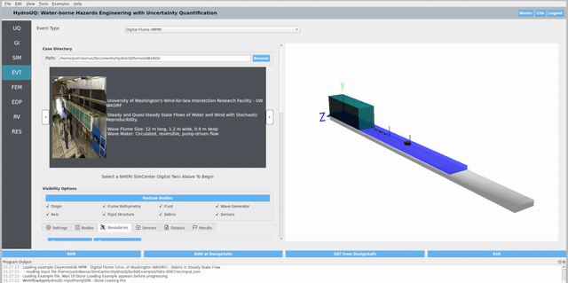

   GUI for the University of Washington's Wind and Sea Interaction Facility (UW WASIRF).

This example examines steady-flow debris impacts on a raised structure by constructing a Material Point Method (MPM, [Bonus2023Dissertation]_ and [Bonus2025ClaymoreUW]_) digital flume of the UW Washington Air–Sea Interaction Research Facility (WASIRF) debris tests (Lewis 2021–2023, [Lewis2023]_ and [Lewis2023Dissertation]_). WASIRF provides a 1:4 geometric down-scale of OSU LWF debris-load experiments and simulations, see :ref:`hdro-0002`, so approximately 1:40 of a prototype tsunami event, using pump-driven, near-steady hydrodynamics and optional wave or wind forcing. Here we focus on the steady water inflow cases without wind effects. We will replicate the pump-driven inflow / outflow of the flume by virtually extending it and applying a velocity boundary condition to the incoming fluid, but it should be noted with some effort that more traditional pressure boundary inflow / outflow conditions can be simulated. Key aspects of these tests are:

- Hydrodynamics: pump-driven flow achieving a target depth–velocity pair from experiments; inflow/outflow emulated numerically via upstream/downstream velocity buffer zones (mass conserved).
- Structure: the raised aluminum box (1:4 of the "orange box" from :ref:`hdro-0002`) modeled as a rigid, separable boundary with numerical load-cells (node-wise force integration on the front face).
- Debris: HDPE prisms (vehicle or boat surrogates) placed ~0.8 m upstream; spacing chosen to replicate the rate at which the experimentalists tended to drop debris into the flow during tests.

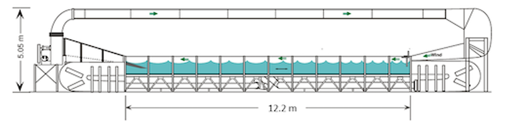

   Schematic for the University of Washington's Wind and Sea Interaction Facility (UW WASIRF).

Our HydroUQ workflow in this example will study structural response of the aluminum box to fluid-debris loading. However, we note that underlying experiments had the goal of studying comprehensive fluid-debris phenomena in tandem with structural loading. For more advanced analysis for motivated readers, we may recommend tracking the below Quantities of interest (QoIs) and non-dimensional metrics in the context of hydrodynamic and debris UQ:

1. Incoming Froude number at the last upstream station before impact:
   :math:`Fr = U_f / \sqrt{g\,h_f}`, with :math:`U_f` and :math:`h_f` measured from ADV or wave-gauge proxies in the simulation.
2. Force coefficient and impulse at the wall:
   :math:`C_F = F / (\rho\,U_f^2\,A)`,  :math:`J^* = \left(\int F(t)\,dt\right) / (\rho\,U_f^2\,A\,T_c)`,
   where :math:`A` is the box projected area and :math:`T_c` a characteristic passage time (for example, debris-front width :math:`L_f/U_f`).
3. Plateau-to-peak load ratio :math:`R_{PP} = F_{\text{plateau}}/F_{\text{peak}}` to quantify buffering and damming under steady inflow.
4. Front porosity :math:`\Phi` and blockage ratio :math:`\beta = A_{\text{blocked}}/A_{\text{flow}}` of the debris pack, governing water leakage and momentum transfer.
5. Debris kinematics: center-of-mass speed ratio :math:`U_d/U_f`, breakup length scale :math:`L_b`, and re-organization patterns at the structure.

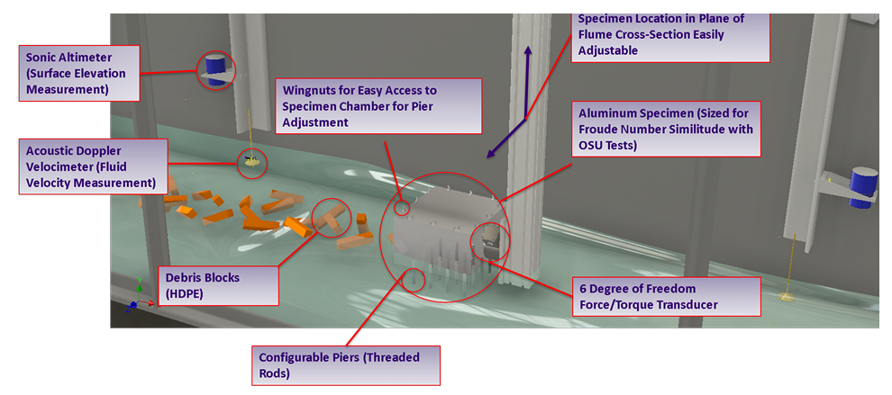

   Digital rendition of the University of Washington's Wind and Sea Interaction Facility (UW WASIRF) to illustrate sensor placement and debris relative to the raised structural box.

.. Because inflow is quasi-steady, a persistent hydrodynamic buffer forms in front of the box. Compared to solitary or dam-break forcing at similar :math:`Fr`, this tends to reduce the impulse peak, lengthen the load plateau, and increase sensitivity to :math:`\Phi` and :math:`\beta`. Under Froude similitude, normalized metrics (:math:`C_F`, :math:`J^*`) provide a scale-aware bridge to OSU LWF while revealing residual scale effects (for example, pump-induced oscillations, small-scale turbulence, column omission if not modeled).

.. _hdro-0007-set-up:

Set-Up
------

Step 1: UQ
~~~~~~~~~~

Configure **Forward** sampling to explore structural/material uncertainty under a fixed hydrodynamic signal.

- **Engine**: Dakota
- **Forward Propagation**: Sampling method (e.g., **LHS**) with ``samples`` (e.g., ``20``) and a reproducible ``seed`` (e.g., ``1``).

.. figure:: figures/hdro-0007_UQ.png
   :align: center
   :alt: HydroUQ UQ panel with Dakota Forward selected, sample count and seed set.
   :figclass: align-center

Step 2: GI
~~~~~~~~~~

Set **General Information** and **Units** consistent with experiments (length, time, density, gravity). Record project metadata.

- Structure name: ``Aluminum Box @ UW WASIRF``
- Units: choose a consistent set (e.g., N-m-s or kips-in-s)

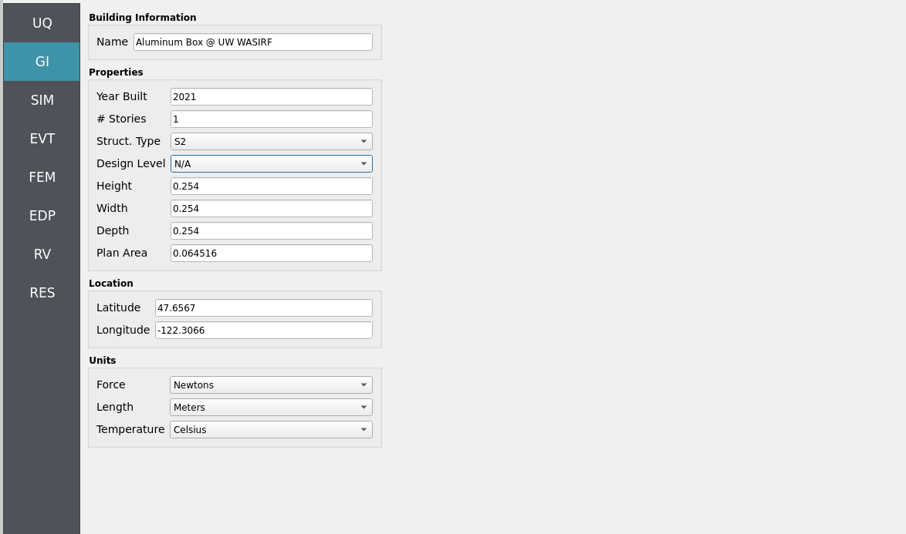

.. note::

   Keep **GI**, **SIM**, **EVT**, and **FEM** units consistent. Match MPM's length/time scales and OpenSees integration settings (e.g., time step). Verify any force/unit conversions used during load mapping.

Step 3: SIM
~~~~~~~~~~~~~~~~~~~~~~~

The structural model is as follows: a single-story Multi-Degree-of-Freedom system (MDOF, see :ref:`lblMDOFSIM`) which we vertically invert to replicate the hanging, raised structural box in the UW WASIRF tests.

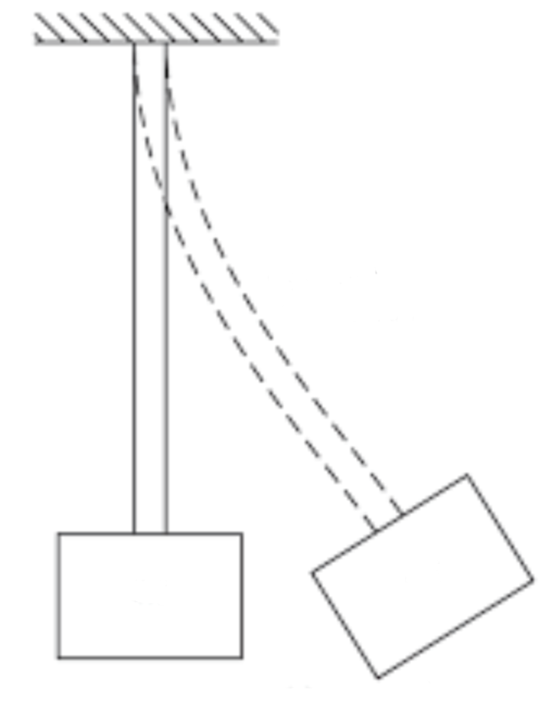

   Schematic of a single-story MDOF structure representing a structural box undergoing deflection from MPM derived hydrodynamic loading.

.. note::

   The structure will be represented initially as a **rigid boundary** in MPM to recover local hydrodynamic forces at grid nodes for direct comparison with **load-cell** data. Structural dynamic response is added later by mapping these loads onto an **OpenSees** model defined here in the SIM panel with analysis options set in the FEM panel.

**Uncertain structural properties** (treated as RVs; see Step 7):

- ``w``: Weight. Mean ``144``, stdev ``12``

Bind parameters via setting alphabetic characters in the variable input boxes (e.g., ``w``) so the **RV** panel recognizes and manages them automatically.

.. figure:: figures/hdro-0007_SIM.png
   :align: center
   :alt: SIM panel showing a single story MDOF system with uncertain variables w.
   :figclass: align-center

While not necessary to have, we show the template OpenSees model for your reference. The script generated in the backend by the MDOF module resembles the following, `MDOF.tcl <https://github.com/NHERI-SimCenter/HydroUQ/blob/master/Examples/hdro-0007/src/MDOF.tcl>`_:

.. raw:: html

   

   
Click to expand the OpenSees input file used for this example

.. literalinclude:: src/MDOF.tcl
   :language: tcl
   :linenos:

.. raw:: html

   

Step 4: EVT
~~~~~~~~~~~~~~~~~~~~~~~~~~~~~~~~~~~~~~~~~~~~~~~~

In this walk-through we will give a detailed step-by-step configuration of the MPM EVT module.

**Settings**

Open ``Settings``. Here we set the simulation time, the time step, and the grid resolution, among other pre-simulation decisions.

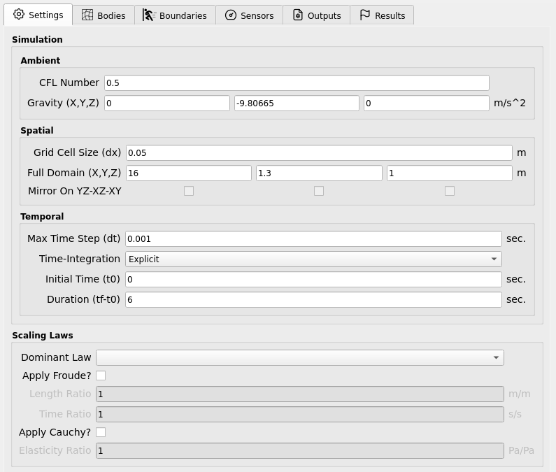

**Bodies**

**Geometry**

- **Fluid geometry**

Open ``Bodies`` / ``Fluid`` / ``Geometry``. Here we set the geometry of the flume's fluid. Note that it is simply a rectangular prism which extends beyond the physical flume due to our velocity buffering approach for inflow / outflow used in this example.

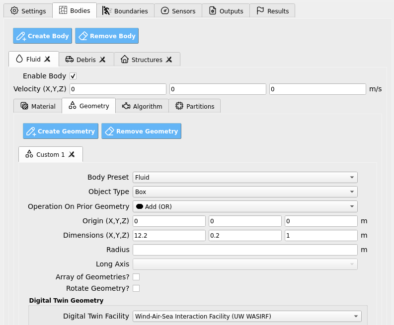

- **Debris geometry**:

Open ``Bodies`` / ``Debris`` / ``Geometry``. Here we set the debris properties, such as the number of debris, the size of the debris, and the spacing between the debris. Rotation is another option, though not used in this example. We've elected to use an 3 x 1 grid of debris (longitudinal axis parallel to long-axis of the flume).

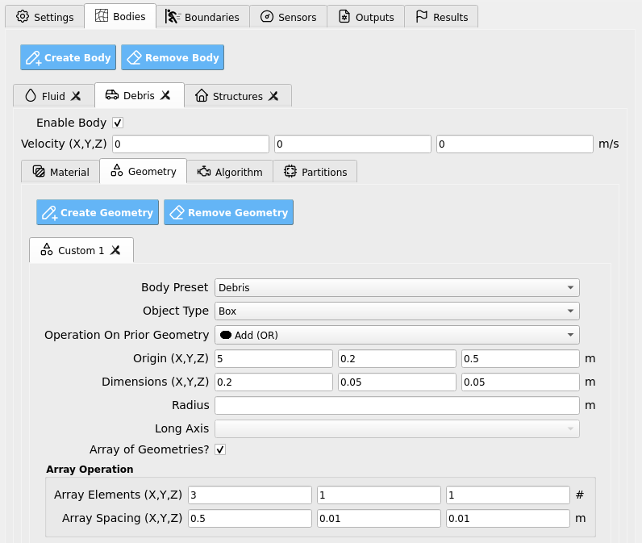

**Material**

- **Fluid material**:

Open ``Bodies`` / ``Fluid`` / ``Material``. Here we set the material properties of the fluid. You may choose to use a realistic bulk modulus value of 2.1 GPa for the water, or you may soften it to 0.21 GPa to accelerate the simulation and reduce numerical stiffness with fairly minimal changes in our final results.

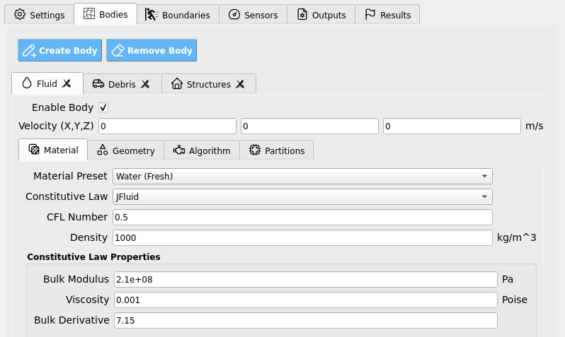

- **Debris material**:

Moving onto the creation of an ordered debris array, we set the debris properties in the ``Bodies`` / ``Debris`` / ``Material`` tab. We will assume debris are made of HDPE plastic, as in experiments by Lewis 2023 [Lewis2023]_, Mascarenas 2022 [Mascarenas2022]_, and Shekhar et al. 2020 [Shekhar2020]_, and set properties accordingly.

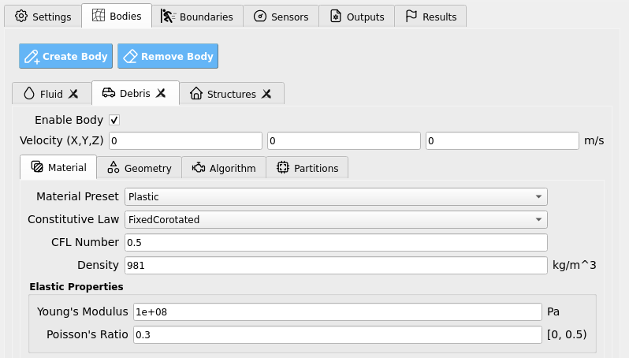

**Algorithm**

Open ``Bodies`` / ``Fluid`` / ``Algorithm``. Here we set the algorithm parameters for the simulation. This is an advanced feature of the MPM module, it is best not to alter it too much. We choose to apply F-Bar antilocking to aid in the pressure field's accuracy on the fluid. The associated toggle must be checked, and the antilocking ratio set to 0.9, loosely. For full bulk modulus water, you may need to increase this value to alleviate numerical stiffness.

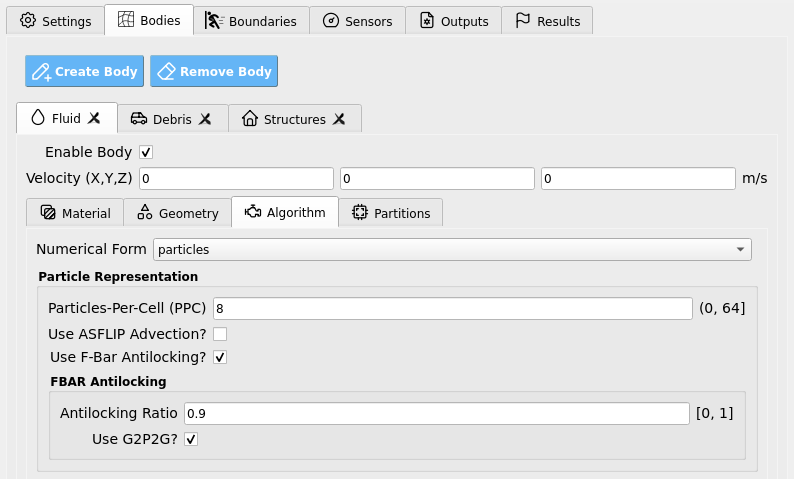

In ``Bodies`` / ``Debris`` / ``Algorithm`` we set debris for compatibility with the fluid as follows: ASFLIP is turned on and F-Bar antilocking is turned off. We keep ASFLIP tuning values at their default of zero as we do not need advanced behavior in this example.

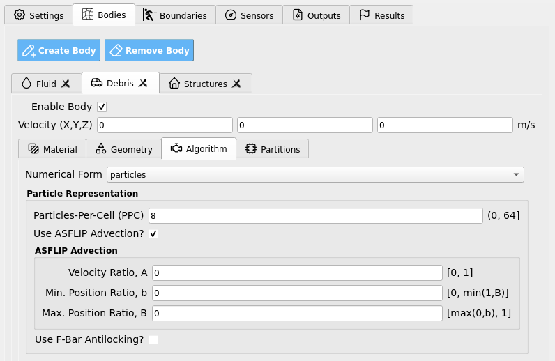

**Partitions**:

Open ``Bodies`` / ``Fluid`` / ``Partitions``. This is an advanced feature of the MPM module which allows us to partition material bodies across hardware devices to optimize simulations. These may be kept as their default values, which have already been set for compatibility on the remote HPC system.

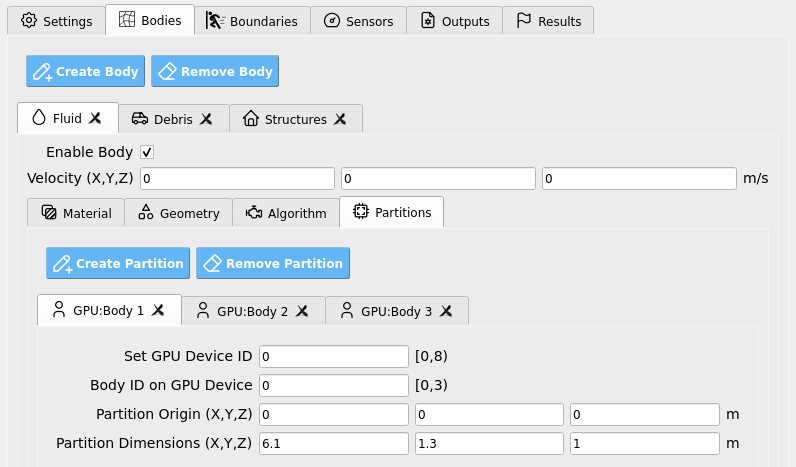

Next, ``Bodies`` / ``Debris`` / ``Partitions`` defines a partition where the debris may exist in our flume domain and defines the hardware device (i.e., GPU) that they will be simulated on. Keep this as the default unless you are an advanced user.

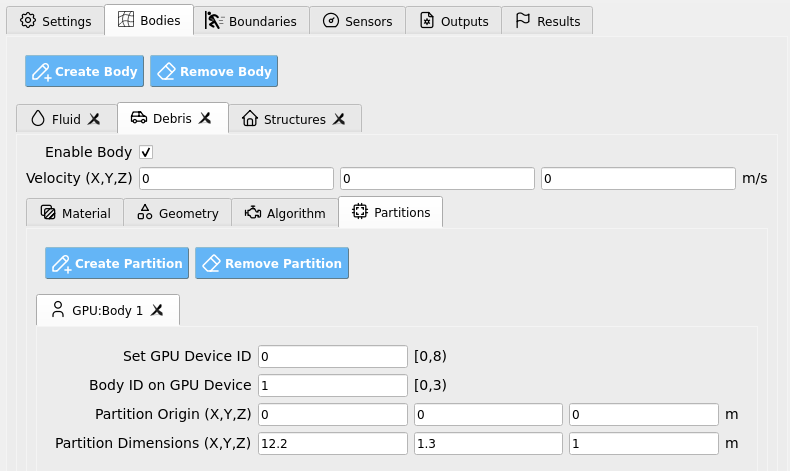

**Structure**:

Finally, open ``Bodies`` / ``Structures``. Uncheck the box that enables this body. We will not model the structure as a deformable MPM material body in this example, instead, we will approximate it as a rigid MPM boundary a few steps from now. After the MPM simulation we will map loads from the boundary to an OpenSees structure for structural analysis, see Steps 3 and 5 for configuration.

   
   HydroUQ Bodies Structures GUI

**Boundaries**

- **Wave Flume boundary**:

Open ``Boundaries`` / ``Flume Facility``. We will set the flume boundary to be a rigid body, with a fixed separable velocity condition. Bathymetry joint points should be identical to the ones used in ``Bodies`` / ``Fluid`` / ``Geometry``.

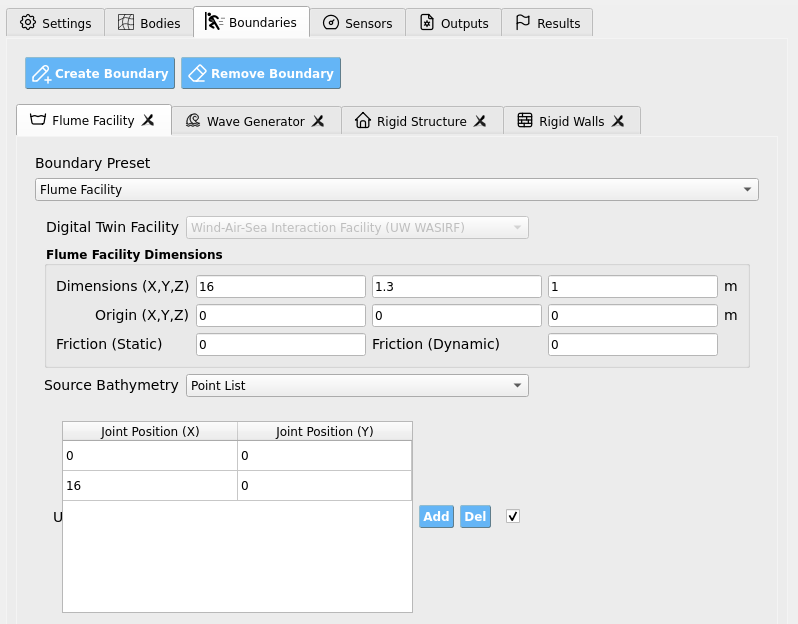

- **Wave Generator**:

Open ``Boundaries`` / ``Wave Generator``. Set the method to be "Velocity" as we are replicating the inflow of a pump-driven fluid using a virtually extended flume with a velocity boundary condition.

.. Fill in the appropriate file-path for the wave generator paddle motion. It is designed to produce near-solitary-like waves.

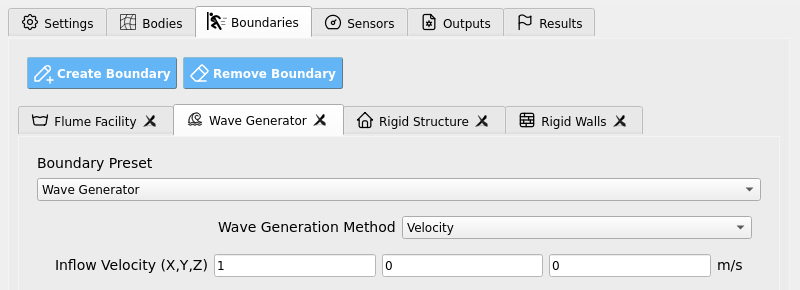

- **Rigid Structure**:

Open ``Boundaries`` / ``Rigid Structure``. This is where we will specify the structure as a boundary condition. By doing so, we can determine the exact loads on the rigid boundary grid-nodes, which automatically map to the model defined in the SIM and FEM tab in Steps 3 and 5 for potentially nonlinear UQ structural response analysis.

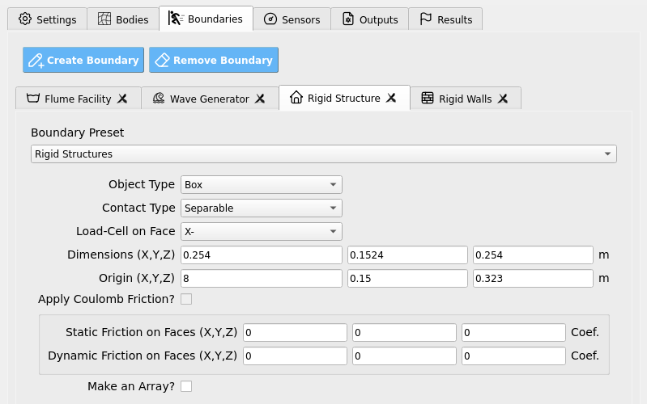

- **Rigid Walls**:

Open ``Boundaries`` / ``Rigid Walls``. Set to encompass the flume domain.

.. figure:: figures/GUI_Boundaries_RigidWalls.png
   :align: center
   :width: 600
   :alt: HydroUQ Rigid Walls panel.
   :figclass: align-center

**Sensors**

- **Wave Gauges**:

Open ``Sensors`` / ``Wave Gauges``. Set the ``Use these sensor?`` box to ``True`` so that the simulation will output results for the instruments we set on this page.

Three wave gauges will be defined along the inflow path towards the structural face, where we anticipate a fluid buffer to develop. 

Set the origins and dimensions of each wave gauge to encompass at least one grid-cell in each direction as in the table below. To match experimental conditions, we also apply a 30 Hz sampling rate to the wave gauges.

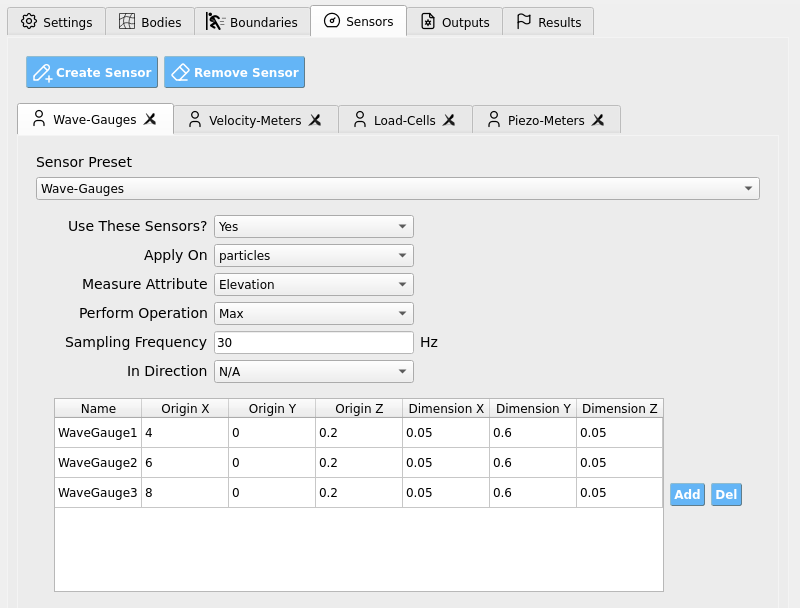

These wave gauges will read all numerical bodies (i.e. particles) within their defined regions at every sampling step and will report the highest elevation value (Position Y) of a contained body as the free-surface elevation at that gauge. The results are written into our sensor results files which we will later analyze.

- **Load Cells**:

Open ``Sensors`` / ``Load Cells``. Set the ``Use these sensor?`` box to ``True`` so that the simulation will output results for the instruments we set on this page. Two load cells are defined so that we may map loads onto two nodes of our OpenSees structural model which we defined in Steps 3 and 5. Output frequency is set to 120 Hz to match experiments and capture primary load phenomena.

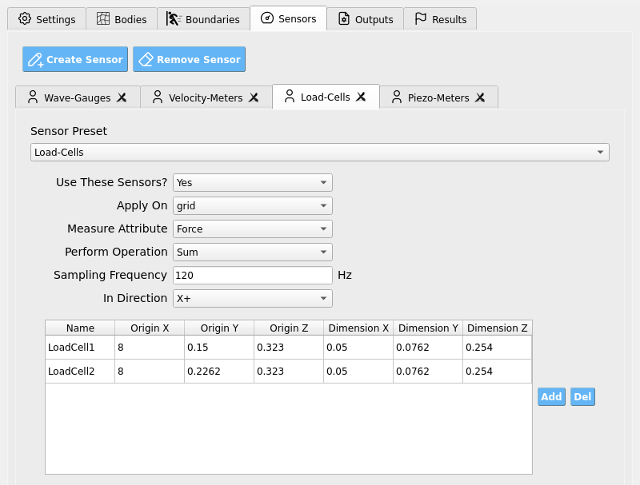

**Outputs**

Open ``Outputs``. Here we set the non-physical output parameters for the simulation, e.g. attributes to save per frame and file extension types. The particle bodies' output frequency is set to 2 Hz, meaning the simulation will output results every 0.5 seconds. This is to save disk space and reduce I/O load, but it may be increased if you wish to make animations (e.g., 10 - 30 Hz). Fill the rest of the data in the figure into your GUI to ensure all your outputs match this example. You may alter output attributes if you are an advanced user familiar with ClaymoreUW attributes and wish to perform more advanced analysis.

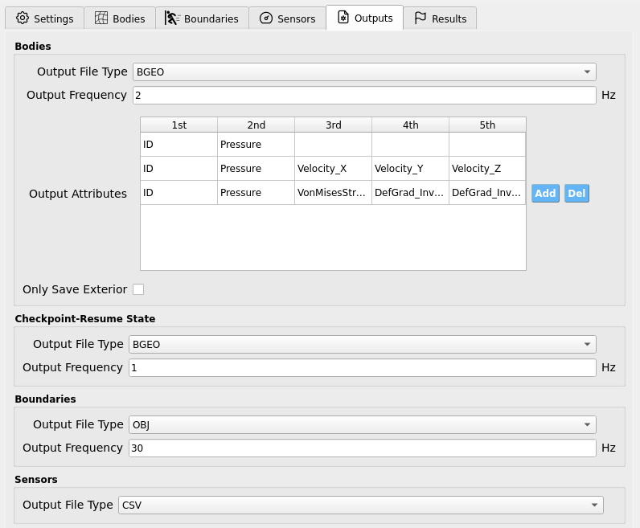

Step 5: FEM
~~~~~~~~~~~~~~~~~~~~~~

This example insofar focused on **hydrodynamic forces** measured on rigid structures. To perform true structural response analysis, map recovered boundary loads to an **OpenSees** model in **SIM** and configure dynamic analysis here as in other HydroUQ tutorials.

**Solver**: OpenSees dynamic analysis. Check:

- Integration step compatible with MPM sensor output interval.
- Algorithm/convergence tolerances suitable for expected nonlinearity.
- Damping model as needed (e.g., Rayleigh).

.. figure:: figures/hdro-0007_FEM.png
   :align: center
   :alt: FEM panel with integration, algorithm, solver, and damping settings.
   :figclass: align-center

Step 6: EDP
~~~~~~~~~~~

Select **Engineering Demand Parameters (EDPs)** to summarize response:

- Peak Floor Acceleration (PFA)
- Root Mean Square Acceleration (RMSA)
- Peak Floor Displacement (PFD)
- Peak Interstory Drift (PID)

.. figure:: figures/hdro-0007_EDP.png
   :align: center
   :alt: EDP panel with standard selections enabled.
   :figclass: align-center

Note that other quantities of interest (QoI) are theoretically obtainable from HydroUQ if the custom EDP module is configured by an advanced user. E.g.: 

- Wave: **max free-surface elevation**, η, at gauges.
- Debris motion: **longitudinal displacement** (forward/back), **lateral spreading angle**.
- Loads: **obstacle force time histories** (impact peaks, total impulses).

Step 7: RV
~~~~~~~~~~~~~~~~~~~~~

Define distributions for structural RV:

**Structural**

- ``w``: **Normal** (mean ``144``, stdev ``12``)

.. figure:: figures/hdro-0007_RV.png
   :align: center
   :alt: RV panel listing weight (w) with Normal distributions and parameters.
   :figclass: align-center

For future UQ, consider:

- Debris: mass variance, placement variance.
- Wave: steady-state tolerance relative to inflow depth and velocity.
- Obstacles: small misalignment/placement tolerance.

.. _hdro-0007-simulation:

Simulation
----------

This case was executed on **TACC Stampede3** using **2x NVIDIA H100** GPUs on a single node (queue: ``h100``).  
Simulated physical time: **6 seconds**. Wall time: **60 minutes** (allow ample **Max Run Time** in job settings).

.. important::
   Provide generous **Max Run Time**, on the order of 60 to 90 minutes, to complete the run and post-processing before scheduler limits are reached.

.. warning::
   Keep sensor regions, counts, sampling rates, and output frequencies reasonable—excess I/O can dominate runtime.

**Outputs**

- Sensor CSVs (gauges, debris CoM, loads) at your chosen rates.
- Particle/field snapshots (e.g., BGEO/VTK) for visualization/diagnostics.

.. _hdro-0007-analysis:

Analysis
--------

**Accessing Results and Simulation Files**

When the simulation job has been completed, the results and simulation files will be available on the remote system for retrieval or remote post-processing.

Retrieving the ``results.zip``, ``templatedir.zip``, ``workdir.tar.gz``, and ``MPM`` folders will allow you to analyze all of the simulation output (e.g., hydrodynamic, structural, uncertainty quantification).

- ``results.zip``: Contains primary uncertainty quantification output and MPM sensor files. This will be the primary place for analysis.

- ``templatedir.zip``: Contains template and workflow files for the job. This is an important resource for debugging your workflows.

- ``workdir.tar.gz``: Contains the working directories in which each unique simulation was ran. This is where structural response uncertainty is expanded on typically.

- ``MPM``: Contains all the MPM simulation files. Includes the raw particle output frames which can be used to create animations or to perform more advanced post-processing.

The most straightforward way to retrieve the most important files, ``results.zip`` and ``templatedir.zip``, is by clicking the ``GET From DesignSafe`` button in ``HydroUQ``.

.. figure:: figures/getFromDesignSafe.png
   :align: center
   :width: 400
   :figclass: align-center
   
   HydroUQ ``GET From DesignSafe`` button, which opens up a jobs table of all your remote simulations.

Then, right-click on your job (if it is finished) and select ``Retrieve Data``. This will download ``results.zip`` and ``templatedir.zip``. 

.. figure:: figures/retrieveData.png
   :align: center
   :width: 400
   :figclass: align-center
   
   Locating the ``Retrieve Data`` button in the HydroUQ remote jobs table.

HydroUQ will then automatically unzip them into ``results`` and ``templatedir``, which will be located in ``{your_path}/HydroUQ/RemoteWorkDir/tmp.SimCenter``. On most systems, this will be ``~/Documents/HydroUQ/RemoteWorkDir/tmp.SimCenter``, but you can check by clicking on ``Files`` / ``Preferences`` on the upper-left corner of HydroUQ.

To retrieve ``workdir.tar.gz`` and ``MPM``, there are two approaches: 

(1) You can right-click on your job within HydroUQ and select ``Open Job Folder`` to be taken directly to the Design Safe web-page displaying all remote files. 

.. figure:: figures/openJobFolder.png
   :align: center
   :width: 400
   :figclass: align-center
   
   Locating the ``Open Job Folder`` button in the HydroUQ remote jobs table.

(2) You can manually navigate to the designsafe-ci.org website. For the latter, login and go to ``Upper-right Drop-down`` / ``Job Status``.

.. figure:: figures/DSToolsAndAppsJobsStatus.png
   :align: center
   :width: 600
   :figclass: align-center
   
   Locating the job files on DesignSafe

Check if the job has finished in the central vertical drawer by refreshing the page. If it has, click ``View Details``.  

.. figure:: figures/DSToolsAndAppsJobsStatusFinished.png
   :align: center
   :width: 600
   :figclass: align-center
   
   Job status is finished on DesignSafe

Once the job is finished, the output files should be available in the directory which the analysis results were sent to

Find the files by clicking ``View Output``. 
	
.. figure:: figures/DSToolsAndAppsJobsStatusViewFiles.png
   :align: center
   :width: 600
   :figclass: align-center
   
   Viewing the job files on DesignSafe

After navigating to your job folder by one of two ways, it is time to move files for processing. Move important files to somewhere in ``My Data/`` for easier processing. Use the extractor tool available on DesignSafe to unzip the ``results.zip``, ``workdir.tar.gz``, and ``templatedir.zip`` folders natively on DesignSafe. 

.. figure:: figures/extractonDS.png
   :align: center
   :width: 600
   :figclass: align-center
    
   Extracting the ``results.zip`` folder on DesignSafe

Alternatively, you may directly download the zipped folders to your PC, which will require you to use the DesignSafe zip tool on the ``MPM`` folder prior.

.. figure:: figures/downloadResults.png
   :align: center
   :width: 600
   :figclass: align-center

   Download button on DesignSafe shown in red

Locate the downloaded zip folders and extract them somewhere convenient. The HydroUQ local or remote work directory on your computer is a good option.

.. warning::
   
   Files in the HydroUQ local and remote working directories may be erased if another simulation is set up in HydroUQ, so keep a backup if you wish to maintain the files.

Particle geometry files often have a ``BGEO`` extension and are located in the ``MPM`` folder. Open with Side FX Houdini Apprentice (free to use) to look at MPM results in high-detail, or use the PartIO library.

HydroUQ's sensor/probe/instrument output is available in ``{your_path}/HydroUQ/RemoteWorkDir/tmp.SimCenter/results/`` as ``CSV`` files. You may process these files as you wish, most opt to use custom Python scripts or Excel due to their simplicity. 

.. note::
   
   For convenience, HydroUQ also includes basic plotting of all sensors files in the ``EVT`` / ``Results`` tab. Click ``Post-Process Sensors``, configure the drop-down boxes for the sensor you wish to view, and then click ``Plot``.

Plotting the wave gauges shows the development of a tsunami-like wave as it propagates inflow velocity condition over the flat flume bathymetry.

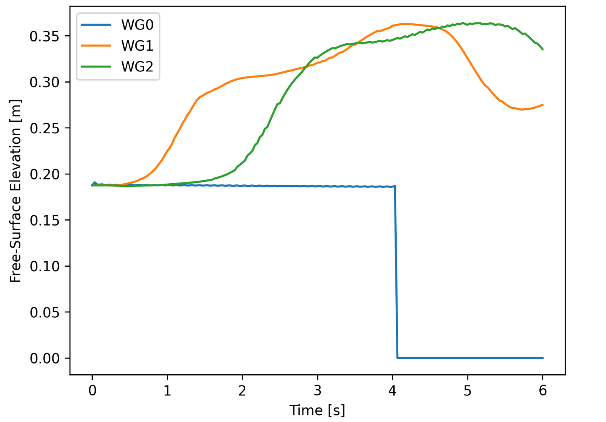

   Simulated free-surface elevations at three wave gauges in MPM.

Load-cell data shows a small initial peak force from debris impact which has been heavily buffered by fluid build-up at the structural face (in-part due to the Froude scale we are operating on relative to debris size), followed by damming forces and eventually a fully developed hydrodynamic drag.

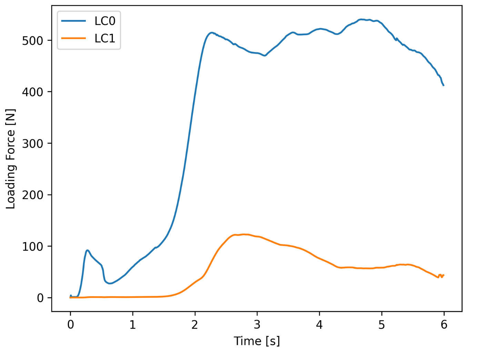

   Simulated load-cell forces in MPM. These are later mapped onto an OpenSees structure for dynamic response analysis.

**Structural Analysis**

Returning to our primary HydroUQ workflow, which concerns uncertainty in structural response, we may now view the final results in the **RES** tab. Clicking ``Summary`` on the top-bar, a statistical summary of results is shown below:

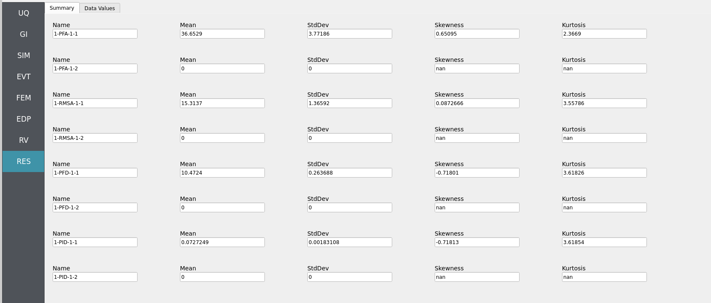

Clicking ``Data Values`` on the top-bar shows detailed histograms, cumulative distribution functions, and scatter plots relating the dependent and independent variables:

.. note:: 
   In the **Data Values** tab, left- and right-click column headers to change plot axes; selecting a single column with both clicks displays frequency and CDF plots.

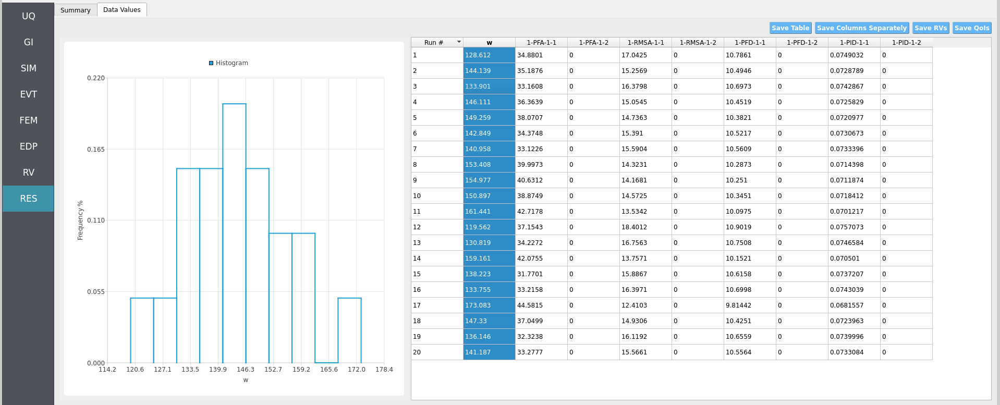

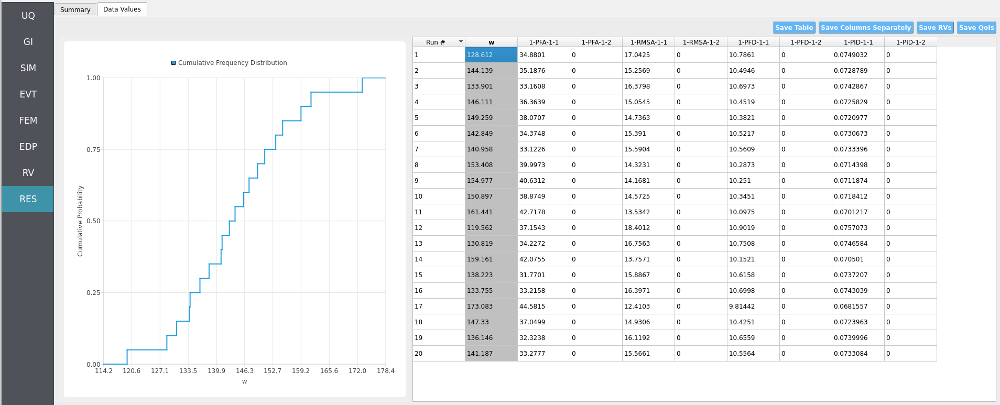

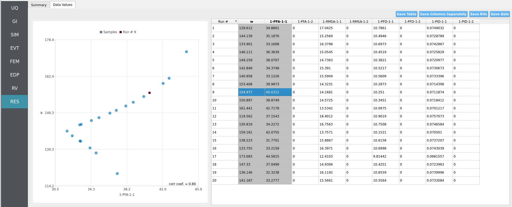

.. note::
   Use **consistent Froude similitude scaling** when comparing numerical simulations, experiments, and full-scale scenarios. For cross-method comparisons, adopt **identical debris footprints**, **friction models**, **probe placement**, and other pertinent parameters to reduce bias.

For more advanced analysis, export results as a CSV file by clicking ``Save Table`` on the upper-right of the application window. This will save the independent and dependent variable data. I.e., the **Random Variables** you defined and the **Engineering Demand Parameters** determined from the structural response per each simulation.

To save your simulation configuration with results included, click ``File`` / ``Save As`` and specify a location for the HydroUQ JSON input file to be recorded to. You may then reload the file at a later time by clicking ``File`` / ``Open``. You may also send it to others by email or place it in an online repository for research reproducibility. This example's input file is viewable at :ref:`hdro-0007-reproducibility`.

To directly share your simulation job and results in HydroUQ with other DesignSafe users, click ``GET from DesignSafe``. Then, navigate to the row with your job and right-click it. Select ``Share Job``. You may then enter the DesignSafe username or usernames (comma-separated) to share with. 

.. important::
   Sharing a job requires that the job was initially ran with an ``Archive System ID`` (listed in the ``GET from DesignSafe`` table's columns) that is **not** ``designsafe.storage.default``. Any other ``Archive System ID`` allows for sharing with DesignSafe **members on the associated project**. See :ref:`lbl-jobs` for more details. 

.. _hdro-0007-conclusions:

Conclusions
-----------

The HydroUQ MPM digital flume of UW WASIRF reproduces the mechanistic signatures anticipated for steady-flow debris impacts and aligns with the broader tsunami debris literature for the length and time-scale studied.

.. - Buffer-dominated impact: steady inflow yields a smaller impulse peak and a longer damming plateau relative to solitary or dam-break cases at similar :math:`Fr`. The rise in :math:`R_{PP}` captures this transition from impulsive to quasi-steady loading.
.. - Dimensionless collapse: after normalizing by :math:`\rho U_f^2 A`, the simulated :math:`C_F` and :math:`J^*` largely collapse toward OSU LWF trends; remaining spread correlates with debris front porosity :math:`\Phi` and blockage ratio :math:`\beta`, which are accentuated at 1:4 scale.
.. - Kinematic fidelity: debris breakup and re-organization patterns mirror those seen at larger scale, but require greater water displacement to transmit momentum to the box, a credible source of sub-OSU normalized loads in steady flow.
.. - Scale-aware interpretation: treat WASIRF steady impacts as a lower-impulse, longer-duration envelope of the same mechanism family. Where prototype extrapolation is needed, maintain Froude similitude and report both :math:`C_F` and :math:`J^*` to expose scale effects.

Motivated readers may wish to extrapolate on this example, attempting to: 

- Measure :math:`Fr` upstream; compute :math:`C_F`, :math:`J^*`, and :math:`R_{PP}`; relate them to :math:`\Phi` and :math:`\beta`.
- Build response surfaces :math:`(C_F, J^*) = f(Fr, \Phi, \beta, h_f)` and propagate Forward UQ over depth–velocity targets and debris arrangement.
- Align signal processing with the lab (filter bands, sampling) to separate debris impulses from facility noise.
- For design-leaning studies, summarize outcomes as dimensionless fragility envelopes versus :math:`Fr` and :math:`\beta`.

.. With modest extensions, such as adding columns under the box to resolve damming or bypass pathways and optional wind or wave forcing, the WASIRF twin can support blind-style validations and yield transferable, scale-aware load models suitable for engineering use across steady and transient inundation regimes.

.. _hdro-0007-references:

References
----------

.. [Lewis2023] Lewis, N. S., Winter, A. O., Bonus, J., Motley, M. R., Eberhard, M. O., Arduino, P., & Lehman, D. E. (2023). Open-source simulation of strongly-coupled fluid-structure interaction between non-conformal interfaces. Frontiers in Built Environment, 9. https://doi.org/10.3389/fbuil.2023.1120518

.. [Lewis2023Dissertation] Lewis, N. (2023). Development of An Open-Source Methodology for Simulation of Civil Engineering Structures Subject to Multi-Hazards. PhD thesis. University of Washington, Seattle.

.. [Bonus2023Dissertation] Bonus, Justin (2023). "Evaluation of Fluid-Driven Debris Impacts in a High-Performance Multi-GPU Material Point Method." PhD thesis. University of Washington, Seattle.

.. [Bonus2025ClaymoreUW] Bonus, J., & Arduino, P. (2025). ClaymoreUW. Zenodo. https://doi.org/10.5281/zenodo.15128706

.. _hdro-0007-reproducibility:

Reproducibility
---------------

- Random seed(s): ``1`` (set in UQ)
- App version: HydroUQ v4.2.0 (or current)
- Solver: MPM (ClaymoreUW, multi-GPU)
- Hardware: TACC Lonestar6 or Stampede3, **3x A100** or **4x H100** (single node, ``gpu-a100`` or ``h100`` queue)
- Simulated time: **6 seconds**; Wall time: **1 hour**
- Sensor sampling: wave-gauges **120 Hz**; particle output **2-10 Hz**
- Input: The HydroUQ input file is as follows: `input.json <https://github.com/NHERI-SimCenter/HydroUQ/blob/master/Examples/hdro-0007/src/input.json>`_ , is used:
.. raw:: html

   

   
Click to expand the HydroUQ input file used for this example

.. literalinclude:: src/input.json
   :language: json
   :linenos:

.. raw:: html

   
