.. _hdro-0008:

===============================================================================
Debris-Flow Down a Hill-Slope - Digital Flume (USGS DFF) - MPM
===============================================================================

+---------------+----------------------------------------------+
| Problem files | :github:`Github <Examples/hdro-0008/>`       |
+---------------+----------------------------------------------+

.. contents:: Table of Contents
   :local:
   :backlinks: none

.. _hdro-0008-overview:

Outline
-------

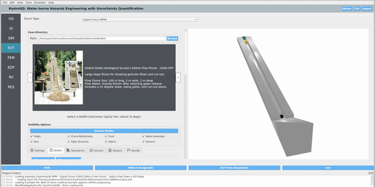

   GUI for the United State Geological Survey's Debris-Flow Flume (USGS DFF).

This example investigates runup of debris flows ([Iverson2010]_) against obstacles by comparing insights from large-scale experiments (e.g., vertical walls vs sloping barriers, [Iverson2016]_) at the United State's Geological Survey's Debris-Flow Flume (USGS DFF) to a fully 3D Material Point Method (MPM, [Bonus2023Dissertation]_ and [Bonus2025ClaymoreUW]_) simulation in HydroUQ. Guided by the experimental findings (shock-dominated runup at normal walls; pre-shock mass and momentum flux that increases runup on sloping obstacles; runup sensitivity to Froude number and effective basal friction/liquefaction), we construct a dry, high-friction MPM scenario:

- A sand mass (Drucker-Prager, dilatant; no pore-pressure coupling) is released on a hillside flume's crest on a 31 deg slope and accelerates downslope.
- At the toe, the flow impacts a raised structural box (an idealized vertical barrier) — the canonical shock-runup regime.
- The runout pad is frictional; macro-roughness may be represented either (i) by a Coulomb friction coefficient with a decay layer (computationally light), or (ii) by explicit roughness elements at fine grid spacing (captures grain-scale bouncing and sorting more faithfully).

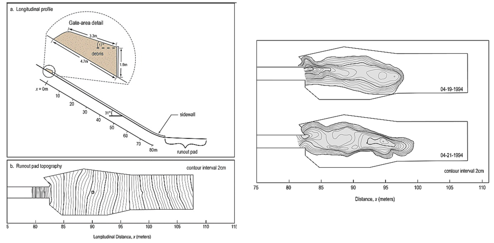

   Schematic of the United State Geological Survey's Debris-Flow Flume (USGS DFF) in Iverson 2016.

Because our base case is dry (no liquefaction), it represents the upper-friction bound of the experimental phase space: we anticipate strong shock development at the wall, shorter runup than low-friction/liquefied cases, and force histories dominated by a sharp impulse followed by damming. The setup is, however, readily extensible to two-phase MPM or hybrid MPM-CFD to examine the role of pore pressure on runup amplification and predictive skill in “ab initio” vs “data-informed” modes. To connect with the full experimental/analytical picture, we recommend advanced users go beyond this example by tracking and non-dimensionalizing the following quantities of interest (QoIs):

1. Incoming front Froude number, :math:`Fr = U_f/\sqrt{g\,h_f}`, with :math:`U_f` and :math:`h_f` measured at the last up-slope station before impact (pre-shock state).  
2. Runup height at the obstacle, measured as peak free-surface elevation (and center-of-mass rise) along the wall; compare to analytical momentum-jump and energy-based predictions.  
3. Normal stress/pressure and impulse on the obstacle face: resolve the rapid deceleration spike and the post-impact damming load plateau; decompose force into inertial vs quasi-hydrostatic components.  
4. Flow redirection metrics: diverted flux, reflected-wave amplitude, and the evolving thickness jump (front steepening) indicative of shock formation.  
5. Friction sensitivity: sweep basal :math:`\mu_{\mathrm{eff}}` and dilation angle; do you expect higher :math:`\mu_{\mathrm{eff}}` -> lower :math:`Fr` at the toe -> reduced runup/impulse, consistent with depth-integrated trends for less-liquefied inflows?

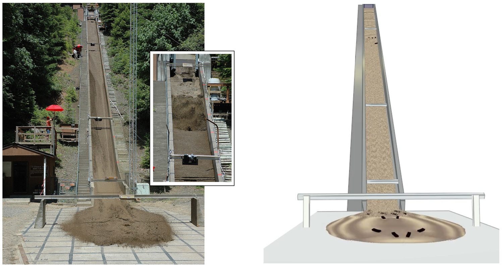

   Comparison of experimental and simulation results at high resolution.

On a final note before proceeding to describe the whole HydroUQ workflow, we remind the reader that our workflow aims to study structural response under extreme debris-flow loads at a reduced scale. The original experiments did seek to discern pressure trends for similar scenarios but were not truly concerned with structural loading and response, hence this represents an extrapolation of their work into a new domain.

.. _hdro-0008-set-up:

Set-Up
------

Step 1: UQ
~~~~~~~~~~

Configure **Forward** sampling to explore structural/material uncertainty under a fixed debris-flow signal traveling downslope.

- **Engine**: Dakota
- **Forward Propagation**: Sampling method (e.g., **LHS**) with ``samples`` (e.g., ``20``) and a reproducible ``seed`` (e.g., ``1``).

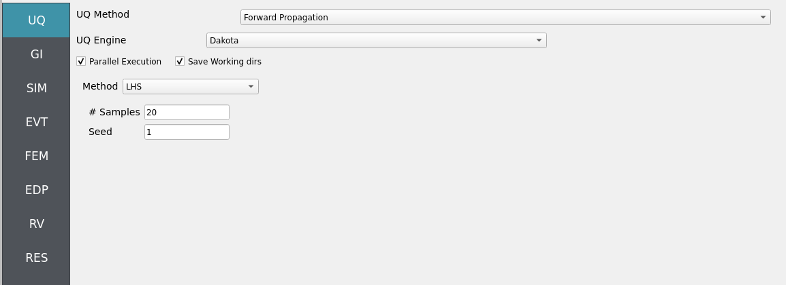

Step 2: GI
~~~~~~~~~~

Set **General Information** and **Units** consistent with experiments (length, time, density, gravity). Record project metadata.

- Structure name: ``Concrete Box @ USGS Debris-Flow Flume``
- Units: choose a consistent set (e.g., N-m-s or kips-in-s)

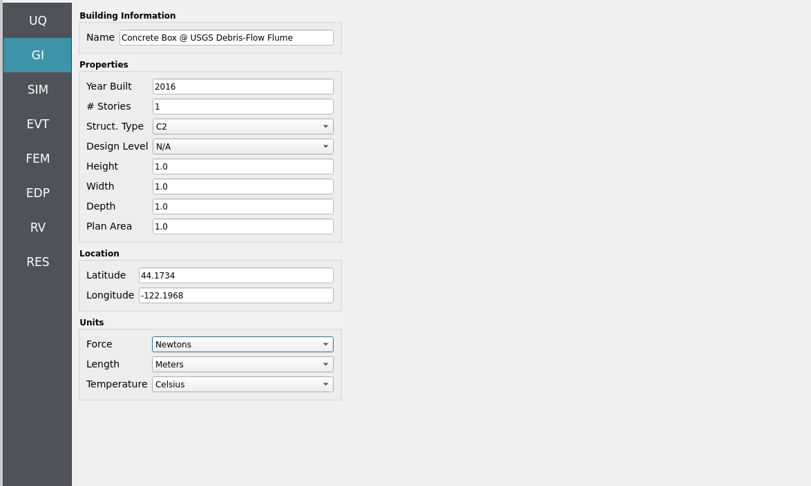

.. note::

   Keep **GI**, **SIM**, **EVT**, and **FEM** units consistent. Match MPM's length/time scales and OpenSees integration settings (e.g., time step). Verify any force/unit conversions used during load mapping.

Step 3: SIM
~~~~~~~~~~~~~~~~~~~~~~~

The structural model is as follows: a single-story Multi-Degree-of-Freedom system (MDOF, see :ref:`lblMDOFSIM`) replicating a structural box placed at the base of the hillslope.

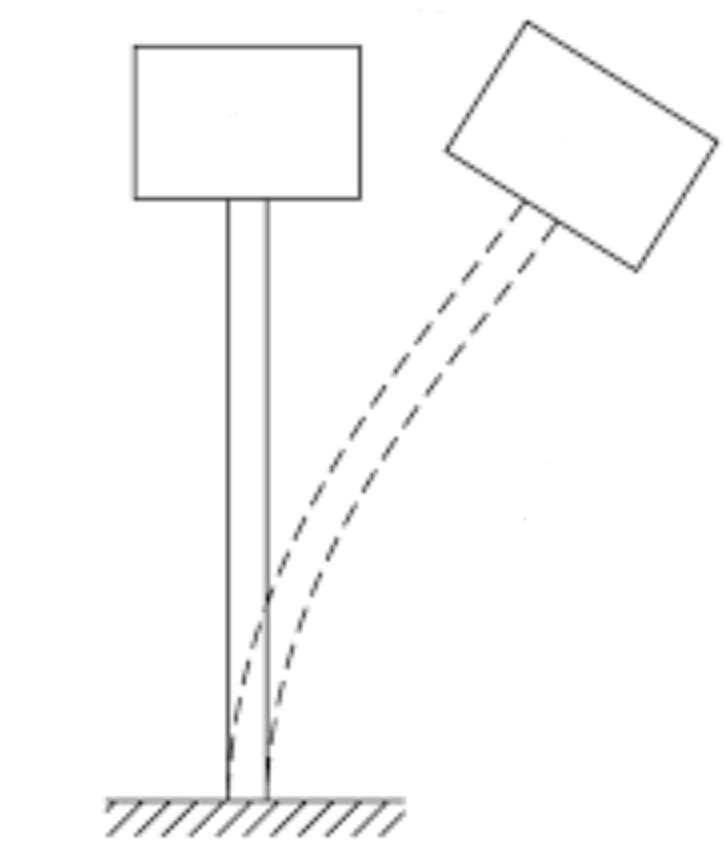

   Schematic of a single-story MDOF structure representing a structural box undergoing deflection from MPM derived debris-flow loading.

.. note::

   The structure will be represented initially as a **rigid boundary** in MPM to recover local debris-flow forces at grid nodes for direct comparison with **load-cell** data. Structural dynamic response is added later by mapping these loads onto an **OpenSees** model defined here in the SIM panel with analysis options set in the FEM panel.

**Uncertain structural properties** (treated as RVs; see Step 7):

- ``w``: Weight. Mean ``144``, stdev ``12``

Bind parameters via setting alphabetic characters in the variable input boxes (e.g., ``w``) so the **RV** panel recognizes and manages them automatically.

.. figure:: figures/hdro-0008_SIM.png
   :align: center
   :alt: SIM panel showing a single story MDOF system with uncertain variables w.
   :figclass: align-center

While not necessary to have, we show the template OpenSees model for your reference. The script generated in the backend by the MDOF module resembles the following, `MDOF.tcl <https://github.com/NHERI-SimCenter/HydroUQ/blob/master/Examples/hdro-0008/src/MDOF.tcl>`_:

.. raw:: html

   

   
Click to expand the OpenSees input file used for this example

.. literalinclude:: src/MDOF.tcl
   :language: tcl
   :linenos:

.. raw:: html

   

Step 4: EVT
~~~~~~~~~~~~~~~~~~~~~~~~~~~~~~~~~~~~~~~~~~~~~~~~

In this walk-through we will give a detailed step-by-step configuration of the MPM EVT module.

**Settings**

Open ``Settings``. Here we set the simulation time, the time step, and the grid resolution, among other pre-simulation decisions. Note that we have rotated the gravity vector to digitally create the 31 degree hill-slope out of an otherwise horizontal plane.

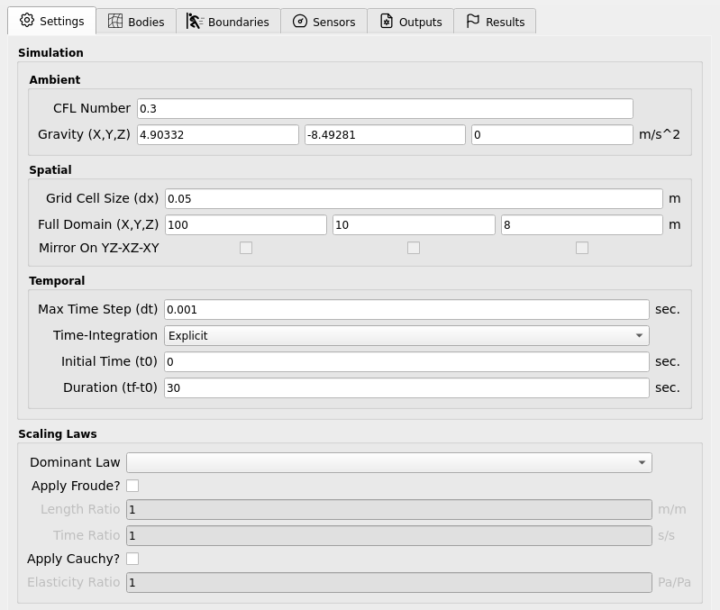

**Bodies**

**Geometry**

- **Fluid geometry**

Open ``Bodies`` / ``Fluid`` / ``Geometry``. Here we set the geometry of the flume's sand-mass. Note that it is simply a rectangular prism located at the top of the hillslope, where it is ready to collapse under gravity.

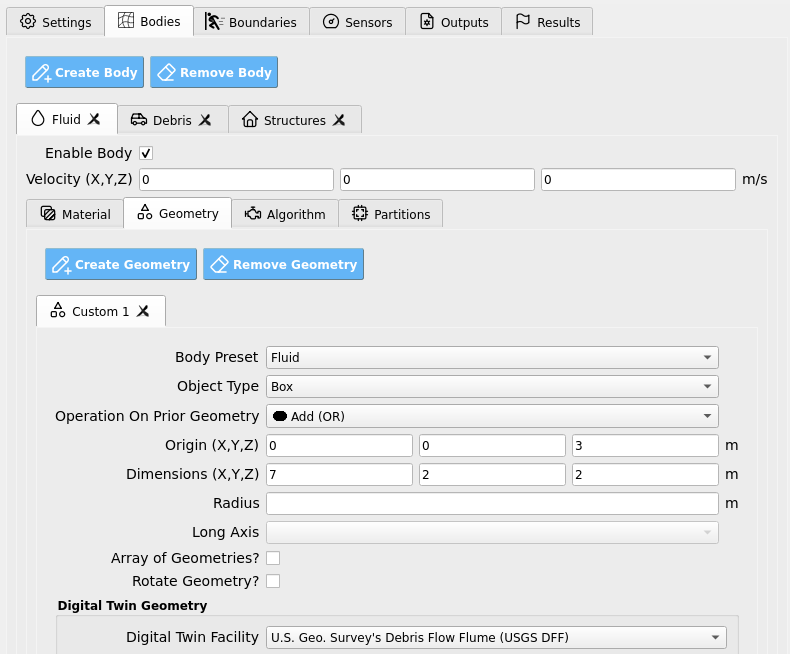

- **Debris geometry**:

Open ``Bodies`` / ``Debris`` / ``Geometry``. Here we set the debris properties, such as the number of debris, the size of the debris, and the spacing between the debris. Rotation is another option, though not used in this example. We've elected to use an 4 x 2 grid of debris (longitudinal axis parallel to long-axis of the flume).

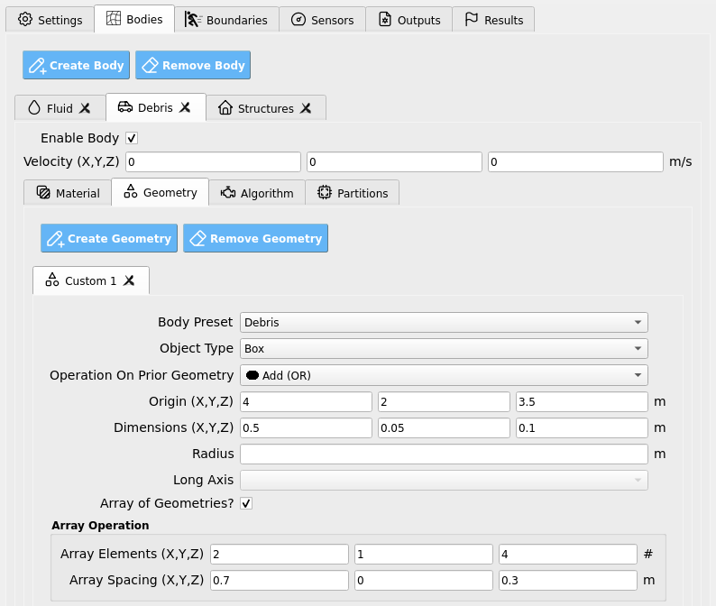

**Material**

- **Fluid material**:

Open ``Bodies`` / ``Fluid`` / ``Material``. Here we set the material properties of the sand. We base values off of those reported for the dry specimen in [Iverson2016]_ and assume that a standard Drucker-Prager constitutive model is applicable.

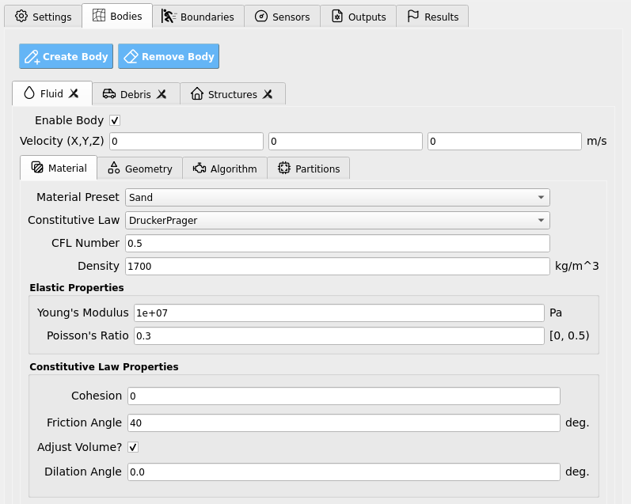

- **Debris material**:

Moving onto the creation of an ordered debris array, we set the debris properties in the ``Bodies`` / ``Debris`` / ``Material`` tab. We will assume debris are made of HDPE plastic so that they remain mostly buoyant while entrained in the debris-flow. This also helps to match the extensive literature on tsunami debris which uses HDPE plastic debris, as seen in Lewis 2023 [Lewis2023]_, Mascarenas 2022 [Mascarenas2022]_, and Shekhar et al. 2020 [Shekhar2020]_.

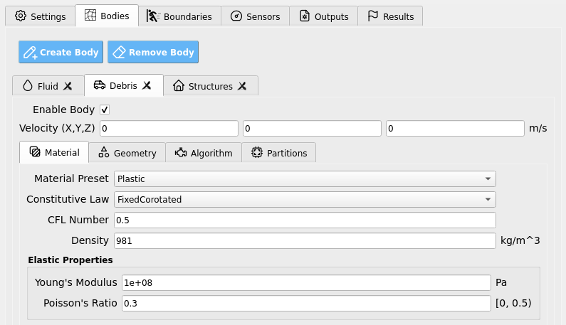

**Algorithm**

Open ``Bodies`` / ``Fluid`` / ``Algorithm``. Here we set the sand algorithm parameters for the simulation. This is an advanced feature of the MPM module, it is best not to alter it too much. We choose not to apply F-Bar antilocking as our sand is not numerically stiff enough to require it. The associated toggle must be unchecked. ASFLIP is turned on to allow us to apply friction to the sand mass as it flows downslope, as well as to allow us to track its velocity on a per-particle basis. 

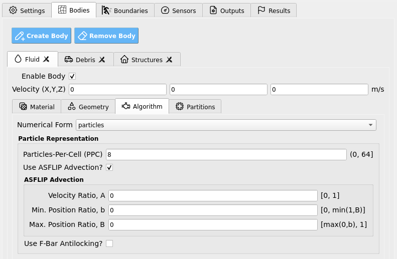

In ``Bodies`` / ``Debris`` / ``Algorithm`` we set debris as follows: ASFLIP is turned on and F-Bar antilocking is turned off. Turning on ASFLIP is, again, for the purpose of applying friction to the debris when appropriate (i.e., when contacting the flume floor) and for tracking debris particle velocity vectors.

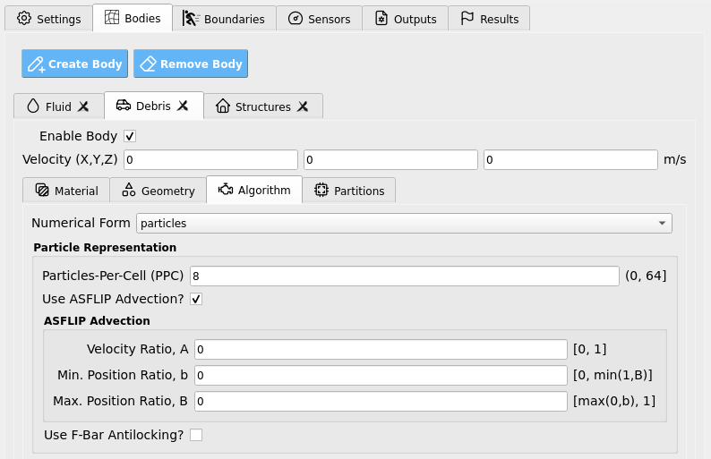

**Partitions**:

Open ``Bodies`` / ``Fluid`` / ``Partitions``. This is an advanced feature of the MPM module which allows us to partition material bodies across hardware devices to optimize simulations. These may be kept as their default values, which have already been set for compatibility on the remote HPC system.

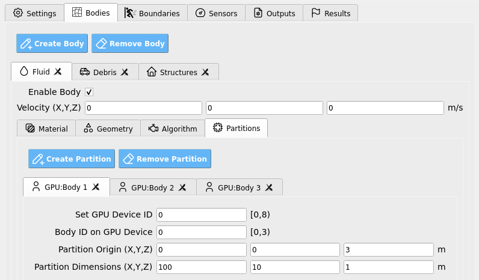

Next, ``Bodies`` / ``Debris`` / ``Partitions`` defines a partition where the debris may exist in our flume domain and defines the hardware device (i.e., GPU) that they will be simulated on. Keep this as the default unless you are an advanced user.

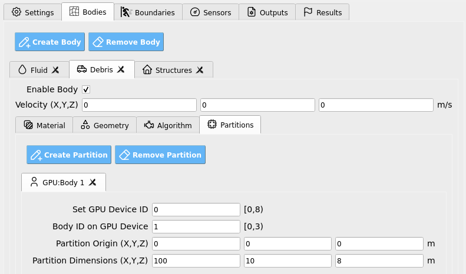

**Structure**:

Finally, open ``Bodies`` / ``Structures``. Uncheck the box that enables this body. We will not model the structure as a deformable MPM material body in this example, instead, we will approximate it as a rigid MPM boundary a few steps from now. After the MPM simulation we will map loads from the boundary to an OpenSees structure for structural analysis, see Steps 3 and 5 for configuration.

   
   HydroUQ Bodies Structures GUI

**Boundaries**

- **Wave Flume boundary**:

Open ``Boundaries`` / ``Flume Facility``. We will set the flume boundary to be a rigid body, with a fixed separable velocity condition. Bathymetry joint points should be identical to the ones used in ``Bodies`` / ``Fluid`` / ``Geometry``. Large friction coefficients of ``2`` are applied to replicate sand on concrete. Note that you may increase these in the range of 5 - 20 to try to better replicate the macro-roughness of the bumpy hillslope and runout pads used in experiments.

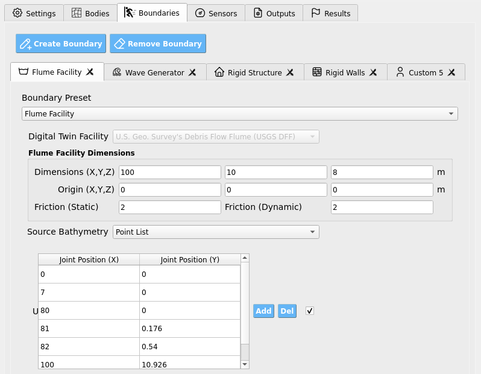

- **Wave Generator**:

Open ``Boundaries`` / ``Wave Generator``. As our so-called wave-generation method is the application of gravity to a sand-mass, we simply need to move the wave generator boundary condition outside of our digital flume so that it doesn't interfere with the debris-flow. It may also be removed entirely, if desired.

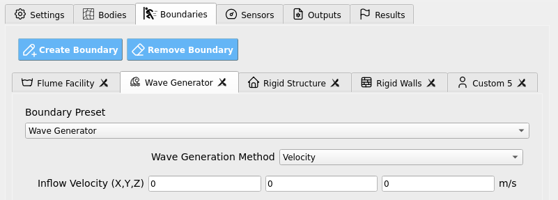

- **Rigid Structure**:

Open ``Boundaries`` / ``Rigid Structure``. This is where we will specify the structure as a boundary condition. By doing so, we can determine the exact loads on the rigid boundary grid-nodes, which automatically map to the model defined in the SIM and FEM tab in Steps 3 and 5 for potentially nonlinear UQ structural response analysis.

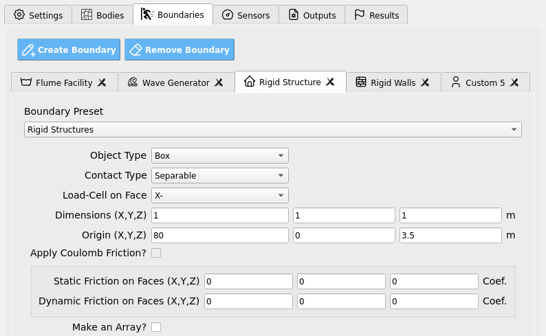

- **Rigid Exterior Walls**:

Open ``Boundaries`` / ``Rigid Walls``. Set to encompass the flume domain and runout pad.

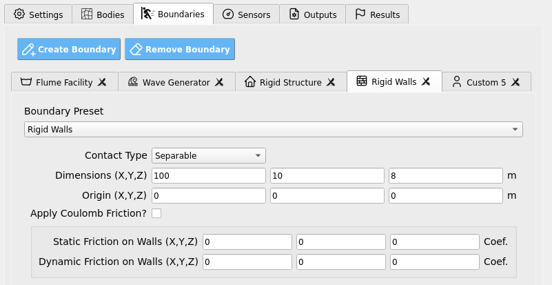

- **Side Walls**

Click ``Create Boundary``. Navigate to ``Boundaries`` / ``Custom 5``. This boundary will be used to define the side-walls of the flume experiments. Define them as rigid rectangular prisms as below in an array of two, with a gap inbetween designated for the downslope debris-flow development.

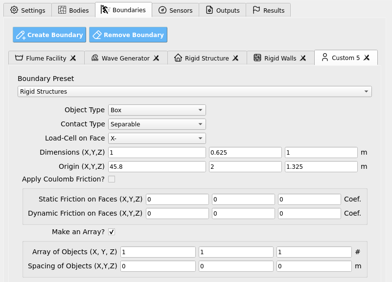

**Sensors**

- **Wave Gauges**:

Open ``Sensors`` / ``Wave Gauges``. Set the ``Use these sensor?`` box to ``True`` so that the simulation will output results for the instruments we set on this page.

Four wave gauges will be defined along the hillslope ramp's path towards the structural face, where we anticipate a sand buffer to develop. 

Set the origins and dimensions of each wave gauge to encompass at least one grid-cell in each direction as in the table below. To match experimental conditions, we also apply a 30 Hz sampling rate to the wave gauges.

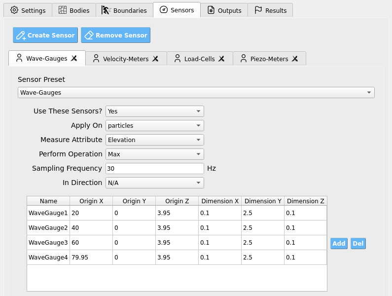

These wave gauges will read all numerical bodies (i.e. particles) within their defined regions at every sampling step and will report the highest elevation value (Position Y) of a contained body as the free-surface elevation at that gauge. The results are written into our sensor results files which we will later analyze.

- **Load Cells**:

Open ``Sensors`` / ``Load Cells``. Set the ``Use these sensor?`` box to ``True`` so that the simulation will output results for the instruments we set on this page. Two load cells are defined so that we may map loads onto two nodes of our OpenSees structural model which we defined in Steps 3 and 5. Output frequency is set to 120 Hz to capture primary load phenomena, but note that the experiments themselves did not feature such load-cells.

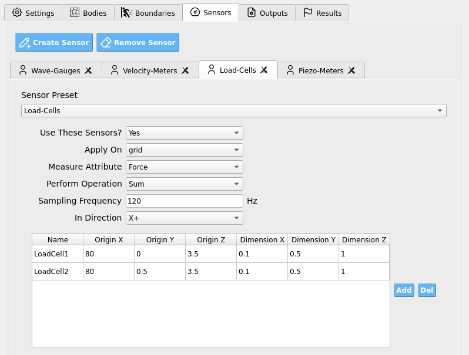

**Outputs**

Open ``Outputs``. Here we set the non-physical output parameters for the simulation, e.g. attributes to save per frame and file extension types. The particle bodies' output frequency is set to 2 Hz, meaning the simulation will output results every 0.5 seconds. This is to save disk space and reduce I/O load, but it may be increased if you wish to make animations (e.g., 10 - 30 Hz). Fill the rest of the data in the figure into your GUI to ensure all your outputs match this example. You may alter output attributes if you are an advanced user familiar with ClaymoreUW attributes and wish to perform more advanced analysis.

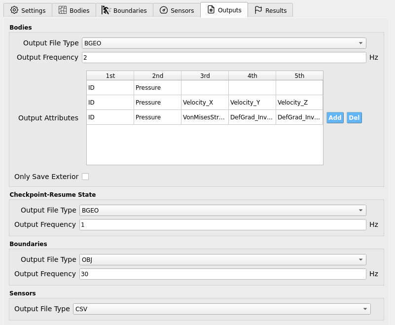

Step 5: FEM
~~~~~~~~~~~~~~~~~~~~~~

This example insofar focused on **debris-flow forces** measured on rigid structures. To perform true structural response analysis, map recovered boundary loads to an **OpenSees** model in **SIM** and configure dynamic analysis here as in other HydroUQ tutorials.

**Solver**: OpenSees dynamic analysis. Check:

- Integration step compatible with MPM sensor output interval.
- Algorithm/convergence tolerances suitable for expected nonlinearity.
- Damping model as needed (e.g., Rayleigh).

.. figure:: figures/hdro-0008_FEM.png
   :align: center
   :alt: FEM panel with integration, algorithm, solver, and damping settings.
   :figclass: align-center

Step 6: EDP
~~~~~~~~~~~

Select **Engineering Demand Parameters (EDPs)** to summarize response:

- Peak Floor Acceleration (PFA)
- Root Mean Square Acceleration (RMSA)
- Peak Floor Displacement (PFD)
- Peak Interstory Drift (PID)

.. figure:: figures/hdro-0008_EDP.png
   :align: center
   :alt: EDP panel with standard selections enabled.
   :figclass: align-center

Note that other quantities of interest (QoI) are theoretically obtainable from HydroUQ, if the custom EDP module is configured. E.g.: 

- Wave: free-surface elevation η(t) at gauges.
- Debris motion: **longitudinal displacement** (forward/back), **lateral spreading angle**, **stack interaction metrics** (contact counts/overturns).
- Loads: **obstacle force time histories** (impact peaks, impulses).

Step 7: RV
~~~~~~~~~~~~~~~~~~~~~

Define distributions for structural RV:

**Structural**

- ``w``: **Normal** (mean ``144``, stdev ``12``)

.. figure:: figures/hdro-0008_RV.png
   :align: center
   :alt: RV panel listing weight (w) with Normal distributions and parameters.
   :figclass: align-center

For future UQ, consider:

- Debris: mass variance, friction coefficients (debris-apron, debris-debris).
- Wave: amplitude/period tolerance relative to vacuum-maker target.
- Obstacles: small misalignment/placement tolerance.

.. _hdro-0008-simulation:

Simulation
----------

This case was executed on **TACC Stampede3** using **2x NVIDIA H100** GPUs on a single node (queue: ``h100``).  
Simulated physical time: **15 seconds**. Wall time: **90 minutes** (allow ample **Max Run Time** in job settings).

.. important::
   Provide generous **Max Run Time**, on the order of 60 to 90 minutes, to complete the run and post-processing before scheduler limits are reached.

.. warning::
   Keep sensor regions, counts, sampling rates, and output frequencies reasonable—excess I/O can dominate runtime.

**Outputs**

- Sensor CSVs (gauges, debris CoM, loads) at your chosen rates.
- Particle/field snapshots (e.g., BGEO/VTK) for visualization/diagnostics.

.. _hdro-0008-analysis:

Analysis
--------

**Accessing Results and Simulation Files**

When the simulation job has been completed, the results and simulation files will be available on the remote system for retrieval or remote post-processing.

Retrieving the ``results.zip``, ``templatedir.zip``, ``workdir.tar.gz``, and ``MPM`` folders will allow you to analyze all of the simulation output (e.g., hydrodynamic, structural, uncertainty quantification).

- ``results.zip``: Contains primary uncertainty quantification output and MPM sensor files. This will be the primary place for analysis.

- ``templatedir.zip``: Contains template and workflow files for the job. This is an important resource for debugging your workflows.

- ``workdir.tar.gz``: Contains the working directories in which each unique simulation was ran. This is where structural response uncertainty is expanded on typically.

- ``MPM``: Contains all the MPM simulation files. Includes the raw particle output frames which can be used to create animations or to perform more advanced post-processing.

The most straightforward way to retrieve the most important files, ``results.zip`` and ``templatedir.zip``, is by clicking the ``GET From DesignSafe`` button in ``HydroUQ``.

.. figure:: figures/getFromDesignSafe.png
   :align: center
   :width: 400
   :figclass: align-center
   
   HydroUQ ``GET From DesignSafe`` button, which opens up a jobs table of all your remote simulations.

Then, right-click on your job (if it is finished) and select ``Retrieve Data``. This will download ``results.zip`` and ``templatedir.zip``. 

.. figure:: figures/retrieveData.png
   :align: center
   :width: 400
   :figclass: align-center
   
   Locating the ``Retrieve Data`` button in the HydroUQ remote jobs table.

HydroUQ will then automatically unzip them into ``results`` and ``templatedir``, which will be located in ``{your_path}/HydroUQ/RemoteWorkDir/tmp.SimCenter``. On most systems, this will be ``~/Documents/HydroUQ/RemoteWorkDir/tmp.SimCenter``, but you can check by clicking on ``Files`` / ``Preferences`` on the upper-left corner of HydroUQ.

To retrieve ``workdir.tar.gz`` and ``MPM``, there are two approaches: 

(1) You can right-click on your job within HydroUQ and select ``Open Job Folder`` to be taken directly to the Design Safe web-page displaying all remote files. 

.. figure:: figures/openJobFolder.png
   :align: center
   :width: 400
   :figclass: align-center
   
   Locating the ``Open Job Folder`` button in the HydroUQ remote jobs table.

(2) You can manually navigate to the designsafe-ci.org website. For the latter, login and go to ``Upper-right Drop-down`` / ``Job Status``.

   
   Locating the job files on DesignSafe

Check if the job has finished in the central vertical drawer by refreshing the page. If it has, click ``View Details``.  

.. figure:: figures/DSToolsAndAppsJobsStatusFinished.png
   :align: center
   :width: 600
   :figclass: align-center
   
   Job status is finished on DesignSafe

Once the job is finished, the output files should be available in the directory which the analysis results were sent to

Find the files by clicking ``View Output``. 
	
.. figure:: figures/DSToolsAndAppsJobsStatusViewFiles.png
   :align: center
   :width: 600
   :figclass: align-center
   
   Viewing the job files on DesignSafe

After navigating to your job folder by one of two ways, it is time to move files for processing. Move important files to somewhere in ``My Data/`` for easier processing. Use the extractor tool available on DesignSafe to unzip the ``results.zip``, ``workdir.tar.gz``, and ``templatedir.zip`` folders natively on DesignSafe. 

.. figure:: figures/extractonDS.png
   :align: center
   :width: 600
   :figclass: align-center
    
   Extracting the ``results.zip`` folder on DesignSafe

Alternatively, you may directly download the zipped folders to your PC, which will require you to use the DesignSafe zip tool on the ``MPM`` folder prior.

   Download button on DesignSafe shown in red

Locate the downloaded zip folders and extract them somewhere convenient. The HydroUQ local or remote work directory on your computer is a good option.

.. warning::
   
   Files in the HydroUQ local and remote working directories may be erased if another simulation is set up in HydroUQ, so keep a backup if you wish to maintain the files.

Particle geometry files often have a ``BGEO`` extension and are located in the ``MPM`` folder. Open with Side FX Houdini Apprentice (free to use) to look at MPM results in high-detail, or use the PartIO library.

HydroUQ's sensor/probe/instrument output is available in ``{your_path}/HydroUQ/RemoteWorkDir/tmp.SimCenter/results/`` as ``CSV`` files. You may process these files as you wish, most opt to use custom Python scripts or Excel due to their simplicity. 

.. note::
   
   For convenience, HydroUQ also includes basic plotting of all sensors files in the ``EVT`` / ``Results`` tab. Click ``Post-Process Sensors``, configure the drop-down boxes for the sensor you wish to view, and then click ``Plot``.

Plotting the wave gauges shows the development of a debris-flow as it propagates from the initial hill-perched mass down the highly frictional hillslope. It attains a steady-state flow-depth of approximately 0.25 meters prior to collision with the rigid structural box, which causes a 'splash' upto 2.5 meter which settles down to approximately 0.75 to 1.0 meter of quasi-hydrostatic sand-mass build-up at the structural face.

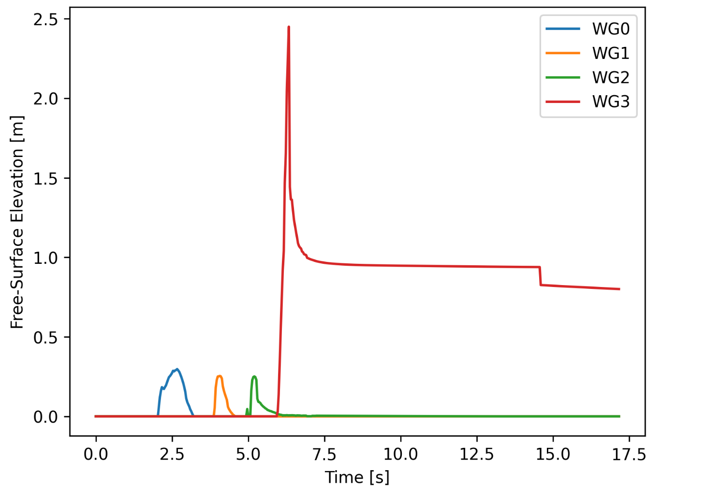

   Simulated free-surface elevations at four wave gauges in MPM.

Load-cell data shows an initially extremely high peak force caused by the kinematic energy transfer of the fast moving debris-flow. It is followed by decaying damming forces and eventually just a slight quasi-hydrostatic loading. These results emphasize the extreme hazard that fast moving debris-flow pose to structures, even at this reduced scale.

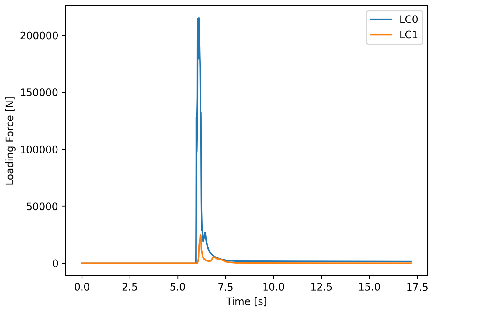

   Simulated load-cell forces in MPM. These are later mapped onto an OpenSees structure for dynamic response analysis.

To demonstrate the applicability of the MPM module within HydroUQ to replicating these experiments, we show below a higher resolution case from [Bonus2023Dissertation]_ which replicates many aspects of even a partially liquefied flow. For an ever more apt comparison, a side-by-side of dry experiments and simulations is also shown in the overview section.

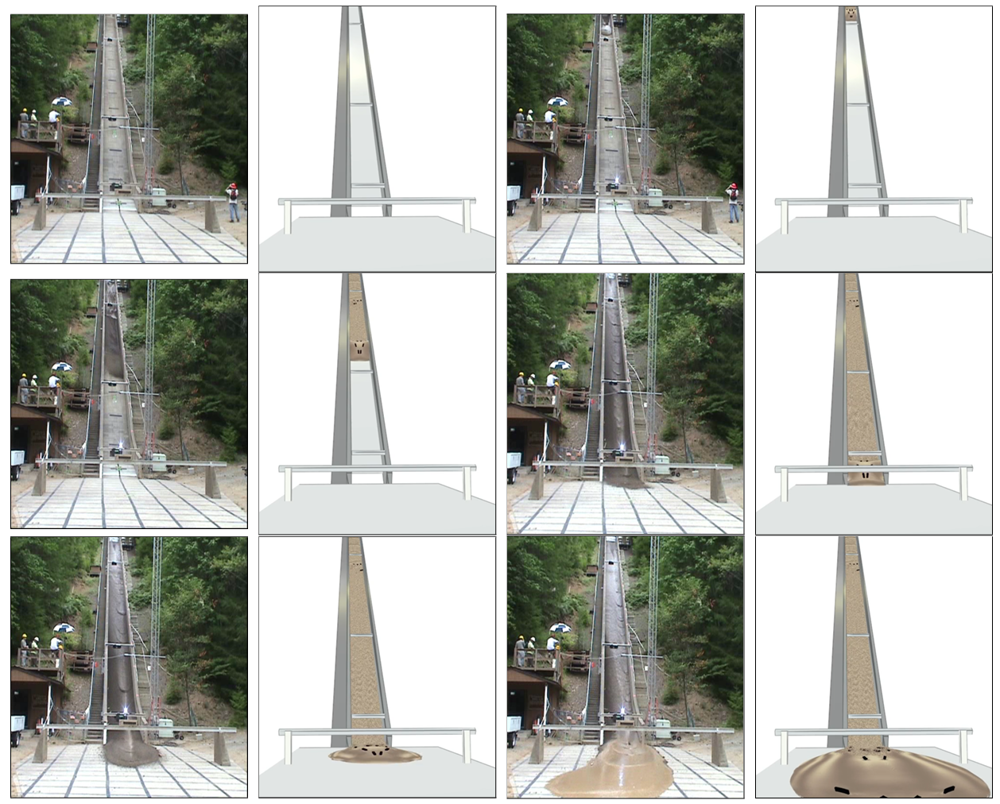

Elevation contours of the runout can also be visualized as seen below. This shows appropriate kinetic energy dissipation as the debris-flow propagates down the frictional hillslope and onto the frictional runout pad. High relative accuracy in the runout pattern also suggests that the Drucker-Prager constitutive model was an appropriate choice for the dry experimental scenario examined.

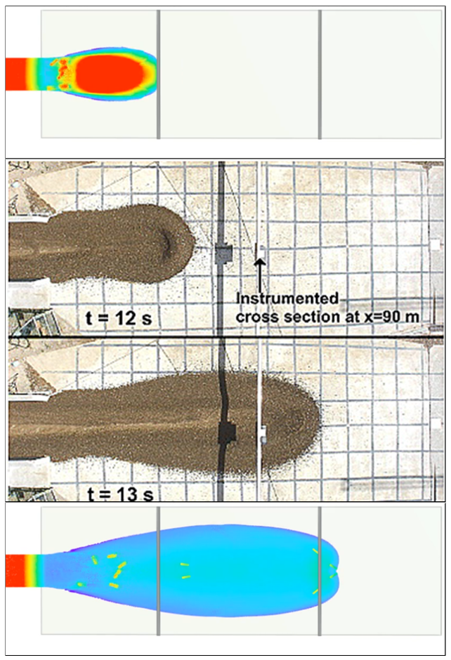

Finally, the impact on the structural box can be looked at more closely. Here we see the pressure visualized in the debris-flow with entrained debris color-coded for visual identification. A clear build-up of mass and pressure at the structure is observed, followed by a 'splash' dissipating remaining energy, and finally a quasi-hydrostatic state is reached at the structural face. Debris are seen to flow with and decouple from the debris-flow without issue.

.. figure:: figures/hdro-0008_Impact_Frames.png
   :align: center
   :width: 600
   :figclass: align-center

**Structural Analysis**

Returning to our primary HydroUQ workflow, which concerns uncertainty in structural response, we may now view the final results in the **RES** tab. Clicking ``Summary`` on the top-bar, a statistical summary of results is shown below:

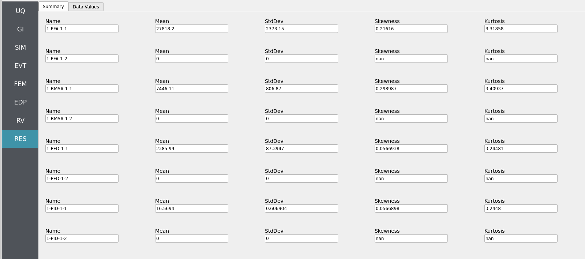

Clicking ``Data Values`` on the top-bar shows detailed histograms, cumulative distribution functions, and scatter plots relating the dependent and independent variables:

.. note:: 
   In the **Data Values** tab, left- and right-click column headers to change plot axes; selecting a single column with both clicks displays frequency and CDF plots.

.. figure:: figures/hdro-0008_RES_Histogram.png
   :align: center
   :width: 600
   :alt: RES panel histogram of dependent variable.
   :figclass: align-center

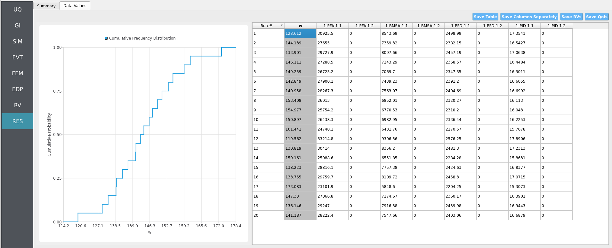

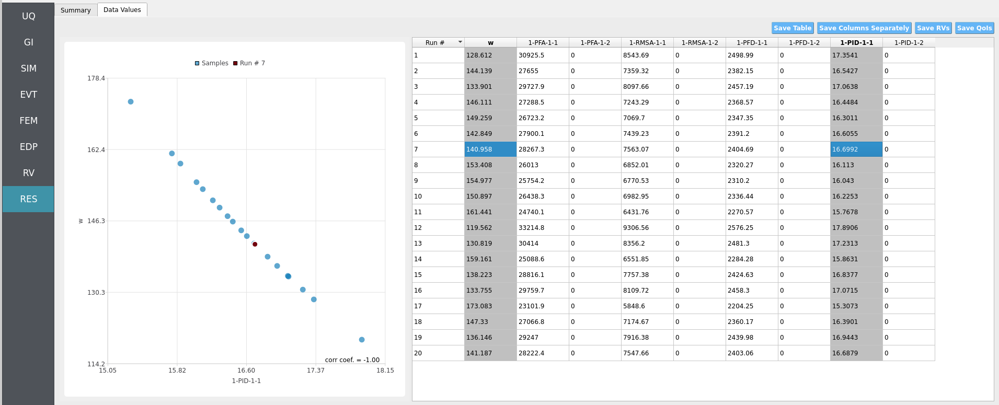

.. note::
   Use **consistent Froude similitude scaling** when comparing numerical simulations, experiments, and full-scale scenarios. For cross-method comparisons, adopt **identical debris footprints**, **friction models**, **probe placement**, and other pertinent parameters to reduce bias.

For more advanced analysis, export results as a CSV file by clicking ``Save Table`` on the upper-right of the application window. This will save the independent and dependent variable data. I.e., the **Random Variables** you defined and the **Engineering Demand Parameters** determined from the structural response per each simulation.

To save your simulation configuration with results included, click ``File`` / ``Save As`` and specify a location for the HydroUQ JSON input file to be recorded to. You may then reload the file at a later time by clicking ``File`` / ``Open``. You may also send it to others by email or place it in an online repository for research reproducibility. This example's input file is viewable at :ref:`hdro-0008-reproducibility`.

To directly share your simulation job and results in HydroUQ with other DesignSafe users, click ``GET from DesignSafe``. Then, navigate to the row with your job and right-click it. Select ``Share Job``. You may then enter the DesignSafe username or usernames (comma-separated) to share with. 

.. important::
   Sharing a job requires that the job was initially ran with an ``Archive System ID`` (listed in the ``GET from DesignSafe`` table's columns) that is **not** ``designsafe.storage.default``. Any other ``Archive System ID`` allows for sharing with DesignSafe **members on the associated project**. See :ref:`lbl-jobs` for more details. 

.. _hdro-0008-conclusions:

Conclusions
-----------

The HydroUQ MPM runs of the digital USGS DFF reproduce the mechanistic signatures of a dry debris-flow highlighted in the experiments by [Iverson2016]_. In summary:

- The model captures appropriate depth-velocity flow pairing relative to the sand material and frictional hillslope.
- Against a vertical barrier, runup is shock-dominated: front thickening, rapid momentum loss, and a clear pressure/impulse peak followed by brief quasi-static damming.
- The ab initio (dry, high-friction) configuration provides a conservative lower bound on runup for comparable geometries if investigating dry, high-friction scenarios.
- Runout is reasonably captured relative to the macro-friction of the bumpy hillslope and runout pads that are replicated with a large Coulomb friction coefficient.
- Further, we extrapolate to structural analysis by mapping MPM-derived loads onto an OpenSees model in our modular workflow, allowing for design insights to be garnered if analysis is refined.

For HydroUQ users interested in advanced analysis of further cases in this experimental set and digital flume, we may suggest investigating:

- When the barrier is conceptualized with an adverse slope (parametric variants), do the runs show a pre-shock mass/momentum transfer to the front that increases runup before a shock forms, i.e., consistent with the sloping-obstacle observations of experiments?
- Do predicted runup height scales with :math:`Fr` at the toe and decreases with increasing basal :math:`\mu_{\mathrm{eff}}`, matching the trend that less-liquefied flows run up less?
- Whether data-informed variants (calibrated :math:`Fr`, :math:`h_f`, :math:`\mu_{\mathrm{eff}}`, or adding a pore-pressure mechanism) improve quantitative accuracy without changing the underlying shock vs pre-shock narrative?
- Does the model resolve flow redirection and reflected-wave growth, which feed back on the incoming body to modulate the impulse tail? Do these multidimensional effects explain why simplified analytical models can bracket but not fully match peak loads in all regimes?
- Report :math:`Fr`, :math:`h_f`, :math:`U_f` at a fixed station upstream; plot runup ratio :math:`R/h_f` vs :math:`Fr` and vs :math:`\mu_{\mathrm{eff}}` and evaluate trends.
- Integrate wall-normal force to obtain impulse; separate peak and damming contributions using a suitable decomposition method.
- Visualize thickness jumps and reflected waves (space-time plots at the wall and along the pad) to diagnose shock onset.
- For design-leaning studies, map the envelope of :math:`(Fr, \mu_{\mathrm{eff}})` to runup and impulse fragility curves, then propagate uncertainty with Forward UQ.
- Explore use of more advanced UQ techniques for refined structural design in this extreme loading environment.

Overall, the MPM digital flume captures the physics that matter for runup forecasting — shock formation, flux-front coupling, and friction-controlled dissipation — and offers a clear path to higher fidelity (two-phase coupling, explicit roughness) when needed. This supports using HydroUQ MPM as a predictive, mechanistic tool for evaluating debris-flow runup and impact loads on protective structures across a spectrum of flow regimes.

.. _hdro-0008-references:

References
----------

.. [Iverson2010] Iverson, R. M., Logan, M., LaHusen, R. G., & Berti, M. (2010). The perfect debris flow? Aggregated results from 28 large-scale experiments. Journal of Geophysical Research F: Earth Surface, 115(F3), F03005-. https://doi.org/10.1029/2009JF001514

.. [Iverson2016] Iverson, R. M., George, D. L., & Logan, M. (2016). Debris flow runup on vertical barriers and adverse slopes. Journal of Geophysical Research: Earth Surface, 121(12), 2333–2357. https://doi.org/https://doi.org/10.1002/2016JF003933

.. [Bonus2023Dissertation] Bonus, Justin (2023). "Evaluation of Fluid-Driven Debris Impacts in a High-Performance Multi-GPU Material Point Method." PhD thesis. University of Washington, Seattle.

.. [Bonus2025ClaymoreUW] Bonus, J., & Arduino, P. (2025). ClaymoreUW. Zenodo. https://doi.org/10.5281/zenodo.15128706

.. _hdro-0008-reproducibility:

Reproducibility
---------------

- Random seed(s): ``1`` (set in UQ)
- App version: HydroUQ v4.2.0 (or current)
- Solver: MPM (ClaymoreUW, multi-GPU)
- Hardware: TACC Lonestar6 or Stampede3, **3x A100** or **4x H100** (single node, ``gpu-a100`` or ``h100`` queue)
- Simulated time: **30 seconds**; Wall time: **1-2 hours**
- Sensor sampling: wave-gauges **120 Hz**; particle output **2-10 Hz**
- Input: The HydroUQ input file is as follows: `input.json <https://github.com/NHERI-SimCenter/HydroUQ/blob/master/Examples/hdro-0008/src/input.json>`_ , is used:
.. raw:: html

   

   
Click to expand the HydroUQ input file used for this example

.. literalinclude:: src/input.json
   :language: json
   :linenos:

.. raw:: html

   
