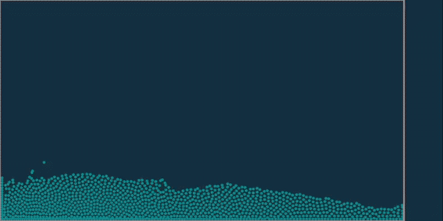
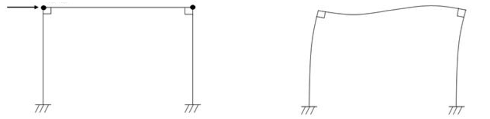
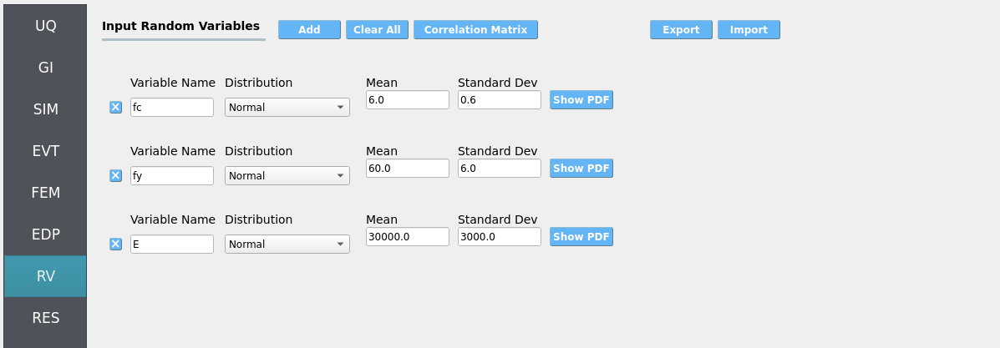
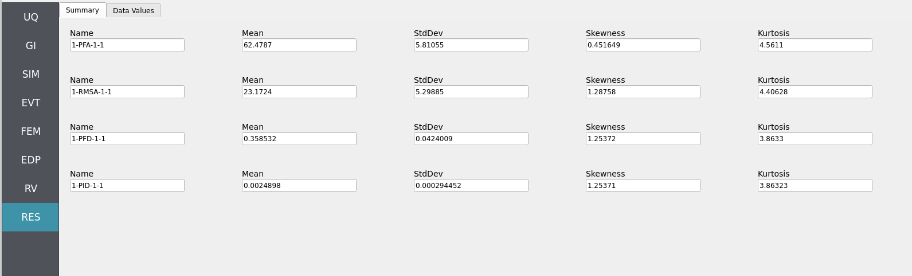
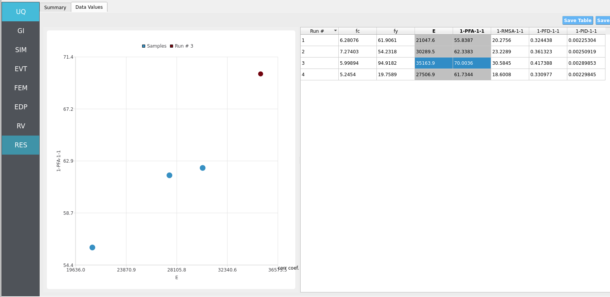
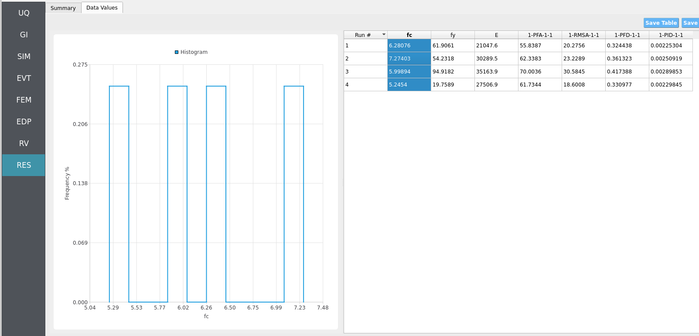
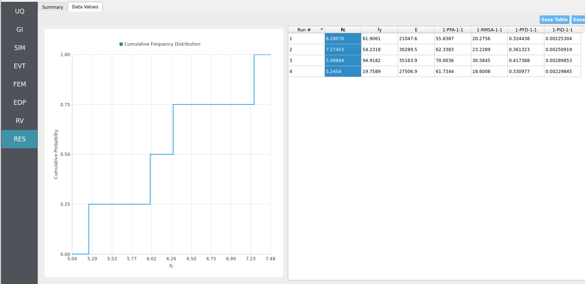

.. _hdro-0010:

====================================================================================
Real-Time Wave-Solver - Simple Piston Generated Wave Loading - Taichi Event
====================================================================================

+---------------+----------------------------------------------+
| Problem files | :github:`Github <Examples/hdro-0010/>`       |
+---------------+----------------------------------------------+

.. contents:: Table of Contents
   :local:
   :backlinks: none

.. _hdro-0010-overview:

Overview
--------

Forward sample an uncertain structure loaded by a physics-based wave maker piston's generated wave in real-time. This workflow uses the high-performance **Taichi Lang** on your local PC to accelerate simulations using your **CPU** or your **GPU** [Hu2019]_. We numerically simulate **position-based fluid dynamics (PBFD)** in 2D: the **right** boundary is a moving wall (wave-maker piston), the **center** is a water particle mass, and the **left** is a rigid wall representing the structure onto which HydroUQ maps hydrodynamic loads for an **OpenSees** model. This replicates the basic physics of wave-makers in real facilities, such as Oregon State University's Large Wave Flume and Directional Wave Basin. The OpenSees structure is a **2D three degree-of-freedom portal frame** with uncertain variables.

.. note::

   Keep **GI**, **SIM**, **EVT**, and **FEM** units consistent. Match Taichi's PBFD length/time scales and OpenSees integration settings (e.g., time step). Verify any force/unit conversions used during load mapping.

.. _hdro-0010-set-up:

Set-Up
------

Step 1: UQ
~~~~~~~~~~

Configure **Forward** sampling to explore structural/material uncertainty under a fixed piston-generated wave signal.

- **Engine**: Dakota
- **Forward Propagation** (e.g., **LHS**) with ``samples`` (e.g., ``4``) and a reproducible ``seed`` (e.g., ``1``).

.. figure:: figures/hdro-0010_UQ.png
   :align: center
   :alt: HydroUQ UQ panel with Dakota engine; Forward method selected with sample count and seed set.
   :figclass: align-center

Step 2: GI
~~~~~~~~~~

Set **General Information** and **Units**. Ensure that length/time units are consistent with the Taichi Lang script's and OpenSees model's parameters.

- Project name: ``hdro-0010``
- Location/metadata: optional  
- Units: choose a consistent set (e.g., N-m-s or kips-in-s)

.. figure:: figures/hdro-0010_GI.png
   :align: center
   :alt: General Information panel showing project name and unit selections.
   :figclass: align-center

Step 3: SIM
~~~~~~~~~~~

The structural model is as follows: a **2D, 3-DOF OpenSees portal frame** in OpenSees, :ref:`lblOpenSeesSIM`. 

   2D 3-DOF portal frame under stochastic wave loading (JONSWAP)

For the OpenSees generator the following model script, `Frame.tcl <https://github.com/NHERI-SimCenter/HydroUQ/blob/master/Examples/hdro-0010/src/Frame.tcl>`_ , is used:

.. raw:: html

   

   
Click to expand the OpenSees input file used for this example

.. literalinclude:: src/Frame.tcl
   :language: tcl
   :linenos:

.. raw:: html

   

.. note::
   
   The first lines containing ``pset`` in an OpenSees tcl file will be read by the application when the file is selected. The application will autopopulate the random variables in the **RV**  panel with these same variable names. 

.. figure:: figures/hdro-0010_SIM.png
   :align: center
   :alt: SIM panel referencing an OpenSees model file (Frame.tcl) with fields for material properties set as variable names fc, fy, and E.
   :figclass: align-center

These variable names (``fc``, ``fy``, ``E``) are **recognized** in ``Frame.tcl`` due to use of the `pset` command instead of `set`. This is so that **RV** picks them up automatically. You can try adding new **RV** parameters in the same way.

**Uncertain properties** (treated as RVs; see Step 7):

- ``fc``: mean ``6``, stdev ``0.06``  
- ``fy``: mean ``60``, stdev ``0.6``  
- ``E``: mean ``30000``, stdev ``300``

Step 4: EVT
~~~~~~~~~~~

**Load Generator**: **Taichi Event - 2D PBFD piston wave maker** (local, real-time capable).

Typical configuration (adjust to your scenario):

- **Domain**: width/height, particle spacing, boundary conditions (rigid walls at left/bottom; moving wall at right).
- **Piston motion**: stroke amplitude, frequency (or velocity profile), phase start/stop.
- **PBFD numerics**: solver iterations per step, CFL-safe time step, density/stiffness tuning.
- **Export**: per-step force/pressure sampling at the left wall; choose sampling grid/resolution and output rate.

If desired, you can promote piston parameters (e.g., amplitude/frequency) to RVs in future studies; here we keep them **deterministic** to focus on structural uncertainty.

.. figure:: figures/hdro-0010_EVT.png
   :align: center
   :alt: EVT panel showing Taichi piston event settings (domain, piston motion, PBFD parameters, and export options).
   :figclass: align-center

You will run, and may edit to implement hydrodynamic uncertainty, the following Taichi Lang Python script for position-based fluid dynamics, `pbf2d.py <https://github.com/NHERI-SimCenter/HydroUQ/blob/master/Examples/hdro-0010/src/pbf2d.py>`_:

.. raw:: html

   

   
Click to expand the Python script used for this example

.. literalinclude:: src/pbf2d.py
   :language: python
   :linenos:

.. raw:: html

   

Step 5: FEM
~~~~~~~~~~~

**Solver**: OpenSees dynamic analysis. Check:

- Integration step compatible with PBFD export interval (or use interpolation).
- Appropriate algorithm/convergence tolerances for expected nonlinearity.
- Damping model as needed (e.g., Rayleigh).

.. figure:: figures/hdro-0010_FEM.png
   :align: center
   :alt: FEM panel with integration, algorithm, solver, and damping choices.
   :figclass: align-center

Step 6: EDP
~~~~~~~~~~~

Select **Engineering Demand Parameters (EDPs)** to summarize response:

- Peak Floor Acceleration (PFA)
- Root Mean Square Acceleration (RMSA)
- Peak Floor Displacement (PFD)
- Peak Interstory Drift (PID)

.. figure:: figures/hdro-0010_EDP.png
   :align: center
   :alt: EDP panel with standard selections enabled.
   :figclass: align-center

Step 7: RV
~~~~~~~~~~

Define distributions for the structural RVs:

- ``fc``: **Normal** (mean ``6``, stdev ``0.06``)
- ``fy``: **Normal** (mean ``60``, stdev ``0.6``)
- ``E``:  **Normal** (mean ``30000``, stdev ``300``)

.. warning::

   Do not leave distributions as **constant** when using the Dakota UQ engine unless the variable is intentionally deterministic for this study.

.. _hdro-0010-simulation:

Simulation
----------

This workflow is intended for **local execution** to leverage real-time/near-real-time Taichi PBFD on **CPU or GPU**. Click **RUN**. When complete, the **RES** panel opens.

.. warning::
   Keep recorder counts, output frequency, and sample size reasonable. Excessive I/O (high-rate PBFD exports or too many recorders) can dominate runtime and disk usage.

We assume most modern computers will be able to run 1 - 10 of these simulations (set by samples in the ``UQ`` tab) in parallel in real-time (60 frames-per-second) or near real-time. A pop-up GUI(s) should appear once the ``RUN`` button is clicked at the bottom of the HydroUQ desktop app. The ``taichi`` PyPi will be automatically installed if your system does not currently have it. The backend graphics library is automatically swapped out by Taichi to meet your systems capabilities, though there are some edge-cases which you may contact NHERI SimCenter developers for assistance on.

.. _hdro-0010-analysis:

Analysis
--------

Returning to our primary HydroUQ workflow, which concerns uncertainty in structural response, we may now view the final results in the **RES** tab. Clicking ``Summary`` on the top-bar, a statistical summary of results is shown below:

Clicking ``Data Values`` on the top-bar shows detailed histograms, cumulative distribution functions, and scatter plots relating the dependent and independent variables:

.. note:: 
   In the **Data Values** tab, left- and right-click column headers to change plot axes; selecting a single column with both clicks displays frequency and CDF plots.

For more advanced analysis, export results as a CSV file by clicking ``Save Table`` on the upper-right of the application window. This will save the independent and dependent variable data. I.e., the **Random Variables** you defined and the **Engineering Demand Parameters** determined from the structural response per each simulation.

To save your simulation configuration with results included, click ``File`` / ``Save As`` and specify a location for the HydroUQ JSON input file to be recorded to. You may then reload the file at a later time by clicking ``File`` / ``Open``. You may also send it to others by email or place it in an online repository for research reproducibility. This example's input file is viewable at :ref:`hdro-0010-reproducibility`.

To directly share your simulation job and results in HydroUQ with other DesignSafe users, click ``GET from DesignSafe``. Then, navigate to the row with your job and right-click it. Select ``Share Job``. You may then enter the DesignSafe username or usernames (comma-separated) to share with. 

.. important::
   Sharing a job requires that the job was initially ran with an ``Archive System ID`` (listed in the ``GET from DesignSafe`` table's columns) that is **not** ``designsafe.storage.default``. Any other ``Archive System ID`` allows for sharing with DesignSafe **members on the associated project**. See :ref:`lbl-jobs` for more details. 

.. _hdro-0010-conclusions:

Conclusions
-----------

This example demonstrates that **real-time physics simulations** can be run in a modular HydroUQ workflow to determine physics-based, statistical demands on **uncertain structures**. Feel free to explore using **Taichi Lang** to simulate other scenarios and numerical methods (e.g., **Smoothed Particle Hydrodynamics**, **Material Point Method**, **Finite Volume Method**).

.. _hdro-0010-references:

References
----------

.. [Hu2019] Hu, Yuanming et al. (2019). "Taichi: a language for high-performance computation on spatially sparse data structures." ACM Transactions on Graphics (TOG). Volume 38.

.. _hdro-0010-reproducibility:

Reproducibility
---------------

- Random seed(s): ``1`` (UQ/event), if reproducibility is desired
- Model file: ``Frame.tcl``
- App version: HydroUQ v4.2.0 (or current)
- System: Local Mac, Linux, or Windows with CPU/GPU Taichi support
- Input: The HydroUQ forward sampling input file is as follows: `input.json <https://github.com/NHERI-SimCenter/HydroUQ/blob/master/Examples/hdro-0010/src/input.json>`_ , is used:
.. raw:: html

   

   
Click to expand the HydroUQ input file used for this example

.. literalinclude:: src/input.json
   :language: json
   :linenos:

.. raw:: html

   
