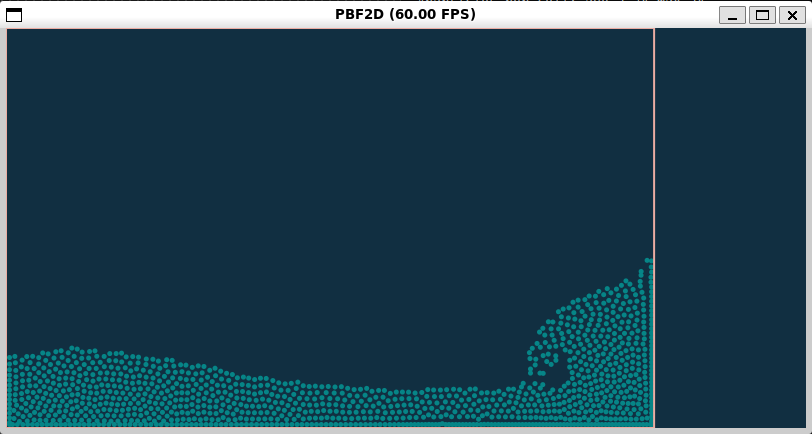
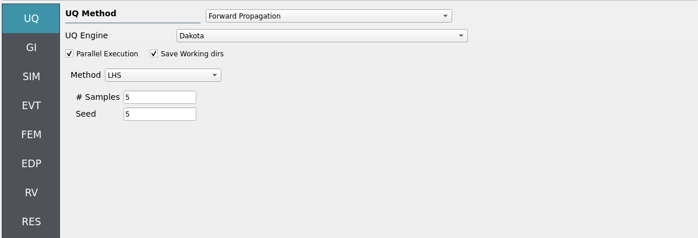
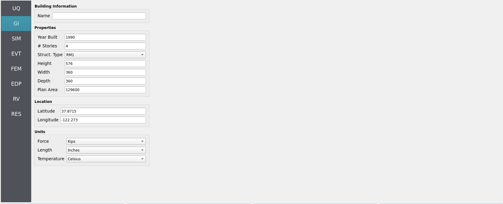
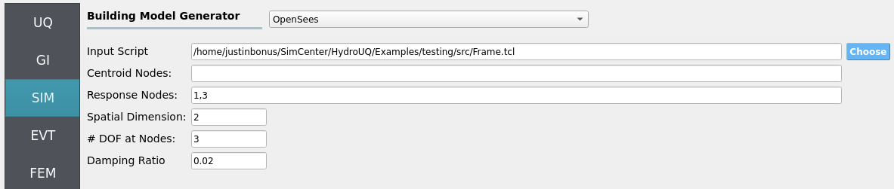

.. _hdro-0010:

====================================================================================
Forward Sampling - Simple Piston Generated Wave - Taichi Event
====================================================================================

+---------------+----------------------------------------------+
| Problem files | :github:`Github <Examples/hdro-0010/>`       |
+---------------+----------------------------------------------+

.. contents:: Table of Contents
   :local:
   :backlinks: none

.. _hdro-0010-overview:

Overview
--------

   
   TaichiEvent EVT of the pbf2d.py example. Includes a linear piston wave-maker creating breaking waves using local HPC resources (e.g. vectorized CPU, GPU).

In this local workflow example, we demonstrate high-performance computation making use of your personal computer's hardware (both CPU and GPU). A linear actuator (i.e. piston) produces a wave in real-time with automatic visualization via the Taichi Lang framework [Hu2019]_. This replicates the basic physics of wave-makers in real facilities, such as Oregon State University's Large Wave Flume.

.. _hdro-0010-setup:

Set-Up
------

   
   Uncertainty Quantification (UQ) tab with forward propagation selected.

First we select forward propagation using the Dakota UQ engine under the ``UQ`` tab. We will be looking at parallel execution of multiple simulations, set by the samples variable.

   
   General Information (GI) tab with placeholder values as no structure is being analyzed in this example.

The general information tab, ``GI``, is left unmodified as in this example we are not looking at a structure, just a wave maker. Note that this example can be extrapolated to include structural analysis due to the produced wave's loading.

   Structural Information Model tab (SIM) set to a placeholder structure, as this example does not require a structre. 

The simulation tab, ``SIM``, is not neccesary either, due to no structure being used, however it must be filled in regardless.

.. figure:: figures/hdro-0010_EVT.png
   :align: center
   :width: 600
   :figclass: align-center

   Event tab (EVT) set to the TaichiEvent module for high-performance numerical simulations. Specifically, it is set to run a fluid simulation of a linear piston wave-maker generating breaking waves, similar to the OSU LWF.

Opening the event tab, ``EVT``, set the event to be TaichiEvent. Set the workflow script to be TaichiEvent.py and the simulation script to be pbf2d.py, found at applications/createEVENT/TaichiEvent/.

.. figure:: figures/hdro-0010_EDP.png
   :align: center
   :width: 600
   :figclass: align-center

   Engineering Demand Parameters tab (EDP).

As we are not looking at a structure, the ``EDP`` tab is not necessary. However, note that in coastal engineering intensity measures such as wave height, velocity, and momentum flux are often taken to be EDPs. It is possible in the SimCenter workflow to implement such IMs as custom EDPs if you wish to extrapolate this example for structural analysis.

.. _hdro-0010-simulation:

Simulation
----------

We assume most modern computers will be able to run 1 - 10 of these simulations (set by samples in the ``UQ`` tab) in parallel in real-time (60 frames-per-second) or near real-time. A pop-up GUI(s) should appear once the ``RUN`` button is clicked at the bottom of the HydroUQ desktop app. The ``taichi`` PyPi will be automatically installed if your system does not currently have it. The backend graphics library is automatically swapped out by Taichi to meet your systems capabilities, though there are some edge-cases which you may contact NHERI SimCenter developers for assistance on. 

.. _hdro-0010-analysis:

Analysis
--------

No further analysis is performed in this simple demonstration of the Taichi Lang framework within HydroUQ. As Taichi Lang is a powerful language for numerical simulation, it can be extrapolated to run essentially any form of simulation with subsequent analysis. Contact the NHERI SimCenter developer team for assistance in doing so if desired.

.. _hdro-0010-references:

References
----------

.. [Hu2019] Hu, Yuanming et al. (2019). "Taichi: a language for high-performance computation on spatially sparse data structures." ACM Transactions on Graphics (TOG). Volume 38.
