.. _hdro-0020:

====================================================================================
Near-Real Time Wave-Solver - Seaside, OR Experimental Replication - Celeris
====================================================================================

+---------------+----------------------------------------------+
| Problem files | :github:`Github <Examples/hdro-0020/>`       |
+---------------+----------------------------------------------+

.. contents:: Table of Contents
   :local:
   :backlinks: none

.. _hdro-0020-overview:

Overview
--------

.. figure:: figures/hdro-0020.gif
   :align: center
   :width: 600
   :alt: Near-real-time Celeris Boussinesq wave simulation over a scaled-down Seaside, Oregon bathymetry; solitary wave generated by a piston wavemaker and propagating toward the shoreline.

Forward sample a near-real time **Celeris** wave simulator. Replicate tsunami experiments on a **scaled-down Seaside, Oregon**, by **Cox et al. (2008)**, performed in **Oregon State University’s Directional Wave Basin**. Then, use BRAILS and NOAA APIs to perform a full-scale rendition. Two approaches will be taken:

1. Analysis on an existing, reduced-scale experimental bathymetry file with a limited building inventory for the town of Seaside, Oregon. This represents a typical but unwieldy workflow.

2. Analysis on a bathymetry that is created at run-time by calling on a NOAA API for bathymetry-topography and merging in automated building inventory scraping results from BRAILS for Seaside, Oregon. This represents a highly automated and convenient workflow.

Hydrodynamic loading comes from a **piston-generated solitary wave**; we also treat the incoming wave **amplitude** (mean 0.5, stdev 0.15) and **period** (mean 20, stdev 4) as random variables.

.. note::

   Keep **GI**, **SIM**, **EVT**, and **FEM** units consistent between Celeris (wave) outputs and OpenSees (structure) inputs, including any scale factors used for the laboratory-scale replication.

.. _hdro-0020-set-up:

Set-Up
------

Step 1: UQ
~~~~~~~~~~

Configure **Forward** sampling only to explore structural and hydrodynamic uncertainty.

- **Engine**: Dakota
- **Forward Propagation** (e.g., **LHS**) with ``samples`` (e.g., ``4``) and an optional reproducible ``seed`` (e.g., ``1``).

.. figure:: figures/hdro-0020_UQ.png
   :align: center
   :alt: HydroUQ UQ panel with Dakota engine; Forward method selected with sample count and optional seed set.
   :figclass: align-center

Step 2: GI
~~~~~~~~~~

Set **General Information** and **Units**. Ensure units are consistent across the workflow and with the underlying experimental data.

- Project name: ``OSU_Seaside_Celeris``
- Location/metadata: optional  
- Units: choose a consistent set (e.g., N-m-s or kips-in-s)

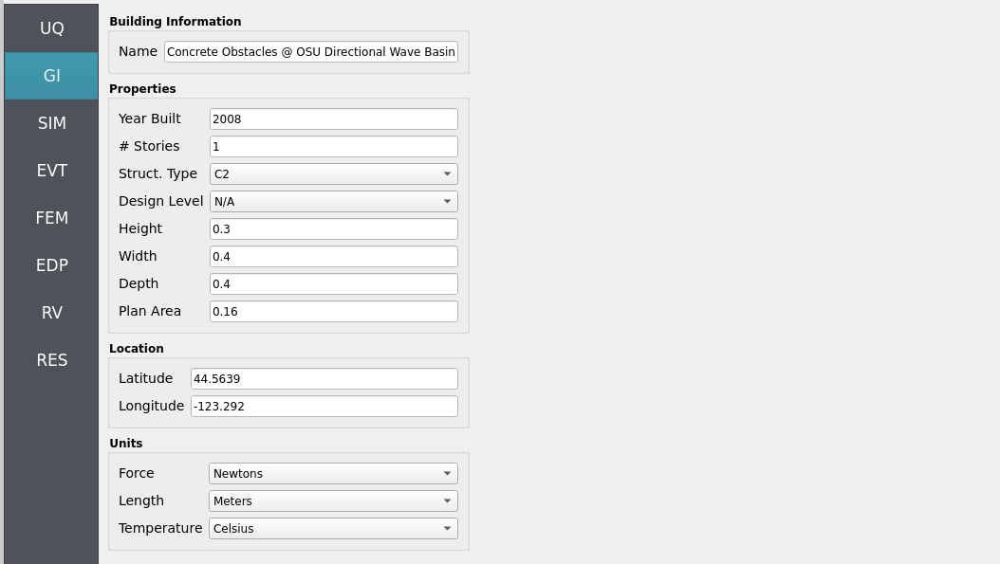

Step 3: SIM
~~~~~~~~~~~

The structural model is as follows: a **2D, 3-DOF OpenSees portal frame** in OpenSees, :ref:`lblOpenSeesSIM`. 

.. figure:: figures/hdro-0020_Structure.png
   :align: center
   :alt: Schematic of a 2D three-degree-of-freedom portal frame subjected to horizontal wave-induced drag forces along the column line, with parameters taken from a JONSWAP spectrum.
   :width: 600
   :figclass: align-center

   2D 3-DOF portal frame under stochastic wave loading (JONSWAP)

For the OpenSees generator the following model script, `Frame.tcl <https://github.com/NHERI-SimCenter/HydroUQ/blob/master/Examples/hdro-0020/src/Frame.tcl>`_ , is used:

.. raw:: html

   

   
Click to expand the OpenSees input file used for this example

.. literalinclude:: src/Frame.tcl
   :language: tcl
   :linenos:

.. raw:: html

   

.. note::
   
   The first lines containing ``pset`` in an OpenSees tcl file will be read by the application when the file is selected. The application will autopopulate the random variables in the **RV**  panel with these same variable names. 

.. figure:: figures/hdro-0020_SIM.png
   :align: center
   :alt: SIM panel referencing an OpenSees model file (Frame.tcl) with fields for material properties set as variable names fc, fy, and E.
   :figclass: align-center

These variable names (``fc``, ``fy``, ``E``) are **recognized** in ``Frame.tcl`` due to use of the `pset` command instead of `set`. This is so that **RV** picks them up automatically. You can try adding new **RV** parameters in the same way.

**Uncertain properties** (treated as RVs; see Step 7):

- ``fc``: mean ``6``, stdev ``0.06``  
- ``fy``: mean ``60``, stdev ``0.6``  
- ``E``: mean ``30000``, stdev ``300``

Step 4: EVT
~~~~~~~~~~~

**Load Generator**: **Celeris Event - Near-Real-Time Boussinesq Solver** (scaled-down Seaside, OR replication per Cox et al. 2008).

Configuration outline:

- **Bathymetry/geometry**: scaled-down Seaside, OR domain matching the experimental layout.
- **Wavemaker**: piston-generated **solitary wave**.
- **Hydrodynamic RVs**: promote the incoming wave **amplitude** and **period** to RVs (see Step 7 for distributions).
- **Export**: time histories of free surface elevation / depth-averaged velocity or pressure/force probes at the structure location for load mapping.

1. To perform the Seaside, Oregon reduced-scale, manual workflow, load-in the following files to the ``Celeris`` tab:

- `config.json <https://github.com/NHERI-SimCenter/HydroUQ/blob/master/Examples/hdro-0020/src/config.json>`_
- `bathy.txt <https://github.com/NHERI-SimCenter/HydroUQ/blob/master/Examples/hdro-0020/src/bathy.txt>`_
- `waves.txt <https://github.com/NHERI-SimCenter/HydroUQ/blob/master/Examples/hdro-0020/src/waves.txt>`_

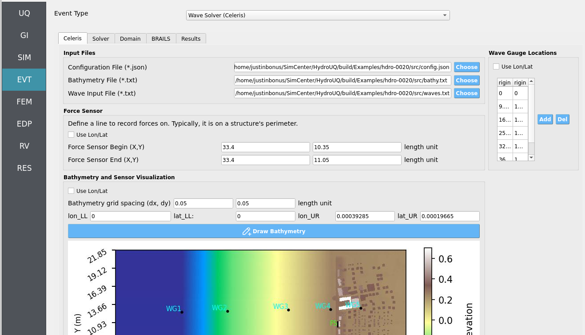

2. To perform the Seaside, Oregon full-scale, automated workflow using BRAILS for a fleshed-out building inventory and a NOAA API for high-quality bathymetry-topography, configure the following in the ``BRAILS`` tab and press ``Run``. It may take between 20 to 120 seconds to finish:

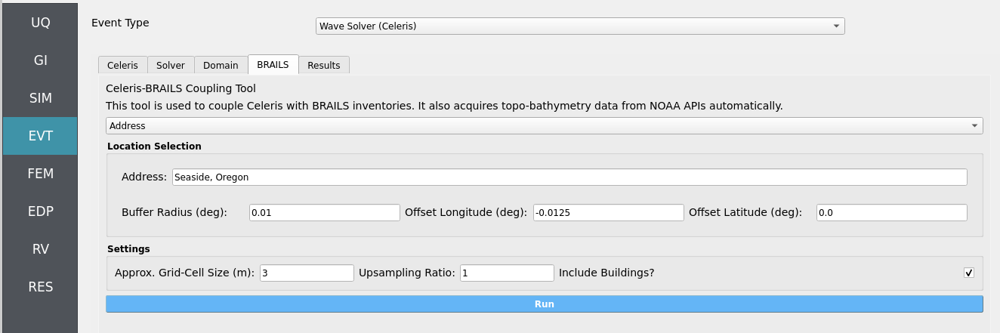

.. important::
   
   You will need to reconfigure wave-gauges and load-sensors to fit this new bathymetry, as the example's provided values are valid for the manual workflow only. You will also need to adjust the incoming waves amplitude and period by Froude similitude factors in order to properly scale-up experimental conditions.

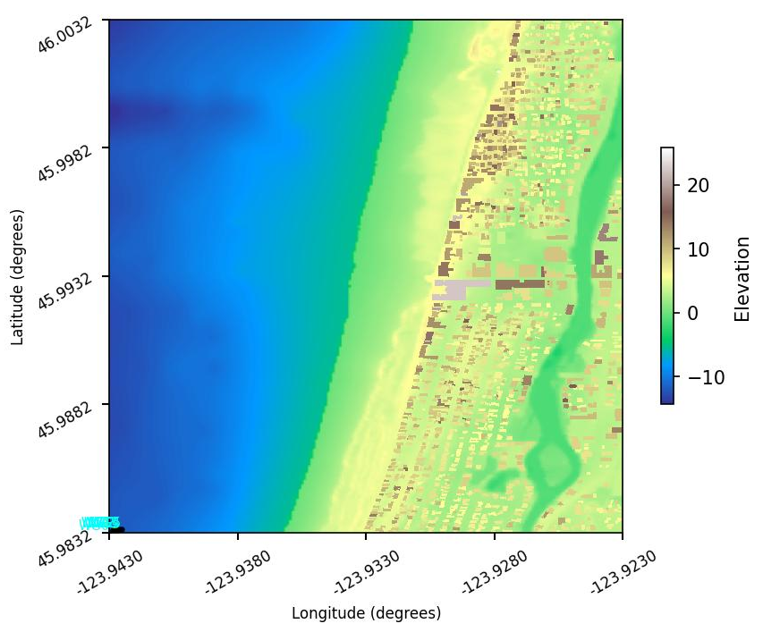

For both workflows, double-check that the following parameters are set in the ``Solver`` and ``Domain`` tabs:

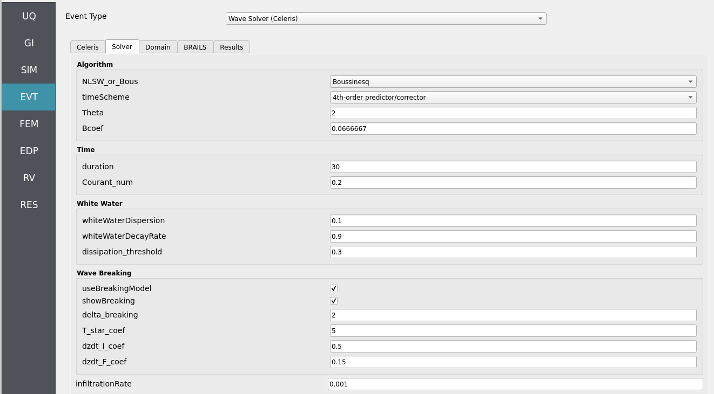

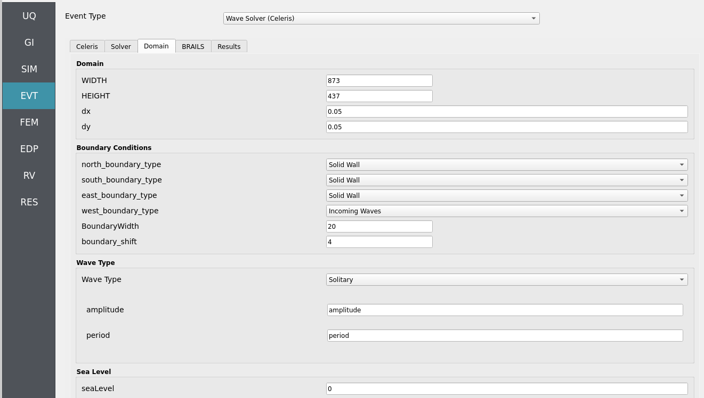

Step 5: FEM
~~~~~~~~~~~

**Solver**: OpenSees dynamic analysis. Check:

- Integration step compatible with Celeris output interval.
- Algorithm/convergence tolerances suitable for expected nonlinearity.
- Damping model as needed (e.g., Rayleigh).

.. figure:: figures/hdro-0020_FEM.png
   :align: center
   :alt: FEM panel with integration, algorithm, solver, and damping settings.
   :figclass: align-center

Step 6: EDP
~~~~~~~~~~~

Select **Engineering Demand Parameters (EDPs)** to summarize response:

- Peak Floor Acceleration (PFA)
- Root Mean Square Acceleration (RMSA)
- Peak Floor Displacement (PFD)
- Peak Interstory Drift (PID)

.. figure:: figures/hdro-0020_EDP.png
   :align: center
   :alt: EDP panel with standard selections enabled.
   :figclass: align-center

Step 7: RV
~~~~~~~~~~

Define distributions for structural and hydrodynamic RVs:

**Structural**

- ``fc``: **Normal** (mean ``6``, stdev ``0.06``)
- ``fy``: **Normal** (mean ``60``, stdev ``0.6``)
- ``E``:  **Normal** (mean ``30000``, stdev ``300``)

**Hydrodynamic (incoming solitary wave)**

- ``amplitude``: **Normal** (mean ``0.5``, stdev ``0.15``)
- ``period``:    **Normal** (mean ``20``, stdev ``4``)

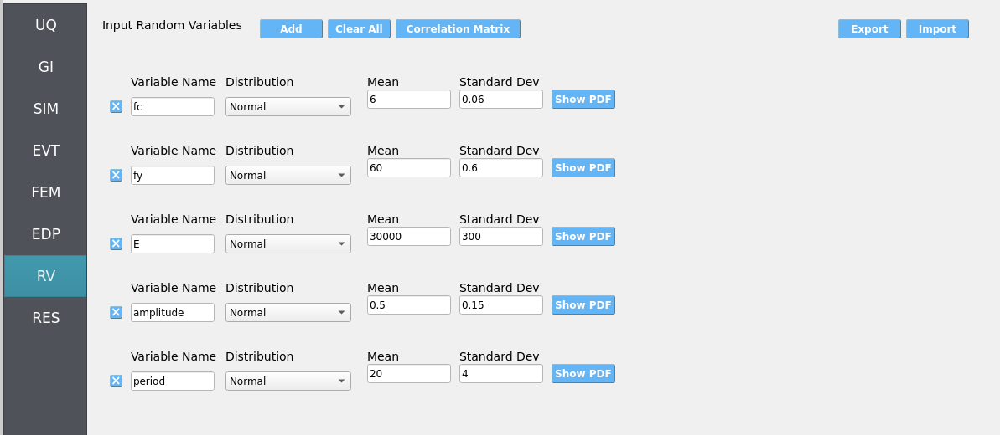

.. warning::

   Ensure positivity of wave parameters (e.g., amplitude) if using Normal distributions—consider truncation or alternative distributions if needed.

.. _hdro-0020-simulation:

Simulation
----------

This workflow is intended for either **local execution** or **remote execution** to leverage near-real-time Celeris computation. Click **RUN** for local if you have a decently strong computer, or **RUN at DesignSafe** if you have a DesignSafe account and wish to use the Stampede3 supercomputer. When complete, the **RES** panel opens. Locally, the workflow will take from 4 to 20 minutes depending on your PC.

.. warning::
   Keep recorder counts, output frequency, and sample size reasonable. Excessive export rates or too many recorders can dominate runtime and disk usage.

.. _hdro-0020-analysis:

Analysis
--------

Visualize time-series from event probes (e.g., wave-gauges, velocimeters, and load-sensors) by navigating to ``EVT`` / ``Wave Solver (Celeris)`` / ``Results``. Then set the ``Run Type`` to ``Local`` for local workflows and choose the simulation you wish to inspect by setting ``Simulation Number`` between 1 and the number of samples you set in the **UQ** tab.  

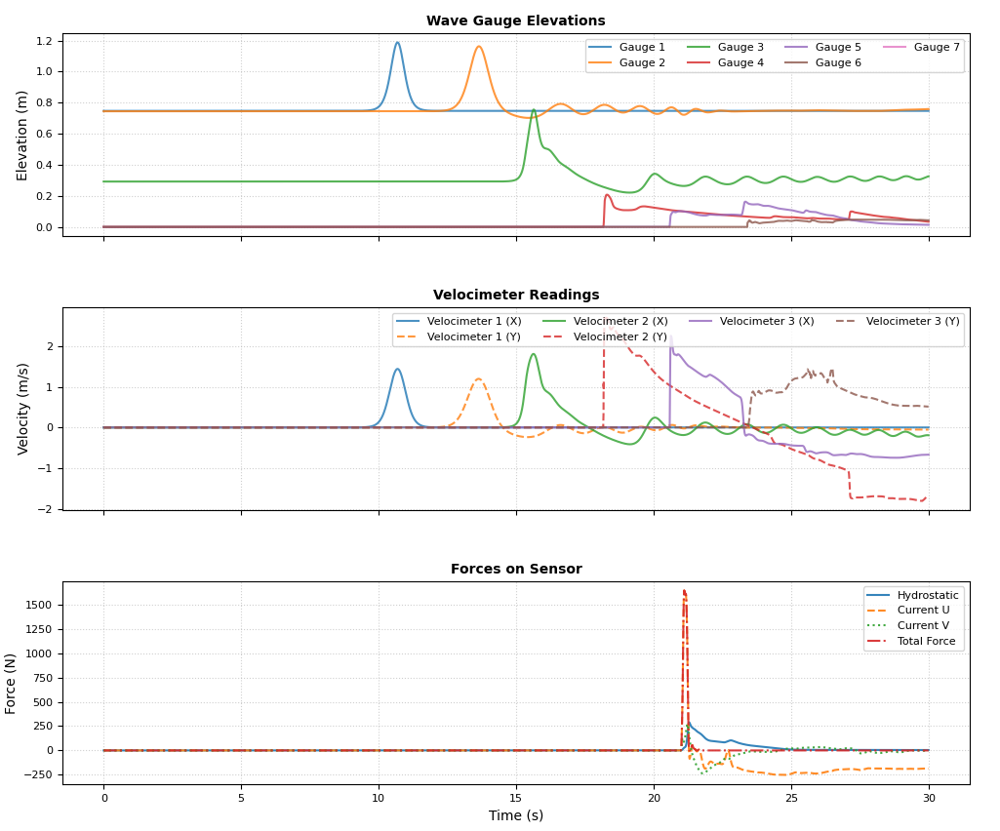

- **Wave-gauges & velocimeters**: generally **match** experimental counterparts well at the instrumented locations.
- **Load-cells**: simulated forces **reasonably predict** experiments. However, the may **overestimate** during wave-overtopping of the structure. Reason: the solver is **2D depth-averaged** with forces calculated based on **momentum** relative to assumed **fully rigid and reflecting load-sensing boundaries**. During wave over-topping **momentum from over-flow is misinterpreted as a loading flow** thus **increasing hydrodynamic loads** compared to the physical experiment.

Returning to our primary HydroUQ workflow, which concerns uncertainty in structural response, we may now view the final results in the **RES** tab. Clicking ``Summary`` on the top-bar, a statistical summary of results is shown below:

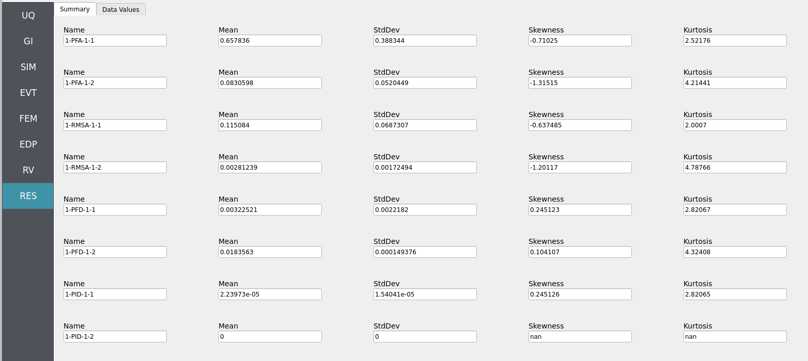

Clicking ``Data Values`` on the top-bar shows detailed histograms, cumulative distribution functions, and scatter plots relating the dependent and independent variables:

.. note:: 
   In the **Data Values** tab, left- and right-click column headers to change plot axes; selecting a single column with both clicks displays frequency and CDF plots.

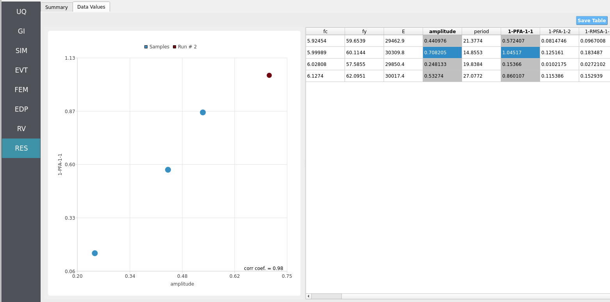

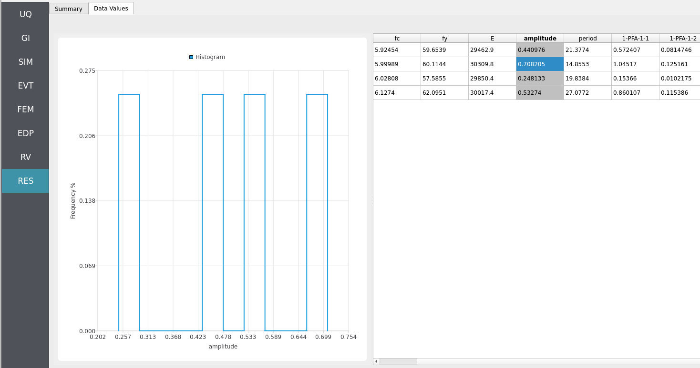

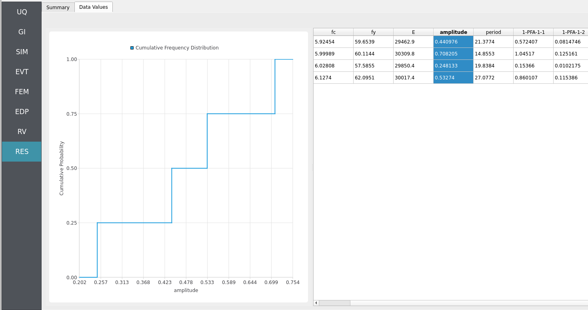

.. note::
   Use **consistent Froude similitude scaling** when comparing numerical simulations, experiments, and full-scale scenarios. For cross-method comparisons, adopt **identical structure footprints**, **friction models**, **probe placement**, and other pertinent parameters to reduce bias.

For more advanced analysis, export results as a CSV file by clicking ``Save Table`` on the upper-right of the application window. This will save the independent and dependent variable data. I.e., the **Random Variables** you defined and the **Engineering Demand Parameters** determined from the structural response per each simulation.

To save your simulation configuration with results included, click ``File`` / ``Save As`` and specify a location for the HydroUQ JSON input file to be recorded to. You may then reload the file at a later time by clicking ``File`` / ``Open``. You may also send it to others by email or place it in an online repository for research reproducibility. This example's input file is viewable at :ref:`hdro-0020-reproducibility`.

To directly share your simulation job and results in HydroUQ with other DesignSafe users, click ``GET from DesignSafe``. Then, navigate to the row with your job and right-click it. Select ``Share Job``. You may then enter the DesignSafe username or usernames (comma-separated) to share with. 

.. important::
   Sharing a job requires that the job was initially ran with an ``Archive System ID`` (listed in the ``GET from DesignSafe`` table's columns) that is **not** ``designsafe.storage.default``. Any other ``Archive System ID`` allows for sharing with DesignSafe **members on the associated project**. See :ref:`lbl-jobs` for more details. 

.. _hdro-0020-conclusions:

Conclusions
-----------

We have successfully replicated experiments on a **scaled-down version of Seaside, Oregon** during a tsunami-like event, and further, extrapolated them to an uncertain structural analysis workflow. Note that because our loads are from this scaled-down scenario, mapping them directly to a **full-scale structural model** can lead to **underpredictions of engineering demand parameters (EDPs)**. This highlights the need to either **scale down the structure** or **scale up the forces** using **similitude laws**. We leave this as an exercise to the reader.

.. _hdro-0020-reproducibility:

Reproducibility
---------------

- Random seed(s): ``1`` (set in UQ)
- Model file: ``Frame.tcl``
- App version: HydroUQ v4.2.0
- Wave solver: Celeris (as provided by NHERI-SimCenter/SimCenterBackendApplications)
- System: Local Mac, Linux, and Windows, as well as TACC HPC clusters such as Stampede3.
- Input: The HydroUQ input file is as follows: `input.json <https://github.com/NHERI-SimCenter/HydroUQ/blob/master/Examples/hdro-0020/src/input.json>`_ , is used:
.. raw:: html

   

   
Click to expand the HydroUQ input file used for this example

.. literalinclude:: src/input.json
   :language: json
   :linenos:

.. raw:: html

   
