.. _hdro-0021:

====================================================================================
Near-Real Time Wave-Solver - Oregon State University's Large Wave Flume - Celeris
====================================================================================

+---------------+----------------------------------------------+
| Problem files | :github:`Github <Examples/hdro-0021/>`       |
+---------------+----------------------------------------------+

.. contents:: Table of Contents
   :local:
   :backlinks: none

.. _hdro-0021-overview:

Overview
--------

.. figure:: figures/hdro-0021.gif
   :align: center
   :width: 600
   :alt: Near-real-time CelerisAi depth-averaged wave simulation in Oregon State University's Large Wave Flume geometry; piston wavemaker on one end, measurement probes along the flume, structure represented near the downstream end.
   :figclass: align-center

In this example we forward sample a scaled-down tsunami-like wave loading experiment and analyze resulting structural response with respect to structural and hydrodynamic uncertainty. Specifications replicate experiments in **Oregon State University's Large Wave Flume**, by **Winter (2019)** [Winter2019]_ and **Mascarenas (2022)** [Mascarenas2022]_, as well as simulations by **Bonus (2023)** [Bonus2023Dissertation]_. See the example :ref:`hdro-0002` for a Material Point Method rendition of this case in 3D.

Using **Celeris**, a near-real-time Boussinesq wave solver, simulate a 1:20 Froude-scaled tsunami (i.e., a solitary-like wave) propagating over a long wave flume's (100 x 2.0 x 3.6 meters) multi-ramp bathymetry. Observe a spilling-type breaking mode at the bathymetry crest. Immediately after, record the flow loading a rigid, square column obstacle. We will additionally model **hydrodynamic** uncertainty. As in an earlier Celeris example, the piston-driven incoming solitary-like wave has random **amplitude** and **period**. New in this case, we also include **seaLevel** to account for water level variations.

Next, couple loads from the **Celeris** wave-solver's rigid structure to an :ref:`lblOpenSeesSIM` structural model. Include uncertainty in the structural parameters using **Random Variables** for uncertainty quantification analysis.

.. warning::

   Although simulations in this example replicate experimental work by Winter (2019) and Mascarenas (2022), instead of using a structural box raised above the initial water level we use a square column of identical foot-print. This means it reaches the flume floor beneath the initial water level. This is required because Celeris' Boussinesq wave-solver is a 2D, depth-averaged method. It **can not resolve the vertically raised** aspect of the experimental structural box. This will cause slight changes in measured free-surface elevations, namely in the reflected wave, and a more notable increase in measured loads on the structure.

Finally, aggregate structural response into **Engineering Demand Parameters** for a statistical view into this scaled-down, tsunami-like loading experiment.

.. note::

   Keep **GI**, **SIM**, **EVT**, and **FEM** units consistent between Celeris outputs and OpenSees inputs, including any geometric/time scaling used for the flume replication.

.. _hdro-0021-set-up:

Set-Up
------

Step 1: UQ
~~~~~~~~~~

Configure **Forward** sampling to explore structural and hydrodynamic uncertainty.

- **Engine**: Dakota
- **Forward Propagation**: Sampling method (e.g., **LHS**) with ``samples`` (e.g., ``4``) and an optional reproducible ``seed`` (e.g., ``1``).

.. figure:: figures/hdro-0021_UQ.png
   :align: center
   :alt: HydroUQ UQ panel with Dakota engine; Forward method selected with sample count and optional seed.
   :figclass: align-center

Step 2: GI
~~~~~~~~~~

Set **General Information** and **Units**. Ensure units are consistent across the workflow and with the underlying experimental data.

- Structure name: ``Orange Box @ OSU's Large Wave Flume``
- Location/metadata: optional  
- Units: pick a consistent set (e.g., N-m-s or kips-in-s)

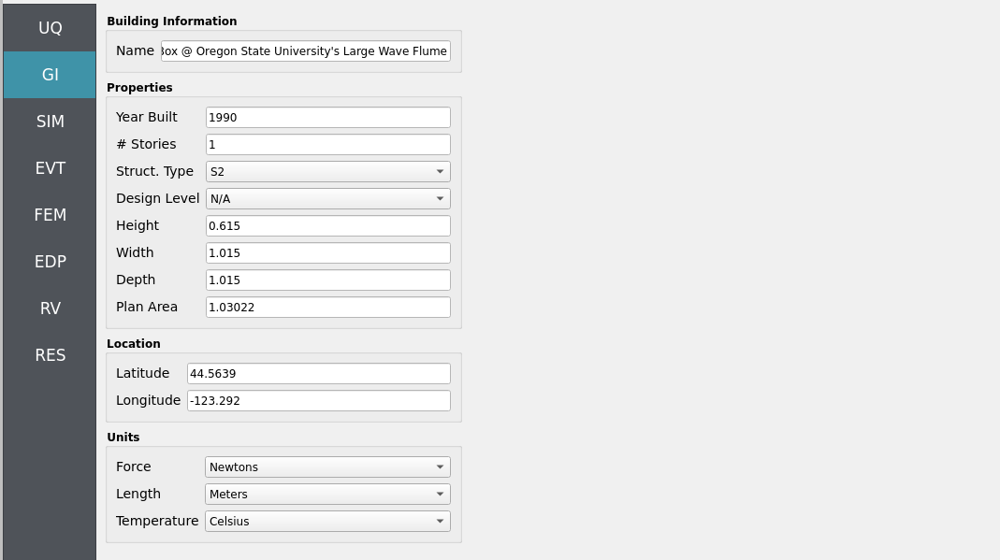

Step 3: SIM
~~~~~~~~~~~

The structural model is as follows: a **2D, 3-DOF OpenSees portal frame** in OpenSees, :ref:`lblOpenSeesSIM`. 

.. figure:: figures/hdro-0021_Structure.png
   :align: center
   :alt: Schematic of a 2D three-degree-of-freedom portal frame subjected to horizontal wave-induced drag forces along the column line, with parameters taken from a JONSWAP spectrum.
   :width: 600
   :figclass: align-center

   2D 3-DOF portal frame under stochastic wave loading (JONSWAP)

For the OpenSees generator the following model script, `Frame.tcl <https://github.com/NHERI-SimCenter/HydroUQ/blob/master/Examples/hdro-0021/src/Frame.tcl>`_ , is used:

.. raw:: html

   

   
Click to expand the OpenSees input file used for this example

.. literalinclude:: src/Frame.tcl
   :language: tcl
   :linenos:

.. raw:: html

   

.. note::
   
   The first lines containing ``pset`` in an OpenSees tcl file will be read by the application when the file is selected. The application will autopopulate the random variables in the **RV**  panel with these same variable names. 

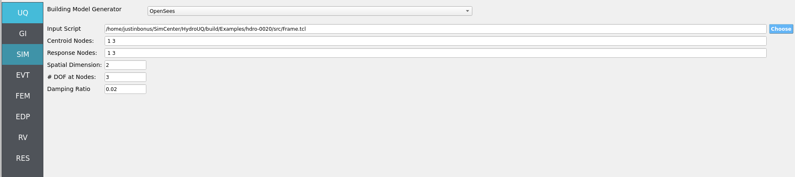

These variable names (``fc``, ``fy``, ``E``) are **recognized** in ``Frame.tcl`` due to use of the `pset` command instead of `set`. This is so that **RV** picks them up automatically. You can try adding new **RV** parameters in the same way.

**Uncertain properties** (treated as RVs; see Step 7):

- ``fc``: mean ``6``, stdev ``0.06``  
- ``fy``: mean ``60``, stdev ``0.6``  
- ``E``: mean ``30000``, stdev ``300``

Step 4: EVT
~~~~~~~~~~~

**Load Generator**: **Celeris Event - Near-Real-Time Boussinesq Solver** (scaled-down tsunami experiment replication by Winter 2019 and Mascarenas 2022).

Configuration outline:

- **Flume geometry**: match the OSU LWF dimensions and bathymetry inserts used in Winter (2019) / Mascarenas (2022).
- **Wavemaker**: piston-driven **solitary wave**; define nominal stroke/profile.
- **Instrumentation**: place **wave-gauges**, **velocimeters**, and **load-cells** (virtual probes) at the experimental stations for comparison.
- **Hydrodynamic RVs**: promote **amplitude** and **period** (solitary wave) and the quasi-static **seaLevel** offset to RVs (see Step 7).
- **Export**: time histories (surface elevation, depth-averaged velocity, and forces/pressures) at probe and structure locations for load mapping.

To perform the manual workflow, load-in the following files to the ``Celeris`` tab:

- `config.json <https://github.com/NHERI-SimCenter/HydroUQ/blob/master/Examples/hdro-0021/src/config.json>`_
- `bathy.txt <https://github.com/NHERI-SimCenter/HydroUQ/blob/master/Examples/hdro-0021/src/bathy.txt>`_
- `waves.txt <https://github.com/NHERI-SimCenter/HydroUQ/blob/master/Examples/hdro-0021/src/waves.txt>`_

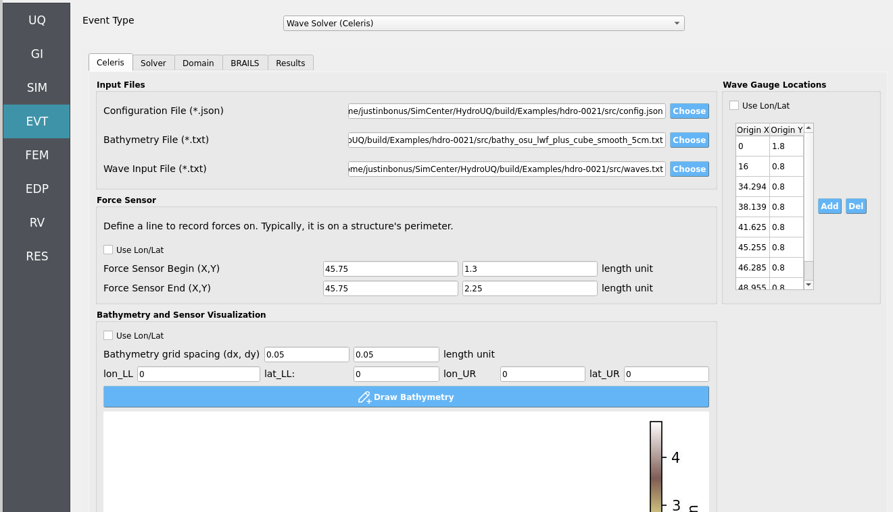

Double-check that the following parameters are set in the ``Solver`` and ``Domain`` tabs:

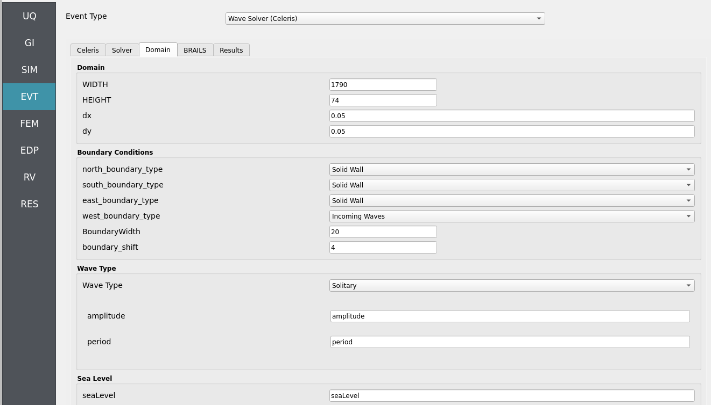

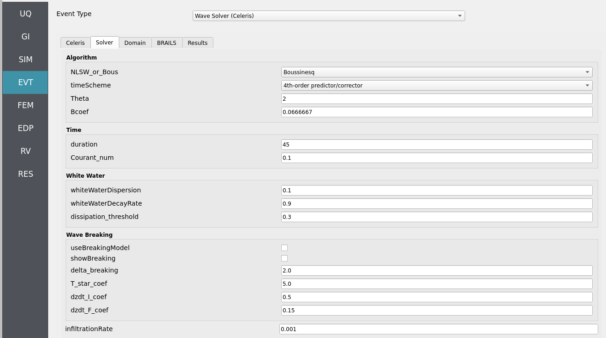

.. note::
   We will not be using the ``BRAILS`` tab in this instance, as we are not concerned with modeling a full-scale, real-world rendition of these experiments and instead rely on the manually inputted files for experimental replication.

   .. admonition:: Advanced Exercise - Extrapolate to the Prototype Event

      As an exercise for advanced users, try using the ``BRAILS`` tab to identify a suitable real-world location and building inventory that could represent the full-scale, prototype event. This involves searching for a coastal site with similar bathymetry and a structure matching the square footprint and approximate blockage ratio (0.28) used in the experiment. You must also ensure appropriate Froude similitude scaling of the incoming wave, and potentially surf similitude scaling of the bathymetry as well.

Step 5: FEM
~~~~~~~~~~~

**Solver**: OpenSees dynamic analysis. Check:

- Integration step compatible with CelerisAi output interval.
- Algorithm/convergence tolerances suitable for expected nonlinearity.
- Damping model as needed (e.g., Rayleigh).

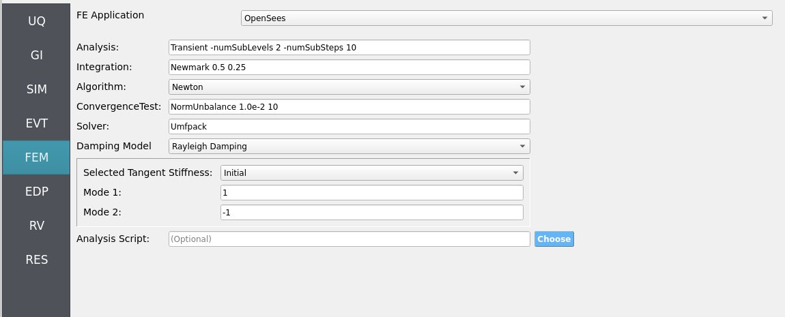

Step 6: EDP
~~~~~~~~~~~

Select **Engineering Demand Parameters (EDPs)** to summarize response:

- Peak Floor Acceleration (PFA)
- Root Mean Square Acceleration (RMSA)
- Peak Floor Displacement (PFD)
- Peak Interstory Drift (PID)

.. figure:: figures/hdro-0021_EDP.png
   :align: center
   :alt: EDP panel with standard selections enabled.
   :figclass: align-center

Step 7: RV
~~~~~~~~~~

Define distributions for **structural** and **hydrodynamic** RVs:

**Structural**

- ``fc``: **Normal** (mean ``6``, stdev ``0.06``)
- ``fy``: **Normal** (mean ``60``, stdev ``0.6``)
- ``E``:  **Normal** (mean ``30000``, stdev ``300``)

**Hydrodynamic (solitary wave + mean level)**

- ``amplitude``: **Normal** (mean ``0.5``, stdev ``0.15``)
- ``period``:    **Normal** (mean ``20``, stdev ``4``)
- ``seaLevel``:  **Normal** (mean ``2.0``, stdev ``0.1``)

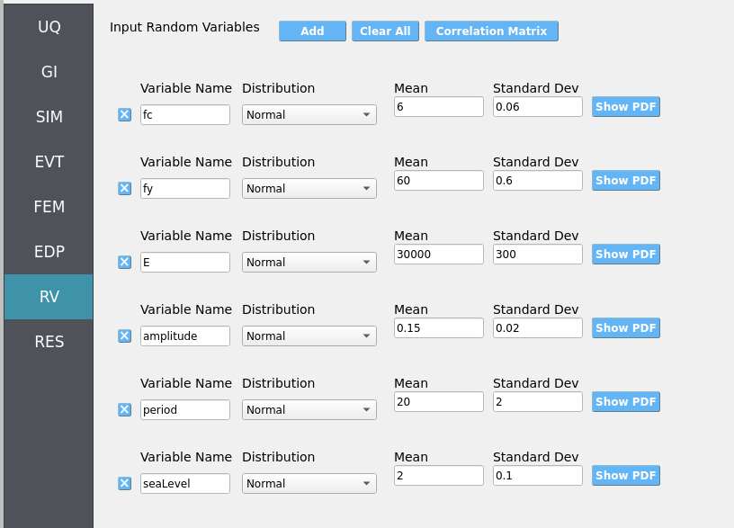

.. warning::

   Ensure positivity of wave parameters (e.g., amplitude) if using Normal distributions—consider truncation or alternative distributions if needed.

.. _hdro-0021-simulation:

Simulation
----------

This workflow is intended for either **local execution** or **remote execution** to leverage near-real-time Celeris computation. Click **RUN** for local if you have a decently strong computer, or **RUN at DesignSafe** if you have a DesignSafe account and wish to use the Stampede3 supercomputer. When complete, the **RES** panel opens. Locally, the workflow will take from 20 to 60 minutes depending on your PC.

.. warning::
   Keep recorder counts, export frequency, and sample size reasonable. Excessive export rates or too many recorders can dominate runtime and disk usage.

.. _hdro-0021-analysis:

Analysis
--------

Visualize time-series from event probes (e.g., wave-gauges, velocimeters, and load-sensors) by navigating to ``EVT`` / ``Wave Solver (Celeris)`` / ``Results``. Then set the ``Run Type`` to ``Local`` for local workflows and choose the simulation you wish to inspect by setting ``Simulation Number`` between 1 and the number of samples you set in the **UQ** tab.  

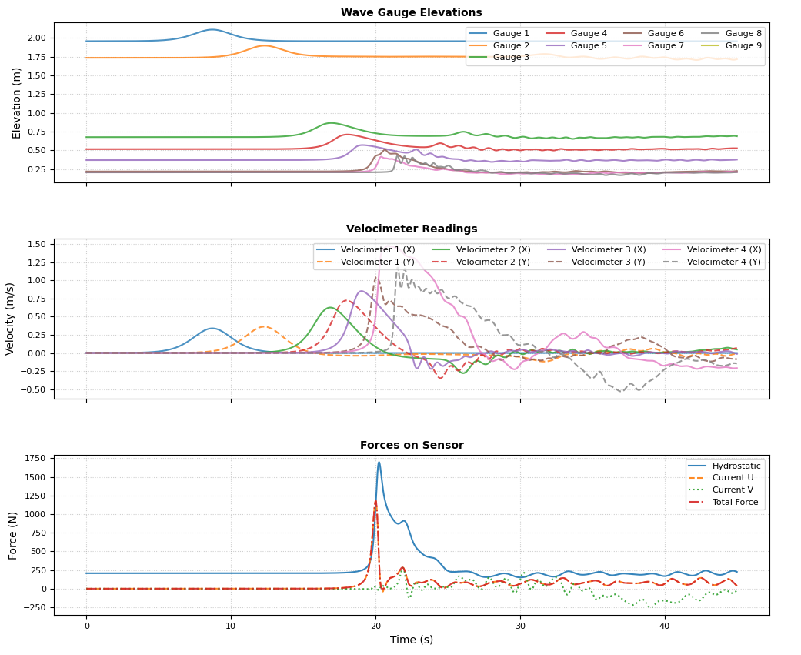

- **Wave-gauges & velocimeters**: generally **match** experimental counterparts well at the instrumented locations.
- **Load-cells**: simulated forces **overpredict** experiments. Reason: the solver is **2D depth-averaged**, and the raised structural box was approximated as a **square column embedded in the bathymetry**—preventing underflow beneath the box, thus **increasing hydrodynamic loads** compared to the physical experiment where water could flow underneath.

.. note::

   This **HydroUQ** example runs the **Celeris** configuration natively. Experimental results can be **imported** (optional) for side-by-side plots in the **Analysis** section for a comparative study, as in **Bonus (2023)**. Acquire said data from: `PRJ-2906 <https://www.designsafe-ci.org/data/browser/public/designsafe.storage.published/PRJ-2906>`_.

Returning to our primary HydroUQ workflow, which concerns uncertainty in structural response, we may now view the final results in the **RES** tab. Clicking ``Summary`` on the top-bar, a statistical summary of results is shown below:

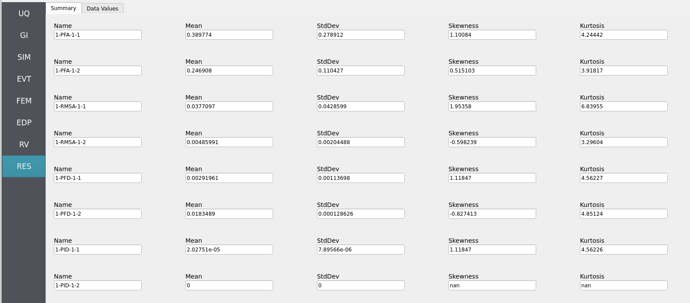

Clicking ``Data Values`` on the top-bar shows detailed histograms, cumulative distribution functions, and scatter plots relating the dependent and independent variables:

.. note:: 
   In the **Data Values** tab, left- and right-click column headers to change plot axes; selecting a single column with both clicks displays frequency and CDF plots.

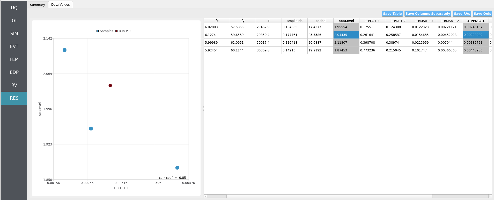

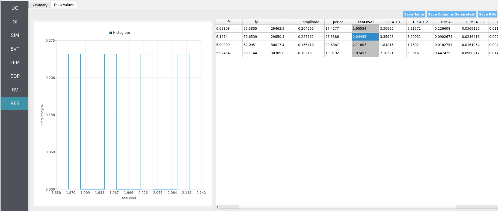

.. figure:: figures/hdro-0021_RES_Cumulative.png
   :align: center
   :alt: CDF view and tabular outputs for key response measures.
   :figclass: align-center

.. note::
   Use **consistent Froude similitude scaling** when comparing numerical simulations, experiments, and full-scale scenarios. For cross-method comparisons, adopt **identical structure footprints**, **friction models**, **probe placement**, and other pertinent parameters to reduce bias.

For more advanced analysis, export results as a CSV file by clicking ``Save Table`` on the upper-right of the application window. This will save the independent and dependent variable data. I.e., the **Random Variables** you defined and the **Engineering Demand Parameters** determined from the structural response per each simulation.

To save your simulation configuration with results included, click ``File`` / ``Save As`` and specify a location for the HydroUQ JSON input file to be recorded to. You may then reload the file at a later time by clicking ``File`` / ``Open``. You may also send it to others by email or place it in an online repository for research reproducibility. This example's input file is viewable at :ref:`hdro-0021-reproducibility`.

To directly share your simulation job and results in HydroUQ with other DesignSafe users, click ``GET from DesignSafe``. Then, navigate to the row with your job and right-click it. Select ``Share Job``. You may then enter the DesignSafe username or usernames (comma-separated) to share with. 

.. important::
   Sharing a job requires that the job was initially ran with an ``Archive System ID`` (listed in the ``GET from DesignSafe`` table's columns) that is **not** ``designsafe.storage.default``. Any other ``Archive System ID`` allows for sharing with DesignSafe **members on the associated project**. See :ref:`lbl-jobs` for more details. 

.. _hdro-0021-conclusions:

Conclusions
-----------

We have successfully replicated experiments in OSU's **Large Wave Flume** using **Celeris**. Load-cell overpredictions arise because a **2D depth-averaged** model approximated a **raised structural box** as a **solid square column**, blocking underflow and elevating forces. Because the loads come from a flume-scale scenario, mapping them directly to a full-scale structural model can underpredict (or misrepresent) EDPs. This highlights the need to **scale the structure** or **scale the forces** using **similitude laws**, which is left as an exercise for the reader.

.. _hdro-0021-references:

References
----------

.. [Winter2019] Winter, A. (2019). "Effects of Flow Shielding and Channeling on Tsunami-Induced Loading of Coastal Structures." PhD thesis. University of Washington, Seattle.

.. [Mascarenas2022] Mascarenas, Dakota. (2022). "Quantification of Wave-Driven Debris Impact on a Raised Structure in a Large Wave Flume." Masters thesis. University of Washington, Seattle.

.. [Bonus2023Dissertation] Bonus, Justin (2023). "Evaluation of Fluid-Driven Debris Impacts in a High-Performance Multi-GPU Material Point Method." PhD thesis. University of Washington, Seattle.

.. _hdro-0021-reproducibility:

Reproducibility
---------------

- Random seed(s): ``1`` (set in UQ)
- Model file: ``Frame.tcl``
- App version: HydroUQ v4.2.0
- Wave solver: Celeris (as provided in NHERI-SimCenter/SimCenterBackendApplications)
- System: Local Mac, Linux, and Windows, as well as TACC HPC clusters such as Stampede3.
- Input: The HydroUQ input file is as follows: `input.json <https://github.com/NHERI-SimCenter/HydroUQ/blob/master/Examples/hdro-0021/src/input.json>`_ , is used:
.. raw:: html

   

   
Click to expand the HydroUQ input file used for this example

.. literalinclude:: src/input.json
   :language: json
   :linenos:

.. raw:: html

   
