.. _hdro-0022:

====================================================================================
Near-Real Time Wave-Solver - Tsunami Vulnerability of a School in Loiza, Puerto Rico - Celeris + BRAILS
====================================================================================

+---------------+----------------------------------------------+
| Problem files | :github:`Github <Examples/hdro-0022/>`       |
+---------------+----------------------------------------------+

.. contents:: Table of Contents
   :local:
   :backlinks: none

.. _hdro-0022-overview:

Overview
--------

.. figure:: figures/hdro-0022.gif
   :align: center
   :width: 600
   :alt: Near-real-time CelerisAi depth-averaged wave simulation over Loiza, Puerto Rico; incoming tsunami-like wave interacts with coastline and a nearby river inlet; school site and probe locations marked.
   :figclass: align-center

Study the **tsunami vulnerability of a school in Loiza, Puerto Rico**, driven by **local bathymetry**—a **coastline** and **nearby river**—amid **sea level rise**. 

.. warning::

   The school is a **cross-shaped** building, which influences both its structural response and the way hydrodynamic loads are distributed during tsunami inundation. This geometry should be considered when interpreting simulation results and configuring probe locations for load mapping, but we emphasize that we keep the structural representation as a simple frame for this example. Advanced users are urged to explore a more detailed structural modeling approach.

.. note::

   The school is adjacent to a diamond shaped, open field and an 'L' shaped structure. The former is a baseball field used by the local, predominantly minority students, and the latter is the stadium seating. We emphasize that this open field poses a localized threat during a tsunami due to its bathymetric features. Further, it is a likely gathering point for students during an evacuation so it may become a **hazard zone**.

Two approaches will be taken: 

1. Analysis on an existing bathymetry file with a limited building inventory for the town of Loiza, Puerto Rico. This represents a typical but unwieldy workflow.

2. Analysis on a bathymetry that is created at run-time by calling on a NOAA API for bathymetry-topography and merging in automated building inventory scraping results from BRAILS for Loiza, Puerto Rico. This represents a highly automated and convenient workflow.

Hydrodynamics are represented by a composed sine-wave tsunami-like far-field signal inflow. On-top of to-be-discussed **structural** uncertainty, this example is unique in that it also includes **hydrodynamic** uncertainty: a **seaLevel** offset (mean 0.0, stdev 0.25) to reflect sea-level rise scenarios which are anticipated to have a pronounced effect on the region.

.. note::

   Keep **GI**, **SIM**, **EVT**, and **FEM** units consistent between CelerisAi outputs and OpenSees inputs, including any geographic/time scaling used for the Loiza domain.

.. _hdro-0022-set-up:

Set-Up
------

Step 1: UQ
~~~~~~~~~~

Configure **Forward** sampling to explore structural and hydrodynamic uncertainty.

- **Engine**: Dakota
- **Forward Propagation**: Sampling method (e.g., **LHS**) with ``samples`` (e.g., ``40``) and an optional reproducible ``seed`` (e.g., ``1``).

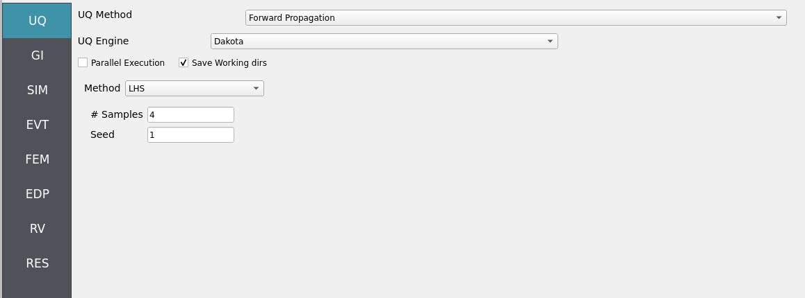

Step 2: GI
~~~~~~~~~~

Set **General Information** and **Units**. Ensure units are consistent across the workflow.

- Project name: ``CelerisAi_Loiza_School``
- Location/metadata: optional  
- Units: pick a consistent set (e.g., N-m-s or kips-in-s)

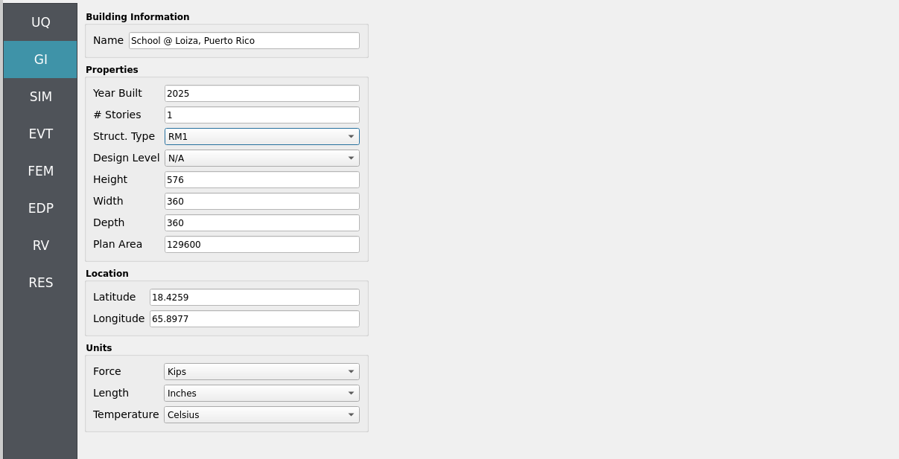

Step 3: SIM
~~~~~~~~~~~

The structural model is as follows: a **2D, 3-DOF OpenSees portal frame** in OpenSees, :ref:`lblOpenSeesSIM`. 

.. figure:: figures/hdro-0022_Structure.png
   :align: center
   :alt: Schematic of a 2D three-degree-of-freedom portal frame subjected to horizontal wave-induced drag forces along the column line, with parameters taken from a JONSWAP spectrum.
   :width: 600
   :figclass: align-center

   2D 3-DOF portal frame under stochastic wave loading (JONSWAP)

For the OpenSees generator the following model script, `Frame.tcl <https://github.com/NHERI-SimCenter/HydroUQ/blob/master/Examples/hdro-0022/src/Frame.tcl>`_ , is used:

.. raw:: html

   

   
Click to expand the OpenSees input file used for this example

.. literalinclude:: src/Frame.tcl
   :language: tcl
   :linenos:

.. raw:: html

   

.. note::
   
   The first lines containing ``pset`` in an OpenSees tcl file will be read by the application when the file is selected. The application will autopopulate the random variables in the **RV**  panel with these same variable names. 

.. figure:: figures/hdro-0022_SIM.png
   :align: center
   :alt: SIM panel referencing an OpenSees model file (Frame.tcl) with fields for material properties set as variable names fc, fy, and E.
   :figclass: align-center

These variable names (``fc``, ``fy``, ``E``) are **recognized** in ``Frame.tcl`` due to use of the `pset` command instead of `set`. This is so that **RV** picks them up automatically. You can try adding new **RV** parameters in the same way.

**Uncertain properties** (treated as RVs; see Step 7):

- ``fc``: mean ``6``, stdev ``0.06``  
- ``fy``: mean ``60``, stdev ``0.6``  
- ``E``: mean ``30000``, stdev ``300``

Step 4: EVT
~~~~~~~~~~~

**Load Generator**: **CelerisAi Event - Near-Real-Time Boussinesq Solver** (Loiza, PR coastal + riverine bathymetry).

Configuration outline:

- **Bathymetry/geometry**: Loiza coastline, adjacent river channel, and local urban footprint for shielding/flow pathways.
- **Wavemaker**: tsunami-like incoming signal (solitary/long-wave proxy).
- **Instrumentation**: place **wave-gauges** (η), **velocimeters** (u, v), and **load proxies** at school façade and along the river corridor to study channeling.
- **Hydrodynamic RVs**: promote **seaLevel** to a RV (see Step 7).
- **Export**: time histories at probe and structure locations for load mapping into OpenSees.

1. To perform the standard, manual workflow, load-in the following files to the ``Celeris`` tab:

- `config.json <https://github.com/NHERI-SimCenter/HydroUQ/blob/master/Examples/hdro-0022/src/config.json>`_
- `bathy.txt <https://github.com/NHERI-SimCenter/HydroUQ/blob/master/Examples/hdro-0022/src/bathy.txt>`_
- `waves.txt <https://github.com/NHERI-SimCenter/HydroUQ/blob/master/Examples/hdro-0022/src/waves.txt>`_

.. figure:: figures/hdro-0022_EVT_Celeris.png
   :align: center
   :alt: EVT panel showing Celeris configuration.
   :figclass: align-center

2. To perform the automated workflow using BRAILS for a fleshed-out building inventory and a NOAA API for high-quality bathymetry-topography, configure the following in the ``BRAILS`` tab and press ``Run``. It may take between 20 to 120 seconds to finish:

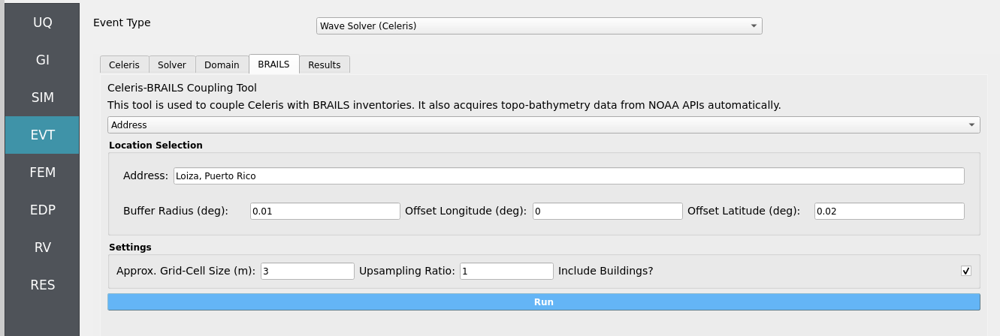

.. important::
   
   You will need to reconfigure wave-gauges and load-sensors to fit this new bathymetry, as the example's provided values are valid for the manual workflow only.

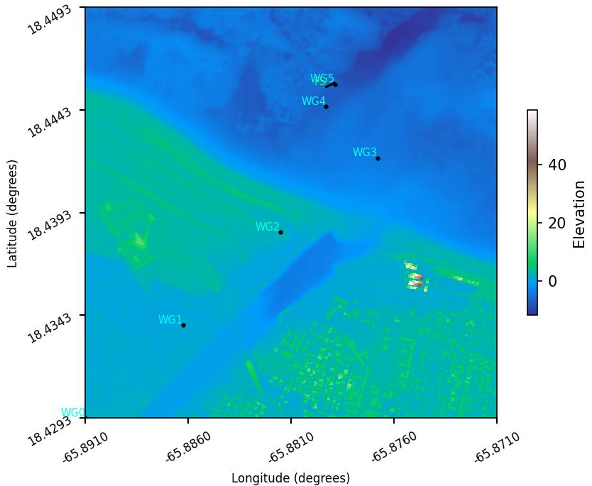

For both workflows, double-check that the following parameters are set in the ``Solver`` and ``Domain`` tabs:

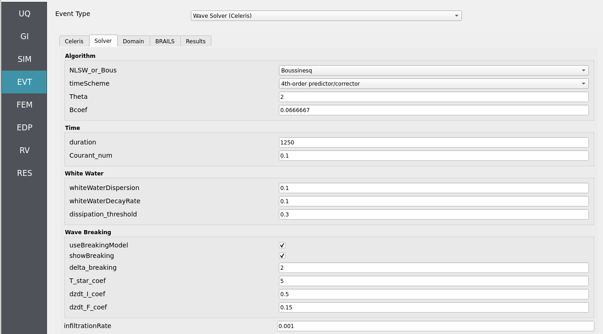

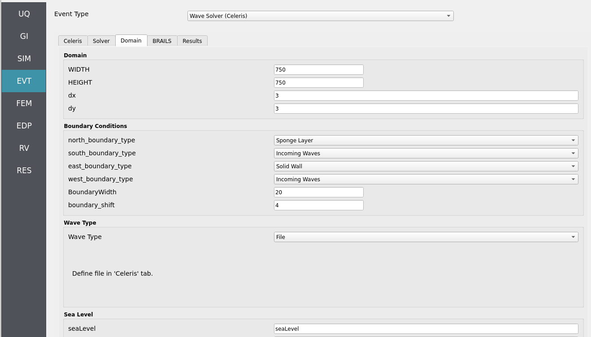

Step 5: FEM
~~~~~~~~~~~

**Solver**: OpenSees dynamic analysis. Check:

- Integration step compatible with Celeris output interval.
- Algorithm/convergence tolerances suitable for expected nonlinearity.
- Damping model as needed (e.g., Rayleigh).

.. figure:: figures/hdro-0022_FEM.png
   :align: center
   :alt: FEM panel with integration, algorithm, solver, and damping settings.
   :figclass: align-center

Step 6: EDP
~~~~~~~~~~~

Select **Engineering Demand Parameters (EDPs)** to summarize response:

- Peak Floor Acceleration (PFA)
- Root Mean Square Acceleration (RMSA)
- Peak Floor Displacement (PFD)
- Peak Interstory Drift (PID)

.. figure:: figures/hdro-0022_EDP.png
   :align: center
   :alt: EDP panel with standard selections enabled.
   :figclass: align-center

Step 7: RV
~~~~~~~~~~

Define distributions for **structural** and **hydrodynamic** RVs:

**Structural**

- ``fc``: **Normal** (mean ``6``, stdev ``0.06``)
- ``fy``: **Normal** (mean ``60``, stdev ``0.6``)
- ``E``:  **Normal** (mean ``30000``, stdev ``300``)

**Hydrodynamic (incoming signal + mean level)**

- ``seaLevel``:  **Normal** (mean ``0.0``, stdev ``0.25``)

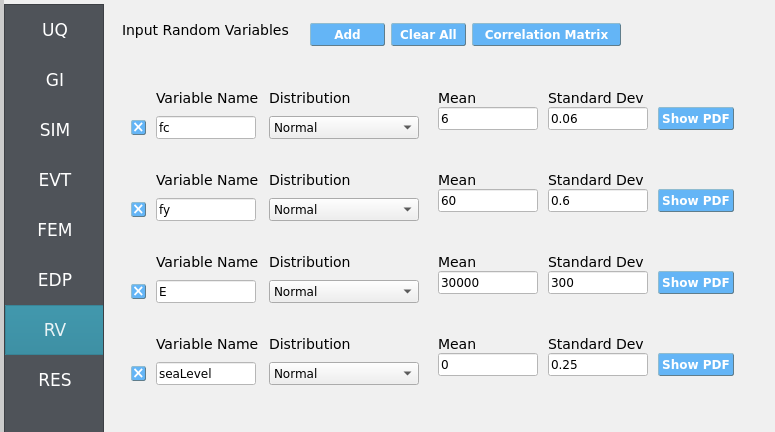

.. _hdro-0022-simulation:

Simulation
----------

This workflow is intended for either **local execution** or **remote execution** to leverage near-real-time Celeris computation. Click **RUN** for local if you have a decently strong computer, or **RUN at DesignSafe** if you have a DesignSafe account and wish to use the Stampede3 supercomputer. When complete, the **RES** panel opens. Locally, the workflow will take from 30 to 120 minutes depending on your PC.

.. warning::
   Keep recorder counts, export frequency, and sample size reasonable. Excessive export rates or too many recorders can dominate runtime and disk usage.

.. _hdro-0022-analysis:

Analysis
--------

Visualize time-series from event probes (e.g., wave-gauges, velocimeters, and load-sensors) by navigating to ``EVT`` / ``Wave Solver (Celeris)`` / ``Results``. Then set the ``Run Type`` to ``Local`` for local workflows and choose the simulation you wish to inspect by setting ``Simulation Number`` between 1 and the number of samples you set in the **UQ** tab.  

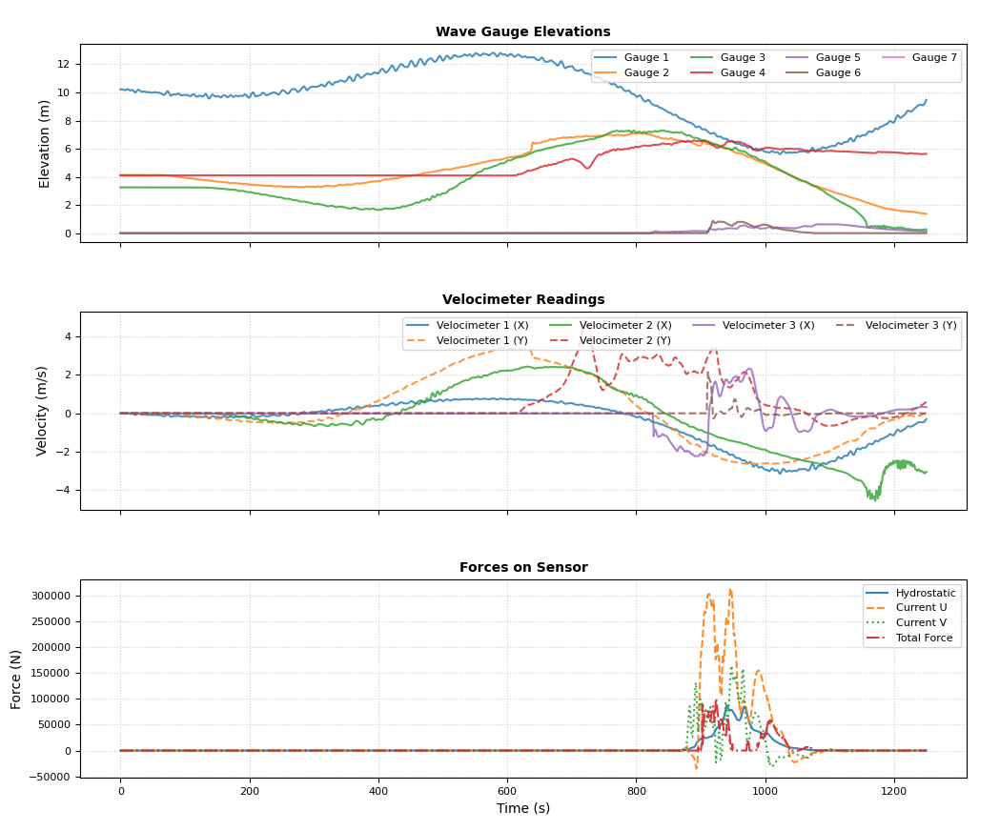

- **Coastline proximity**: not especially predictive of demand at the school due to **shielding by adjacent buildings**.  
- **River proximity**: a **significant hazard driver**—channelized flow and reduced shielding increase local velocities and loads.  
- **Sea-level rise**: higher ``seaLevel`` shifts inundation extents and amplifies local flow depths/velocities along the **river corridor** more than along the coast-fronted school site.

Returning to our primary HydroUQ workflow, which concerns uncertainty in structural response, we may now view the final results in the **RES** tab. Clicking ``Summary`` on the top-bar, a statistical summary of results is shown below:

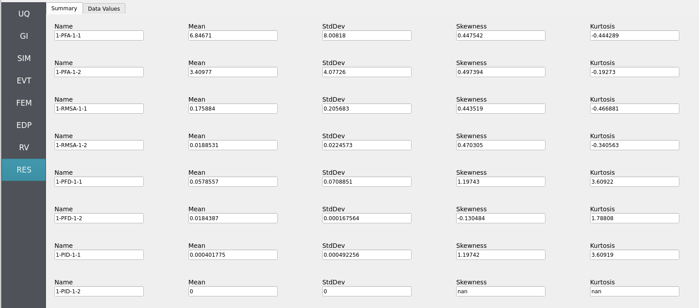

Clicking ``Data Values`` on the top-bar shows detailed histograms, cumulative distribution functions, and scatter plots relating the dependent and independent variables:

.. note:: 
   In the **Data Values** tab, left- and right-click column headers to change plot axes; selecting a single column with both clicks displays frequency and CDF plots.

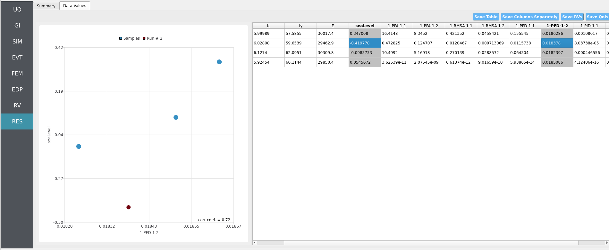

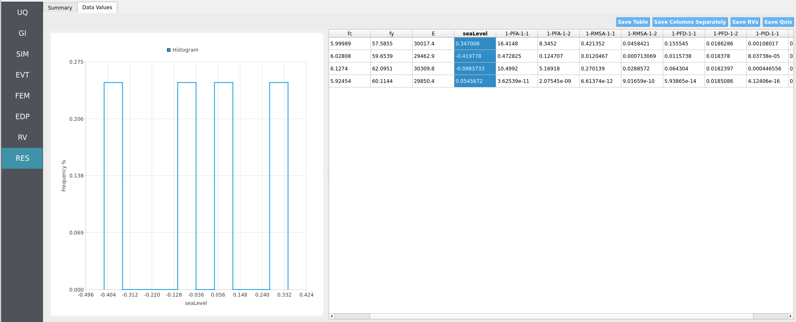

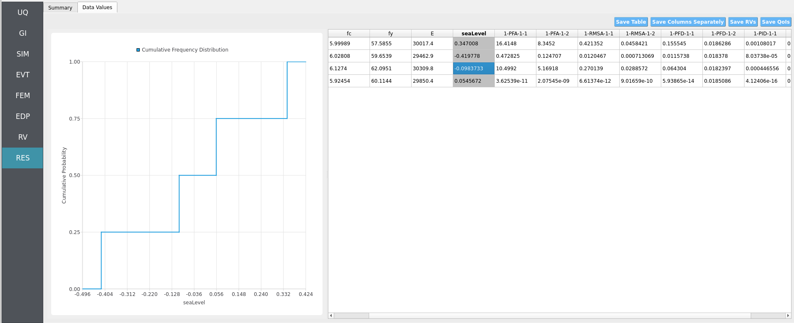

.. note::
   Use **consistent Froude similitude scaling** when comparing numerical simulations, experiments, and full-scale scenarios. For cross-method comparisons, adopt **identical structure footprints**, **friction models**, **probe placement**, and other pertinent parameters to reduce bias.

For more advanced analysis, export results as a CSV file by clicking ``Save Table`` on the upper-right of the application window. This will save the independent and dependent variable data. I.e., the **Random Variables** you defined and the **Engineering Demand Parameters** determined from the structural response per each simulation.

To save your simulation configuration with results included, click ``File`` / ``Save As`` and specify a location for the HydroUQ JSON input file to be recorded to. You may then reload the file at a later time by clicking ``File`` / ``Open``. You may also send it to others by email or place it in an online repository for research reproducibility. This example's input file is viewable at :ref:`hdro-0022-reproducibility`.

To directly share your simulation job and results in HydroUQ with other DesignSafe users, click ``GET from DesignSafe``. Then, navigate to the row with your job and right-click it. Select ``Share Job``. You may then enter the DesignSafe username or usernames (comma-separated) to share with. 

.. important::
   Sharing a job requires that the job was initially ran with an ``Archive System ID`` (listed in the ``GET from DesignSafe`` table's columns) that is **not** ``designsafe.storage.default``. Any other ``Archive System ID`` allows for sharing with DesignSafe **members on the associated project**. See :ref:`lbl-jobs` for more details. 

.. _hdro-0022-conclusions:

Conclusions
-----------

This town and its school, which is minority serving demographically, features notable tsunami risk despite being in a region not well-known for this hazard. Notably, proximity to the coastline was seen to not be especially relevant as other buildings provided shielding effects for the school, however, proximity to a river was a significant source of danger due to the local bathymetry and lack of impeding structures. If we were to further refine our model (both hydrodynamic and structural), it may provide actionable insights for this community. This is due to the advanced UQ-equipped engineering hazard workflow present in HydroUQ.

.. _hdro-0022-reproducibility:

Reproducibility
---------------

- Random seed(s): ``1`` (set in UQ)
- Model file: ``Frame.tcl``
- App version: HydroUQ v4.2.0 (or current)
- Wave solver: CelerisAi (as provided in NHERI-SimCenter/SimCenterBackendApplications)
- System: Local Mac, Linux, and Windows, as well as TACC HPC clusters such as Stampede3.
- Input: The HydroUQ input file is as follows: `input.json <https://github.com/NHERI-SimCenter/HydroUQ/blob/master/Examples/hdro-0022/src/input.json>`_ , is used:
.. raw:: html

   

   
Click to expand the HydroUQ input file used for this example

.. literalinclude:: src/input.json
   :language: json
   :linenos:

.. raw:: html

   
