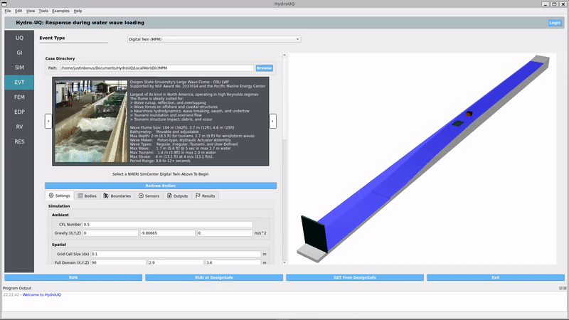
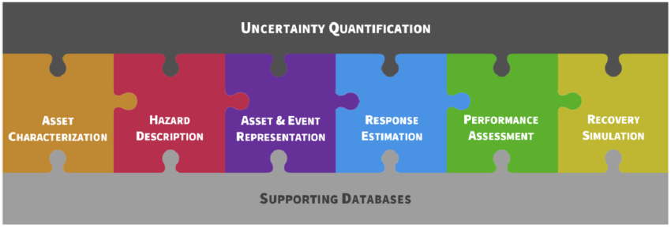

#

<div style="display: flex; justify-content: center;">
  <a href="https://github.com/NHERI-SimCenter/HydroUQ/#gh-light-mode-only"></a>
  <a href="https://github.com/NHERI-SimCenter/HydroUQ/#gh-dark-mode-only"></a>
  <span style="display:inline-block; width: 25px;"></span>
  <div>
    <p>
      <h3 class="subtitle"><b>HydroUQ - Desktop App</b></h3>
      <h3>Water-borne Hazards Engineering with Uncertainty Quantification</h3>
      <h5><i>Frank McKenna, Justin Bonus, Ajay Harish, Nicolette Lewis</i></h5>
      <h5>NHERI SimCenter, 2020-2024</h5>
      <br>
    </p>
  </div>
</div>

---

[](https://github.com/NHERI-SimCenter/HydroUQ/releases/latest)   <span style="display:inline-block; width: 20px;"></span> [](https://doi.org/10.5281/zenodo.10902090)   <span style="display:inline-block; width: 20px;"></span> [](https://ci.appveyor.com/project/fmckenna/hydrouq)  <span style="display:inline-block; width: 20px;"></span> [](https://raw.githubusercontent.com/NHERI-SimCenter/HydroUQ/master/LICENSE)  <span style="display:inline-block; width: 20px;"></span> [](https://github.com/NHERI-SimCenter)  <span style="display:inline-block; width: 20px;"></span>  [](https://www.linkedin.com/company/nheri-simcenter) <span style="display:inline-block; width: 20px;"></span>  [](https://www.youtube.com/@DesignSafe) <span style="display:inline-block; width: 20px;"></span>  

---

<div style="display: flex; justify-content: center;">
    
    
</div>

---

# Why Use HydroUQ?

The ``HydroUQ`` desktop application is a user-facing portal for cutting-edge engineering workflows targeting tsunami and storm-surge demands on structures. It is a free, open-source, graphical software for simulating a structures's response with uncertainty quantification (UQ) during water-borne natural hazard loading. The application's interchangeable workflow allows users to swap between popular uncertainty quantification methods (e.g. Sensitivity, Reliability, Surrogates) to upgrade their previously deterministic models. Modular design lets you drop-in your own building models (SIM), event types (EVT), nonlinear structural analysis (FEM), engineering demand parameters (EDP), and more.


## Capabilities

- Drop-in uncertainty quantification (UQ) methods like forward propagation, sensitivity, and reliability analysis onto previously deterministic computational fluid dynamics (CFD) models using ``SimCenter UQ`` and/or ``Dakota`` backends
- Model experiments from validated wave flume digital twin
    - [Oregon State University's Large Wave Flume](https://oregonstate.designsafe-ci.org) ``OSU LWF`` ` 
    - [Waseda University Tsunami's Wave Basin](https://shibayama.w.waseda.jp/lab_en.html) ``WU TWB`` 
- Bathymetry/topography of the ocean floor and land surface for accurate wave propagation
- Shallow-water solutions (e.g., ``GeoClaw``) as boundary conditions to 3D CFD (e.g., ``OpenFOAM``)
- Capture high-fiedlity wave-driven debris motion, impacts, damming, and deposition.
- User-defined buildings for wave loading input and structural response output
- Design structures including Multi-degree-of-freedom (``MDOF``) model, steel building model, ``OpenSees`` models, and ``OpenSeesPy`` models
- Output probabilistic building responses, velocities and pressure at any point in the fluid domain
- Supports multiscale coupling by resolving areas of interest with a 2D shallow water solver (e.g., ``GeoClaw``) and a 3D CFD solver (e.g., ``OpenFOAM``) and bridging them at an interface.
- Model elasto-plastic, topology-changing debris and/or structures under wave-loads with the Material Point Method (``MPM``)


## Quick Links

- [Download Application](https://www.designsafe-ci.org/data/browser/public/designsafe.storage.community/SimCenter/Software/HydroUQ)
- [Step-by-Step Examples](https://nheri-simcenter.github.io/Hydro-Documentation/common/user_manual/examples/desktop/examples)
- [Documentation & Guides](https://nheri-simcenter.github.io/Hydro-Documentation)
- [Overview Web-Page](https://simcenter.designsafe-ci.org/research-tools/hydro-uq)
- [Forum & Feature Requests](http://simcenter-messageboard.designsafe-ci.org/smf/index.php?board=17.0)


## Citing this Work

If you use ``HydroUQ`` [](https://doi.org/10.5281/zenodo.10902090) in your research, please cite our software as:

```bibtex
@misc{McKennaBonusHarishLewis2024,
  author = {Frank McKenna and Justin Bonus and Ajay Harish and Nicolette Lewis},
  title = {HydroUQ},
  year = {2024},
  month = {4},
  note = {NHERI-SimCenter/HydroUQ: Version 3.1.0 (v3.1.0). Zenodo.},
  url = {https://zenodo.org/records/10902090},
  doi = {10.5281/zenodo.10902090}
}
```

and include the NHERI SimCenter's workflow architecture [](https://www.frontiersin.org/articles/10.3389/fbuil.2020.558706) using:

```bibtex
@Article{Deierlein2020,
  author={Deierlein, Gregory G. and McKenna, Frank and Zsarnóczay, Adam and Kijewski-Correa, Tracy and Kareem, Ahsan and Elhaddad, Wael and Lowes, Laura and Schoettler, Matthew J. and Govindjee, Sanjay},   
  title={A Cloud-Enabled Application Framework for Simulating Regional-Scale Impacts of Natural Hazards on the Built Environment},      
  journal={Frontiers in Built Environment},      
  volume={6},           
  year={2020},      
  url={https://www.frontiersin.org/articles/10.3389/fbuil.2020.558706},       
  doi={10.3389/fbuil.2020.558706},      
  issn={2297-3362},   
}
```

---

## SimCenter Eco-System

The challenges of natural hazards engineering are addressed by the NHERI SimCenter through a suite of applications that provide cutting-edge tools for researchers, practitioners, and stakeholders. The applications are designed to work together to provide a comprehensive solution for natural hazards engineering. A puzzle-piece diagram of the SimCenter ecosystem is shown below:


<a href="https://github.com/NHERI-SimCenter/"></a>


In reality, this is a software workflow representation of the PEER Performance-Based Earthquake Engineering (PBEE) framework that has been extended to include other natural hazards:


<a href="https://github.com/NHERI-SimCenter/"></a>


``HydroUQ`` is just one part of the [NHERI SimCenter](https://simcenter.designsafe-ci.org) ecosystem that provides cutting-edge open-source tools for natural hazards engineering. Tools like ``quoFEM``, ``EE-UQ``, ``WE-UQ``, ``HydroUQ``, ``PBE``, and ``R2D`` work together to provide a comprehensive solution for natural hazards engineering. The SimCenter ecosytem forms a modular hierarchy that allows users to pick and choose the tools they need for their specific research or engineering problem.


While ``R2D`` is the top-level application that provides a regional resilience assessment, ``EE-UQ``, ``WE-UQ``, and ``HydroUQ`` provide uncertainty quantified simulations for earthquake, wind, and water-borne natural hazards, respectively. ``quoFEM`` is the backend UQ functionality they use.

Additional tools, such as ``BRAILS`` and ``TInF``, have special use-cases including AI-augmentation of building stock and creation of turbulent wind inflow for OpenFOAM CFD simulations.


All applications are free, open-source, and available for download on the [DesignSafe-CI](https://www.designsafe-ci.org) website. See the table below for more information on each application:


| Application | Full Title | Download | GitHub | Version |
|:-----------:|:-----------|:--------:|:------:|:-------:|
| ``quoFEM`` | Quantified Uncertainty with Optimization for the Finite Element Method Application | [](https://www.designsafe-ci.org/data/browser/public/designsafe.storage.community/SimCenter/Software/quoFEM) | [](https://github.com/NHERI-SimCenter/quoFEM) |  []() |
| ``EE-UQ`` | Earthquake Engineering with Uncertainty Quantification Application | [](https://www.designsafe-ci.org/data/browser/public/designsafe.storage.community/SimCenter/Software/EE_UQ) | [](https://github.com/NHERI-SimCenter/EE-UQ) | []() |
| ``WE-UQ`` | Wind Engineering with Uncertainty Quantification Application | [](https://www.designsafe-ci.org/data/browser/public/designsafe.storage.community/SimCenter/Software/WE_UQ) | [](https://github.com/NHERI-SimCenter/WE-UQ)  | []() |
| ``HydroUQ`` | Water-Borne Natural Hazards Engineering with Uncertainty Quantification Application | [](https://www.designsafe-ci.org/data/browser/public/designsafe.storage.community/SimCenter/Software/HydroUQ) | [](https://github.com/NHERI-SimCenter/HydroUQ)  | []() |
| ``PBE`` | Performance-Based Engineering Application | [](https://www.designsafe-ci.org/data/browser/public/designsafe.storage.community/SimCenter/Software/PBE) | [](https://github.com/NHERI-SimCenter/PBE) | []() |
| ``R2D`` | Regional Resilience Determination Application | [](https://www.designsafe-ci.org/data/browser/public/designsafe.storage.community/SimCenter/Software/R2Dt) | [](https://github.com/NHERI-SimCenter/R2DTool) | []() |
| ``BRAILS`` | Building Recognition with AI at Large-Scale Application | ``pip install BRAILS`` | [](https://github.com/NHERI-SimCenter/BRAILS) | []() |
| ``TInF`` | Turbulence Inflow Generation for CFD Application | [](https://www.designsafe-ci.org/data/browser/public/designsafe.storage.community//SimCenter/Software/TurbulenceInflowTool) | [](https://github.com/NHERI-SimCenter/TurbulenceInflowTool) | []() |

---

## Getting Started

The ``HydroUQ`` application can be [downloaded](https://www.designsafe-ci.org/data/browser/public/designsafe.storage.community/SimCenter/Software/HydroUQ), [installed](https://nheri-simcenter.github.io/Hydro-Documentation/common/user_manual/installation/desktop/installation.html), [built](https://nheri-simcenter.github.io/Hydro-Documentation/common/developer_manual/how_to_build/desktop/how_to_build.html), and [launched](https://nheri-simcenter.github.io/Hydro-Documentation/common/user_manual/running/desktop/running.html) on Windows, Mac, and Linux operating systems. With a [free DesignSafe account](https://www.designsafe-ci.org/account/register/), users can run HydroUQ simulations remotely on powerful supercomputers including the ``Frontera``, ``Lonestar6``, and ``Stampede3`` systems.


### Download HydroUQ

The ``HydroUQ`` desktop application is available for download on Windows and Mac operating systems from the DesignSafe-CI website at the [HydroUQ Download Link](https://www.designsafe-ci.org/data/browser/public/designsafe.storage.community/SimCenter/Software/HydroUQ)


### Install HydroUQ

The ``HydroUQ`` executable desktop application is available for Windows and Mac operating systems. The installation instructions are available in the [HydroUQ Documentation](https://nheri-simcenter.github.io/Hydro-Documentation/common/user_manual/installation/desktop/installation.html)


### Build HydroUQ

The ``HydroUQ`` application can be built from source code on Windows, Mac, and Linux operating systems. The source code is available in this repository. 

Clone the repository using the following command if the Github CLI is installed on your system:
```
git clone https://github.com/NHERI-SimCenter/HydroUQ.git
```

Otherwise, you can clone the repository on this page by clicking on the green "Code" button and then clicking on "Download ZIP". Extract the downloaded ZIP file to a location on your system.

Instructions on building the HydroUQ application from downloaded source code are available in the [HydroUQ How-To-Build Guide](https://nheri-simcenter.github.io/Hydro-Documentation/common/developer_manual/how_to_build/desktop/how_to_build.html)


### Launch HydroUQ

The ``HydroUQ`` application can be run by executing the ``Hydro_UQ`` executable file. The instructions to run the HydroUQ application are available in the [HydroUQ Documentation](https://nheri-simcenter.github.io/Hydro-Documentation/common/user_manual/running/desktop/running.html)


### Run HydroUQ Remotely

Users with a free DesignSafe account can use the `HydroUQ` desktop app to launch a remote job to run simulations on powerful supercomputers with ease.

[Sign-up for DesignSafe](https://www.designsafe-ci.org/account/register/)

Available systems are the ``Frontera``, ``Lonestar6``, and ``Stampede3`` supercomputers. Systems are located at the Texas Advanced Computing Center (TACC) and made available to the user through NSF's NHERI DesignSafe-CI, the cyberinfrastructure provider for NHERI. 


---

## Get Involved

``HydroUQ`` is an open-source project developed for practitioners, researchers, students, and stakeholders by our team of experts at the NHERI SimCenter. We welcome contributions from the community to help improve the application and add new features.


### Contributing to HydroUQ

Interested in contributing to the HydroUQ project? Find out how in the [HydroUQ Contribution Guide](https://github.com/NHERI-SimCenter/HydroUQ/blob/master/CONTRIBUTING.md).


### Contact Us

Message us on the [SimCenter Message Board](http://simcenter-messageboard.designsafe-ci.org/smf/index.php?board=17.0) for any questions, feature requests, or issues.

| Developer | Email | Role |
|:----|:-----|:----|
| Justin Bonus | bonus@berkeley.edu | [](mailto:bonus@berkeley.edu) | 
| Frank McKenna | fmckenna@berkeley.edu | [](mailto:fmckenna@berkeley.edu) | 
| Ajay Harish | ajay.harish@manchester.ac.uk | [](mailto:ajay.harish@manchester.ac.uk) |
| NHERI SimCenter | nheri-simcenter@berkeley.edu | [](mailto:nheri-simcenter@berkeley.edu) |


### Sign-up for Updates

Stay up-to-date with the latest news, updates, and releases with the [NHERI Newsletter](https://4407eb04.sibforms.com/serve/MUIEAIae4IGtEQHh04xSx9x2pNIIb4m-IjUaN83IpiIrwDW4CtpySmL9ec5ASFjgZSBYRNfgSLwXl1B8sLFSgVYB3Hc2JJP6ORmrNoj9ouHNiX8zAZVmsM1_A18STCEKs3cRP6OXJZGdvUfR7PZd5G0VN_DKVhibD3g9aRAWY7wkEfrCVeJnclbaTXMV8YuGf0KFMZQxOntb5M7Z) and the [SimCenter Newsletter](https://simcenter.designsafe-ci.org/survey/?_gl=1*1mn7c1n*_ga*MTMxNzc2NjI2MC4xNzA5MDIyOTAx*_ga_D96RT1T24K*MTcxNDQ0NDAwOS4xNC4xLjE3MTQ0NDU4NzAuMC4wLjA) newsletters.


---

## Release License
[](https://raw.githubusercontent.com/NHERI-SimCenter/HydroUQ/master/LICENSE)

HydroUQ is released as an open-source research application under a [BSD 2-Clause License](https://nheri-simcenter.github.io/Hydro-Documentation/common/front-matter/license.html)


## Acknowledgement


This material is based upon work supported by the National Science Foundation under Grant [No. 1612843](https://www.nsf.gov/awardsearch/showAward?AWD_ID=1612843) and [No. 2131111](https://www.nsf.gov/awardsearch/showAward?AWD_ID=2131111). Any opinions, findings, conclusions or recommendations expressed in this material are those of the author(s) and do not necessarily reflect the views of the U.S. National Science Foundation.
